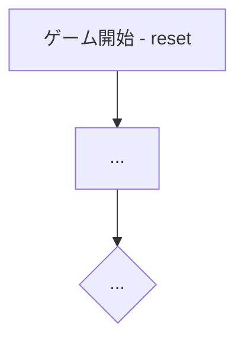

# ＜ゲーム名＞（CUI版）遊び方

<!-- テンプレート: 新規CUIマニュアル作成時にコピーして使用してください -->
<!-- ＜ゲーム名＞を実際のゲーム名に置き換えてください -->
<!-- 各セクションのガイドラインに従い、ゲーム固有の内容を記載してください -->
<!-- ゲーム固有のセクション（例: 特殊ルール）を追加しても構いません -->
<!-- この構成は internal/infrastructure/games/manual_template_test.go の -->
<!-- TestPerGameManualsFollowTemplate が検査します。見出し名・順序・Mermaid flowchart・ -->
<!-- 起動コマンドが合わないと CI が落ちます。worklist は bun scripts/audit-manual-template.mjs -->

## ゲーム概要

<!-- ゲームの簡潔な説明（1〜2文）。プレイヤー数、ゲームタイプ、勝利条件を含める -->

## 起動方法

```sh
go run ./cmd/trumpcards <game>
go run ./cmd/trumpcards --lang en <game>  # 英語モード
```

## ルール

<!-- ゲームのルールを記載。必要に応じてサブセクションに分ける -->
<!-- 例: ### 基本ルール / ### 得点 / ### ゲーム終了 / ### CPU難易度 -->

## ゲームの流れ

<!-- Mermaid flowchartでゲームの進行を図示する（必須） -->



## コマンド一覧

<!-- テーブル形式で全コマンドを列挙する -->
<!-- 列: コマンド | 短縮形 | 説明 -->

| コマンド | 短縮形 | 説明 |
|----------|--------|------|
| `reset` | `r` | 新しいゲームを開始 |
| `quit` | `q` | ゲーム終了 |
| `help` | `?` | コマンド一覧を表示 |

<!-- ゲーム固有のコマンドを追加 -->

## 画面の見方

<!-- CUIの出力サンプルをコードブロックで示し、各要素を説明する -->

```
==========
<Game Name>
==========
...
```

## 遊び方のコツ

<!-- 任意セクション（ガードは必須にしていません）。戦略やヒントを箇条書きで記載 -->
