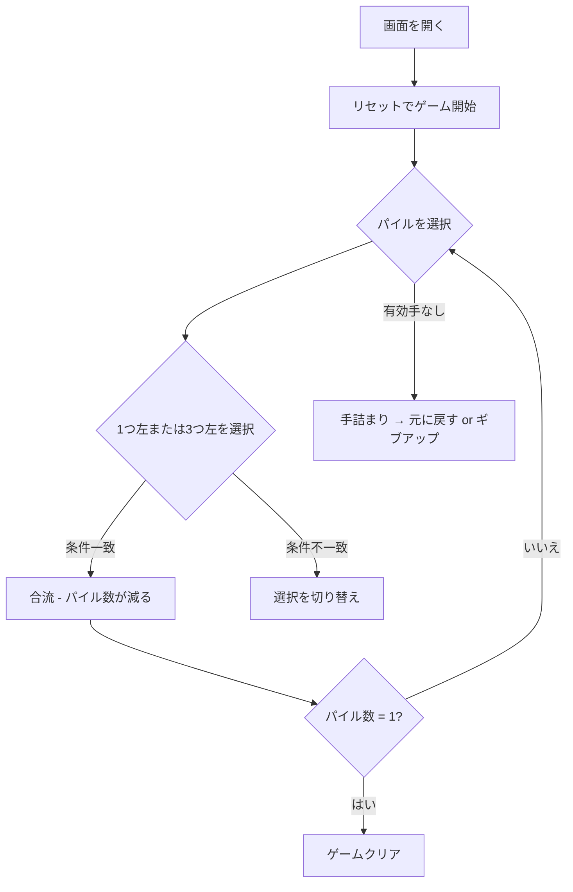

# アコーディオン（Web版）遊び方

## ゲーム概要

1人用のソリティア「アコーディオン（Accordion）」。52枚を1列に並べ、条件に合うパイルを重ねて圧縮し、1つの山にまとめればクリアです。

## 起動方法

```sh
go run ./cmd/cli web        # CLI経由でWebサーバーを起動
go run ./cmd/server         # 直接Webサーバーを起動
```

ブラウザで `http://localhost:8080` にアクセスし、ナビゲーションバーから「アコーディオン」を選択します。
ナビバーのJA/ENボタンで日本語・英語を切り替えられます。

## ルール

### 基本ルール

- 52枚のカードを1列に並べます。各マスは1枚のパイル（山）として扱います。
- パイルを選択したあと、その「1つ左」または「3つ左」のパイルをクリックすると、最上段のカードがスートまたはランクのどちらかで一致している場合に重ねて合流します。
- 合流後は消えたパイルの右側がすべて左に詰まり、列が短くなります。

### ゲーム終了

- パイルが1つに圧縮されれば「ゲームクリア」。
- 打てる手がなく、パイル数が2以上のままなら「手詰まり」。
- 任意のタイミングで「ギブアップ」ボタンにより「ゲームオーバー」。

## ゲームの流れ



## 画面の操作方法

### プレイ中

- 任意のパイルをクリックすると選択状態になり、黄色の枠で強調されます。
- その状態で別のパイルをクリックすると、
  - 1つ左 or 3つ左なら合流が試みられます（条件を満たすときだけ成功）。
  - それ以外のパイルなら選択が切り替わります。
- 「ヒント」ボタンで可能な手の候補が表示され、`fromIdx` のパイルに青、`toIdx` のパイルに緑のリングが光ります。
- 「元に戻す」ボタンまたは「手詰まり脱出」ボタンで直前の操作群を取り消せます。

### キーボードショートカット

現時点ではキーボードショートカットはありません（今後追加予定）。

## 画面構成

```
┌────────────────────────────────────────────┐
│ ナビバー                              JA/EN │
├────────────────────────────────────────────┤
│ フェーズ / 手数 / パイル数  [CLI] [?] [Man.] │
├────────────────────────────────────────────┤
│ [0][1][2][3][4][5][6][7]...                 │
│ 52枚のパイルが折り返しながら並ぶ           │
├────────────────────────────────────────────┤
│ メッセージ / ヒント表示                     │
├────────────────────────────────────────────┤
│ [リセット] [ヒント] [元に戻す] [ギブアップ] │
└────────────────────────────────────────────┘
```

## 遊び方のコツ

- 3つ左への合流を優先すると、将来の選択肢を多く残しやすいです。
- 連続して同じスート/同じランクのカードがある場合は、合流の順番を工夫することで詰まりを避けられます。
- 手詰まりになっても諦めず、`元に戻す` で数手巻き戻してみましょう。
