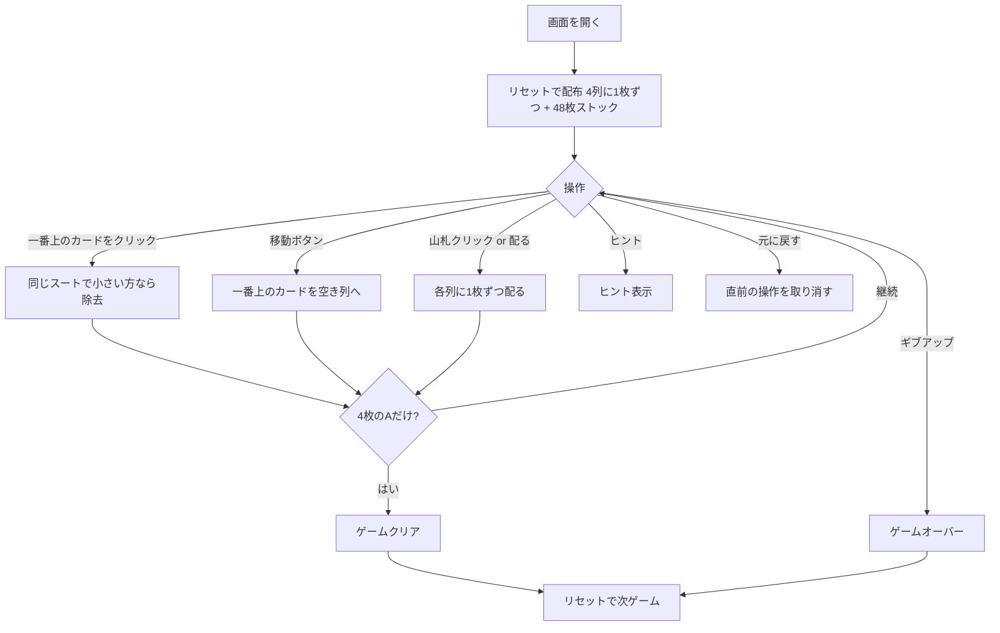

# 四つ葉のクローバー（Web版）遊び方

## ゲーム概要

1人用のソリティアカードゲームです。52枚のカードを4列の場札に配り、各列の一番上にあるカードのうち「同じスートで数字が小さい方」を取り除いていきます。最終的に場に4枚のエース（A）だけが残ればクリアです。エース（A）は最強として扱います。

## 起動方法

```sh
go run ./cmd/trumpcards web     # CLI経由でWebサーバーを起動
go run ./cmd/server              # 直接Webサーバーを起動
```

ブラウザで `http://localhost:8080` にアクセスし、ナビゲーションバーから「四つ葉のクローバー」を選択します。
ナビバーのJA/ENボタンで日本語・英語を切り替えられます。

## ルール

### 基本ルール

- 52枚のトランプ（ジョーカーなし）を使用
- 開始時、4列に1枚ずつ（計4枚）を表向きに配る
- 残り48枚は山札（ストック）に置く
- 操作できるのは各列の一番上のカードのみ

### 除去ルール

- 2つの列の一番上のカードが「同じスート」のとき、ランクが小さい方を除去できる
- エース（A）は最強（K より強い）として扱う。例：♠A と ♠9 が場にあるとき ♠9 を除去できる
- 除去したカードは捨て札へ移動する

### 配るルール

- 「配る」ボタンで山札から各列に1枚ずつ（計4枚）配る

### 移動ルール

- 列が空になったら、他の列の一番上のカードを空き列へ移動できる
- 移動により下のカードが露出し、新たな除去の手が生まれることがある

### ゲームクリア

- 山札を配りきり、場に4枚のエース（各列に1枚ずつ）だけが残ればクリア
- 画面にクリア演出が表示されます

### ゲームオーバー

- これ以上の手がない場合はギブアップでゲームオーバー

### 手詰まり検出

- ヒントが存在せず、かつ山札が空の場合に「手詰まりです」と表示します
- 手詰まり状態では「元に戻す」またはギブアップを選択できます

## ゲームの流れ



## 画面の操作方法

| 操作 | 説明 | キーボード |
|------|------|-----------|
| 一番上のカードをクリック | 除去可能なら除去 | - |
| 移動ボタン | 一番上のカードを空き列へ移動 | - |
| 山札クリック | 各列に1枚ずつ配る | `d` |
| 配るボタン | 各列に1枚ずつ配る | `d` |
| 元に戻すボタン | 直前の操作を取り消す | `z` |
| ヒントボタン | 次の一手のヒントを表示 | `h` |
| ギブアップボタン | ゲームを終了する | `g` |
| リセットボタン | 新しいゲームを開始 | - |

## 画面構成

### メインエリア

- **場札（4列）**: 各列のカードが縦に重なって表示されます。各列の一番上のカードが操作可能で、除去可能なときにクリックで除去できます
- **移動ボタン**: 各列の下に表示され、空き列があるとき一番上のカードを移動できます
- **山札**: 裏向きのカードスタック。クリックで各列に1枚ずつ配ります
- **除去済み枚数**: ヘッダーに表示されます

### フッターエリア

- **配る**: 山札から各列に1枚ずつ配る
- **元に戻す**: 直前の操作を取り消す（複数回可能）
- **ヒント**: 除去・移動・配るのいずれかを提案
- **ギブアップ**: ゲームを終了する
- **リセット**: 確認ダイアログ後に新しいゲームを開始

## 遊び方のコツ

- エースは絶対に除去できないので、早めに各列へ振り分けて空き列を作りましょう
- 同じスートの大きいカードを場に残し、小さいカードを次々と除去するとチェーンが作れます
- 配る前に、いま除去・移動できる手がないか必ず確認しましょう
- 空き列はエースの待避や、下のカードを露出させるために使います
- ヒントボタンで詰まった時のアドバイスを得られます
- 元に戻すを活用して、異なる手順を試しましょう
