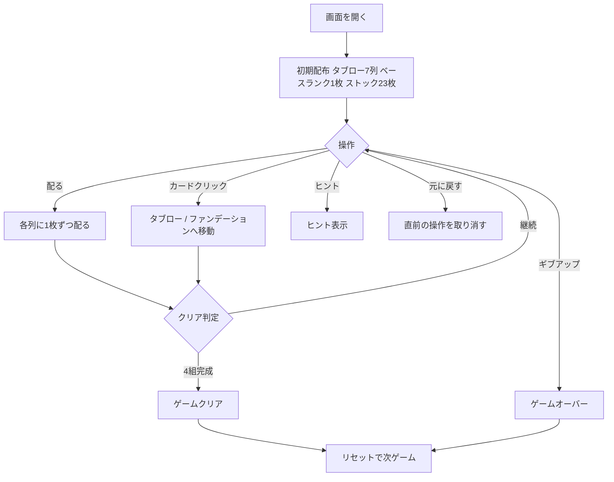

# アグネス・ソレル（Web版）遊び方

## ゲーム概要

アグネス・ソレル（Agnes Sorel）は1人用ソリティアで、クロンダイク式の7列タブローと、キャンフィールド式のベースランクから始まる4つのファンデーションを組み合わせたゲーム。4つのファンデーションをベースランクから始めて13枚ずつ積み上げれば勝利。

## 起動方法

```sh
go run ./cmd/trumpcards web        # CLI経由でWebサーバーを起動
go run ./cmd/server                # 直接Webサーバーを起動
```

ブラウザで `http://localhost:8080` にアクセスし、ナビゲーションバーから「アグネス・ソレル」を選択します。
ナビバーのJA/ENボタンで日本語・英語を切り替えられます。

## ルール

### レイアウト

- **タブロー**: 7列。クロンダイク式に列iにi+1枚配り、各列の底の1枚だけ表向き
- **ファンデーション**: 4つ。開始時に1枚が置かれ、その値がベースランクとなる
- **ストック**: 残りの23枚。`配る`で各列に1枚ずつ表向きに配る（最後の配りは2枚）

### 移動ルール

- **タブロー**: 末尾（底）のカードのみ移動可能。同色かつ1ランク下にのみ重ねられる（ラップなし、Aの上には置けない）。底のカードが移動して露出した裏向きカードは自動で表向きになる
- **ファンデーション**: 同じスート、ベースランクから昇順で13枚まで積む（K→A→…とラップアラウンド）
- タブローの空列は手動では埋められない（ストックの配りでのみ補充）

### ゲーム終了

- 4つのファンデーションがすべて13枚積まれれば **ゲームクリア**
- ギブアップでゲームオーバー

## ゲームの流れ



## 画面の操作方法

### プレイフェーズ

1. **配る**: ストックから各列に1枚ずつ表向きに配る
2. **タブローの末尾カードをクリック**: 移動元として選択
3. **移動先をクリック**: タブロー列またはファンデーションへ移動
4. **ヒント**: 次の一手を提示
5. **元に戻す**: 直前の操作を取り消す
6. **ギブアップ**: 現在のゲームを終了
7. **リセット**: 新しいゲームを開始

## 画面構成

```
┌────────────────────────────────────────────┐
│  ストック              ファンデーション×4    │
│                                            │
│  タブロー 列0 列1 列2 列3 列4 列5 列6        │
│                                            │
│  [配る] [ヒント] [元に戻す] [ギブアップ]      │
│  [リセット]                                 │
└────────────────────────────────────────────┘
```

- **ストック**: 左上。`配る`で各列に1枚ずつ配る
- **ファンデーション**: 右上。4組の組札
- **タブロー**: 中央。7列でカードを重ねる。裏向きカードは伏せて表示
- **操作ボタン**: 下部フッター

## 遊び方のコツ

- ベースランクから昇順に積み上げるため、タブローの末尾カードを優先的にファンデーションへ送る
- 同色・1ランク下で重ねられるカードを使って列を整理し、裏向きカードを表に返す
- 手詰まりになったら`配る`で新しいカードを各列に供給する
