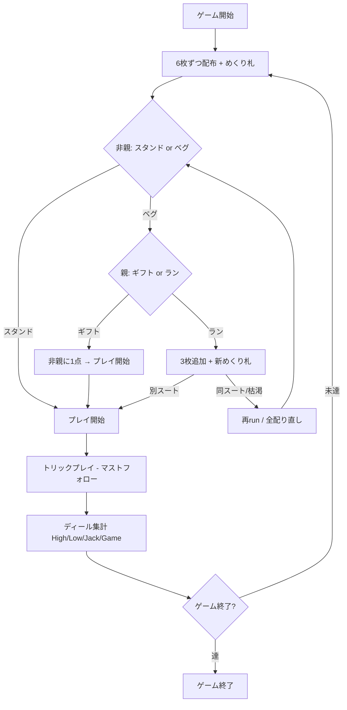

# オールフォーズ（Web版）遊び方

## ゲーム概要

All Fours (別名: Seven Up / Old Sledge) は2人 (人間1 + CPU1) の古典的なトリックテイキングゲームです。
6枚ずつ配り、めくり札 (turn-up) で切り札を決め、各ディールで High / Low / Jack / Game の4種類のポイントを競います。
最初に PointLimit (デフォルト 7) に到達したプレイヤーが勝利します。人間は非親 (elder hand)、CPU が親です。

## 起動方法

```sh
go run ./cmd/trumpcards web  # CLI経由でWebサーバーを起動
go run ./cmd/server          # 直接Webサーバーを起動
```

ブラウザで `http://localhost:8080` にアクセスし、ナビゲーションバーから「オールフォーズ」を選択します。
ナビバーのJA/ENボタンで日本語・英語を切り替えられます。

## ルール

### 基本ルール

- 2人プレイ (人間=非親 / CPU=親)、52枚デッキから6枚ずつ配布
- 次の1枚を表向きにめくり (turn-up)、そのスートが暫定の切り札になる

### ベグ / スタンド (非親の選択)

- 非親は **スタンド** (めくり札の切り札で開始) か **ベグ** (切り直し要求) を選ぶ

### 親の応答 (ベグされた場合)

- **ギフト**: 非親に 1 点を渡し、同じ切り札でプレイ開始
- **ラン (run the cards)**: 互いに3枚追加し新しいめくり札を出す。違うスートなら新しい切り札、
  同じスートが続く場合は再 run。デッキが尽きたら全カードを配り直す

### プレイ

- 非親 (elder hand) が最初にリードする
- フォロー時は **リードスートに従う** か **トランプ (切り札) を出す** 必要がある
- リードスートを持っていなければ任意のカードをプレイ可

### 得点 (1ディール最大4点 + gift)

| 得点 | 内容 |
|------|------|
| **High** | 配られた中で最強のトランプを取った者に +1 |
| **Low** | 配られた中で最弱のトランプを取った者に +1 |
| **Jack** | トランプの J を捕獲した者に +1 (J が配られた場合のみ) |
| **Game** | ピップ合計 (A=4, K=3, Q=2, J=1, 10=10) が単独最大の者に +1 (同点は誰にも入らない) |

### ゲーム終了 / タイブレーク

- 先に PointLimit に到達したプレイヤーが勝利
- 同一ディールで両者が上限到達時は **Gift → High → Low → Jack → Game** の集計順で先に達した者が勝ち

### CPU難易度

| レベル | 動作 |
|--------|------|
| Easy (0) | ランダムプレイ |
| Normal (1) | トリックを取りに行く / トランプ温存 |
| Hard (2) | Normal と同等の戦略的プレイ |

## ゲームの流れ



## 画面の操作方法

- **ベグフェーズ**: 「スタンド」か「ベグ」ボタンをクリック
- **ギフトフェーズ** (親が人間の場合のみ): 「ギフト」か「ラン」ボタンをクリック
- **プレイフェーズ**: 手札のカードを選択し「出す」ボタンをクリック
- **トリック終了**: 「次のトリック」ボタンで進める
- **ディール終了**: 「次のディール」ボタンで集計し次へ
- 設定パネルから CPU難易度・目標スコアを変更できます (変更時はリセット)
- ヒントのチェックを入れると推奨アクションが表示されます
- CLIモードに切り替えてテキストコマンドで操作することも可能です

## 画面構成

- **上部**: ラウンド/トリック番号、親、切り札、めくり札の情報
- **スコア表**: 各プレイヤーのトリック数・ディール得点・累計得点
- **現在のトリック**: 場に出されたカード
- **手札**: あなたの手札 (合法な手はハイライト)
- **フッター**: 設定パネルとフェーズ別の操作ボタン

## 遊び方のコツ

- A・K のトランプを多く持っているときは「スタンド」が有利
- トランプが弱いときは「ベグ」で切り直しを狙う
- J of trump を捕獲すると Jack 点が確定する
- Game ポイントは 10・A の取り合い。引き分けでは誰にも入らない
- Low ポイントは最弱トランプを取った者に入るため、低トランプの扱いに注意
