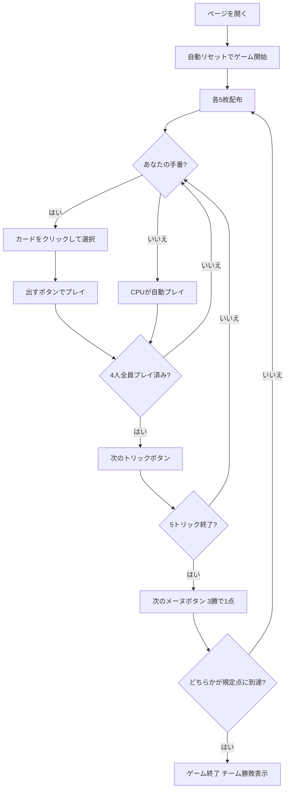

# アリュエット（Web版）遊び方

## ゲーム概要

Aluette（アリュエット）はフランス西部（ヴァンデ／ブルターニュ沿岸）で遊ばれてきた48枚スペイン式デッキのトリックテイキングゲームです。**対面同士が固定パートナー**となる4人2対2のチーム戦で、あなたは席0でプレイします。入札も捨て札もありません。

最大の特徴は **強さが「ランク」ではなく「特定の1枚」で決まること**です。最強の6枚は**リュエット (luettes)** と呼ばれ、スートとランクの組で名指しされた個別の札です。金貨の3 (Monsieur) はデッキ最強である一方、剣の3 はごく普通の札にすぎません。

## 起動方法

```sh
go run ./cmd/trumpcards web         # CLI経由でWebサーバーを起動
go run ./cmd/trumpcards web --open  # サーバー起動 + ブラウザを開く
go run ./cmd/server                 # 直接Webサーバーを起動
```

ブラウザで `http://localhost:8080` にアクセスし、ナビゲーションバーから「アリュエット」を選択します。
ナビバーのJA/ENボタンで日本語・英語を切り替えられます。

## ルール

### デッキ（48枚）

| 種別 | 枚数 | 内訳 |
|------|------|------|
| スート札 | 48 | 4スート × 12枚（1〜9, 11=ソタ, 12=カバジョ, 13=レイ） |

**10は存在しません。**9の次は絵札に飛びます。標準の52枚デッキの部分集合なので、通常のカード画像がそのまま使われます（手続き描画ではありません）。

本作ではスペイン式スートを標準の4スートに割り当てています（♠=剣 / ♣=棍棒 / ♥=聖杯 / ♦=金貨）。

### 序列（このゲームの中心）

**リュエット6枚が上位を独占します。強い順に:**

| 順位 | 呼び名 | 札 |
|------|--------|-----|
| 1 | Monsieur | ♦3（金貨の3） |
| 2 | Madame | ♥3（聖杯の3） |
| 3 | Borgne（隻眼） | ♥2（聖杯の2） |
| 4 | Vache（牝牛） | ♦2（金貨の2） |
| 5 | Grand Neuf | ♥9（聖杯の9） |
| 6 | Petit Neuf | ♦9（金貨の9） |

**リュエット以外はスートを一切見ません。** 3 > 2 > A > 王 > 騎 > 従 > 9 > 8 > 7 > 6 > 5 > 4 の順です。

この序列表は**画面上部に常時表示**され、さらに手札にリュエットがあれば手札の上に呼び名で列挙されます。カード画像だけでは「♦3が最強」とは読み取れないためです。

### トリック・テイキング

- **切札はありません。**
- **フォロー義務もありません。** どの札もいつでも出せます（出せないカードはありません）。
- **同じ強さの札が複数出たときは、先に出した側が勝ちます。**

### 得点計算と勝利条件

- 1メーヌ（mène）は **5トリック**です。
- **5トリック中3トリック**を取ったチームがそのメーヌの **1点**を獲得します。
- 規定点（デフォルト **5点**）に先に到達したチームがマッチの勝者です。

## ゲームの流れ



## 画面の操作方法

### 設定パネル

- **CPU難易度**: Easy / Normal / Hard。変更するとゲームがリセットされます。
- **目標点**: 3 / 5 / 7。先にこの点数に達したチームが勝ちます。
- **ヒント表示**: フロントエンドのヒントツールチップの有効・無効。

### プレイフェーズ

- 手札のカードをクリックして選択し、**「出す」ボタン**でプレイします。**どの札も常に選べます** —— フォロー義務が無いためです。
- **「次のトリック」ボタン**: トリックが解決したら次へ進みます。
- **「次のメーヌ」ボタン**: 5トリック終了後に集計して次のメーヌへ進みます。

入札フェーズも捨て札フェーズも存在しないため、それらのボタンは表示されません。

## 画面構成

```
┌─────────────────────────────────────────────────────┐
│  Aluette (アリュエット) [JA/EN] [CLI]                │
├─────────────────────────────────────────────────────┤
│  メーヌ: 1  トリック: 1  5点先取                      │
│  リュエット: ムッシュー(♦3) > マダム(♥3) > ...        │
├──────────┬──────────────────────────────────────────┤
│          │  得点  チーム0: 0   チーム1: 0            │
│  現在の  │                                           │
│  トリック│  あなた(T0)[親] / CPU1(T1) /              │
│  表示    │  CPU2(T0) / CPU3(T1)                      │
│  エリア  │  手札枚数・獲得トリック数                  │
├──────────┴──────────────────────────────────────────┤
│  メッセージ / 結果表示                                │
├─────────────────────────────────────────────────────┤
│  手札のリュエット: [1] ムッシュー  [3] グランヌフ      │
│  あなたの手札（クリックで選択）                       │
│  [♠A][♦3][♣7][♥9][♠Q]                        5枚    │
│  [出す] [次のトリック] [次のメーヌ] [リセット]         │
└─────────────────────────────────────────────────────┘
```

- **リュエット行**: 序列表を常時表示します。**6枚を覚えるまでは手札を強さ順に並べることすらできない**ためです。
- **手札のリュエット行**: 手札の何番目がどのリュエットかを呼び名で示します。カード画像だけでは判別できません。
- **得点**: チーム単位の累計メーヌ数。個人戦ではありません。
- **プレイヤー情報**: 所属チーム、手札枚数、このメーヌで取ったトリック数、ディーラー表示。

## 遊び方のコツ

- **値ではなく札を覚える**: 「3が強い」ではありません。♦3と♥3は最上位ですが、♠3と♣3は普通の札です。この6枚を覚えることが上達の第一歩です。
- **同格は先出し有利**: 後から同じ強さを重ねても奪えません。強い普通札でリードすると、相手は**それより強い札**を出さない限り取れません。
- **味方のトリックは奪わない**: 対面が既に勝っているトリックに強い札を重ねるのは無駄です。
- **3勝すればよい**: 5トリック全部を取る必要はありません。3トリックを確実に取れる形を組むほうが堅実です。
- **フォロー義務が無いことを使う**: 取れないトリックは最も弱い札で降りましょう。強い札を無駄打ちしないことが勝敗を分けます。
