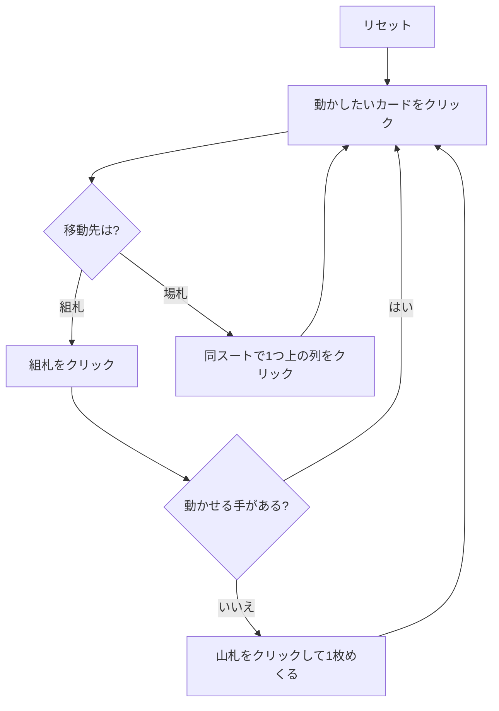

# アメリカン・トード (American Toad) — Web マニュアル

## ゲーム概要

52 枚 2 組（104 枚）で遊ぶカンフィールド系ソリティアの 2 デッキ版。**20 枚のリザーブ**、8 列のタブロー、そして最初に置かれた 1 枚が基礎札の開始ランクを決め、残り 75 枚が山札になる。

基礎札は 8 つ（スートごとに 2 つ）。開始ランクから同スートで昇順、**K の次は A に折り返して 13 枚**で 1 つ完成。8×13＝104 枚すべてを積み切ればクリア。

## 起動方法

1. `go run ./cmd/trumpcards web` でサーバーを起動する
2. ブラウザで `http://localhost:8080` を開く
3. ゲーム一覧または左サイドバーから「アメリカン・トード」を選ぶ

## ルール

- 52 枚 2 組（104 枚）。リザーブ 20 枚、タブロー 8 列、残り 75 枚が山札
- 使えるのはリザーブの一番上、捨て札の一番上、各列の一番上
- **基礎札**: 8 つ。開始ランクから同スートで昇順、**K の次は A**。13 枚で完成
- **タブロー**: **同じスート**の降順。**A の下には K**。連番はまとめて動かせる
- **空き列**:
  - リザーブが残っているうちは**自動的に**リザーブから埋まる（画面には「リザーブ」と表示され、押せない）
  - リザーブを使い切ったあとは**捨て札からのみ**埋められる（表示が「捨て札」に変わる）
  - タブローから空き列へは動かせない
- 山札は 1 枚ずつ捨て札へ。**めくり直しは 1 回だけ**。山札が空になるとボタンが「めくり直す」に変わる

## ゲームの流れ

## 画面の操作方法

| 操作 | 説明 |
|------|------|
| リザーブをクリック | 一番上の札を移動元として選択する |
| 捨て札をクリック | 一番上の札を移動元として選択する |
| 場札のカードをクリック | そのカードを移動元として選択する。**連番の途中を選べば、そこから末尾までがまとめて動く** |
| 組札をクリック | 選択中のカードをその組札に置く |
| 別の列をクリック | 選択中のカード（または連番）をその列に置く |
| 山札 / めくるボタン | 山札を 1 枚めくる。山札が空なら「めくり直す」になり、捨て札を山札に戻す（1 回だけ） |
| ドラッグ＆ドロップ | クリック 2 回と同じ移動をドラッグでも行える |
| ヒントボタン | 組札 → 場札 → めくる の順に手を 1 つ提示する |
| 自動完成ボタン | 組札へ送れる札がなくなるまで自動で送る（**場札の組み替えは行わない**） |
| 元に戻す / 手詰まり脱出ボタン | 1 手戻す / 脱出に必要な手数だけまとめて戻す |
| ギブアップ / リセットボタン | 確認ダイアログのうえで投了 / やり直す |
| CLI トグル | 同じゲームをコマンド入力で操作するモードに切り替える |

キーボードショートカット: `d` めくる / `h` ヒント / `a` 自動完成 / `z` 元に戻す / `g` ギブアップ（確認あり）。

## 画面構成

- **上部**: フェーズ表示、開始ランク、手数
- **中央上段**: リザーブ（残り枚数つき）、8 つの組札、山札と捨て札。めくり直しが使えるときは山札が `↻` になり黄色く縁取られる
- **中央下段**: 8 列の場札。列番号 `#0`〜`#7` はヒント表示の列番号と一致する。空き列は「リザーブ」または「捨て札」と表示され、どちらから埋められるかが分かる
- **下部**: ヒント表示、アクションログ、設定、キーボードショートカット一覧

## 遊び方のコツ

- **リザーブ 20 枚を削ることが最優先。** 空き列を作ってもリザーブが残っていれば自動で埋まるだけ。リザーブを使い切れば空き列が捨て札の受け皿になる
- タブローは**同スート**なので繋がりにくい。同じスートの連番を育てて一気に動かす形を狙う
- **めくり直しは 1 回きり。** 1 巡目のうちに拾えるものは拾っておく
- 組札が 8 つあるので、同じランクが 2 枚来ても両方上げられる
- 詰まったら元に戻すで分岐をやり直す
