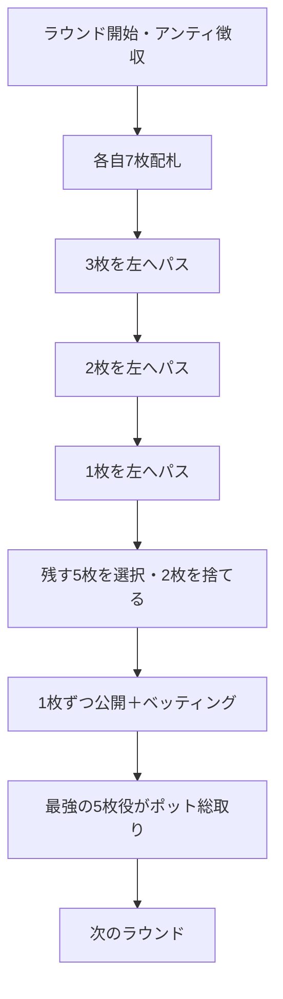

# アナコンダ（Web版）遊び方

## ゲーム概要

アナコンダ（Anaconda / Pass the Trash）はアメリカのホームポーカー文化から生まれた、札の受け渡しが特徴的なポット・ヴァイイング（vying）ゲームです。各プレイヤーには7枚が配られ、3枚→2枚→1枚と左隣へ札を渡してから、最良の5枚を残して2枚を捨てます。残した5枚を1枚ずつ公開（ロール）し、公開の合間にベッティングを行います。最終的にポットに残った中で最強の5枚ポーカー役がポットを総取りします。

## 起動方法

```sh
go run ./cmd/trumpcards web  # CLI経由でWebサーバーを起動
go run ./cmd/server          # 直接Webサーバーを起動
```

ブラウザで `http://localhost:8080` にアクセスし、ナビゲーションバーから「アナコンダ」を選択します。
ナビバーの JA/EN ボタンで日本語・英語を切り替えられます。

## ルール

### 基本ルール

1. 全員がアンティを支払い、標準52枚デッキから各自7枚の手札が配られます。
2. **パスフェーズ**: まず3枚、次に2枚、最後に1枚を左隣のプレイヤーへ渡します。渡された札は自分の手札に加わります。
3. **セットフェーズ**: 手元の札から残す5枚を選び、残り2枚を捨てます。
4. **ロールフェーズ**: 残した5枚を1枚ずつ公開します。公開の合間にコール（チェック）／レイズ／フォールドのベッティングラウンドが入ります。
5. ポットに残った中で最強の5枚ポーカー役（ストレートフラッシュ＞フォーカード＞フルハウス＞フラッシュ＞ストレート＞スリーカード＞ツーペア＞ワンペア＞ハイカード）がポットを総取りします。

### 停止条件

規定ラウンド数を消化するか、アンティを払えるプレイヤーが2人未満になるとゲーム終了。最終的にチップが最も多いプレイヤーが勝者です。

## ゲームの流れ



## 画面の操作方法

- **パス**: パスフェーズで手札から規定枚数（3→2→1）を選んで「パスする」ボタンをクリックします。
- **キープ**: セットフェーズで残す5枚を選んで「キープ」ボタンをクリックします。
- **ベット**: ロールフェーズで「コール / チェック」「レイズ」「フォールド」ボタンから選びます（自分の手番のみ）。
- **次のラウンド**: 結果表示後に「次のラウンド」をクリックして続行します（チップは引き継がれます）。
- **ヒント**: 各フェーズで推奨アクションを表示（オプション）。パス／セットのフェーズでは推奨する札そのものに枠が付きます。
- **アクションログ**: これまでの配札・パス・ベット・精算の履歴を確認できます。

## 画面構成

- **フェーズ表示**: 現在のフェーズ、ラウンド番号、ポット額、アンティ、コール額、チップ残高
- **プレイヤー一覧**: 各プレイヤーのチップ・状態（手番／フォールド／脱落／勝者）。公開済みの役名も表示
- **手札エリア**: あなたの手札。パス／セットではタップして選択し、ロールでは公開の進行に合わせて表示
- **結果表示**: ラウンドの勝敗とポットの行方

## 遊び方のコツ

- パスフェーズでは弱い札を渡し、渡ってきた札で役を狙いましょう。左隣に何を渡すかは相手の手を強くしうる点に注意。
- セットでは無理に役を追わず、フラッシュやストレートのドロー、確実なペアを優先すると安定します。
- ロールでは公開が進むほど相手の役が見えてきます。強い手はレイズで積極的に、弱い手は早めにフォールドしてマッチ負担を避けましょう。
- ヒントを有効にすると、フェーズごとの推奨アクションが表示されます。
