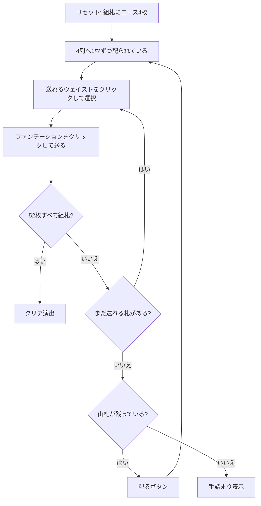

# オールド・ラング・サイン（Web版）遊び方

## ゲーム概要

イギリスの古典的な一人用ペイシェンス。4 枚のエースを最初からファンデーション（組札）に据え、残る 48 枚を 4 つのウェイスト（捨て札列）へ **1 段 4 枚ずつ**配りながら、組札を A から K まで積み上げる。

サー・トミーと盤面は似ているが、**配り先を選べない**のが決定的な違い。「配る」を押すと 4 列へ強制的に 1 枚ずつ配られるため、判断は「いつ配るか」と「送れる札が複数あるときどれを先に送るか」だけになる。

## 起動方法

```sh
go run ./cmd/trumpcards web  # CLI経由でWebサーバーを起動
go run ./cmd/server          # 直接Webサーバーを起動
```

ブラウザで `http://localhost:8080` にアクセスし、ナビゲーションバーから「オールド・ラング・サイン」を選択します。
ナビバーのJA/ENボタンで日本語・英語を切り替えられます。

## ルール

- 52 枚 1 組。エース 4 枚を抜いて 4 つのファンデーションに据え、残る 48 枚を山札にする
- 「配る」を押すと山札から 4 つのウェイストへ 1 枚ずつ配られる（開始時に 1 段目が配られている）
- ファンデーションは**スートを問わず** A→K の順に 1 ずつ積み上げる
- ウェイストは**最上段のみ**ファンデーションへ移せる。列内の入れ替えとウェイスト同士の移動は不可
- 48 枚は 4 の倍数なので、配りは全部で 12 回
- 52 枚すべてを積み上げれば勝ち。配り切って置ける札がなくなれば手詰まり

## ゲームの流れ



## 画面の操作方法

| 操作 | 説明 | キーボード |
|------|------|-----------|
| ウェイストをクリック | その列の最上段を移動元として選択する（もう一度押すと解除） | - |
| ファンデーションをクリック | 選択中のウェイスト最上段をその組札に置く | - |
| 配るボタン | 山札から 4 つのウェイストへ 1 枚ずつ配る | `d` |
| ヒントボタン | 置ける札を 1 つ提示する | `h` |
| 元に戻すボタン | 直前の 1 手を取り消す | `u` |
| オートコンプリートボタン | 山札を配り切ったあと、置ける札を自動で組札へ送る | `a` |
| ギブアップボタン | 確認ダイアログのうえでゲームを終了する | `g` |
| リセットボタン | 確認ダイアログのうえで最初からやり直す | - |
| CLI トグル | 同じゲームをコマンド入力で操作するモードに切り替える | - |

キー操作は**プレイ中のみ**有効です（読み込み中とゲーム終了後は効きません）。フッターの「キーボードショートカット」を開くと同じ一覧が出ます。

## 画面構成

- **上部**: フェーズ表示（プレイ中 / 手詰まり / クリア）と手数
- **中央上段**: 4 つのファンデーション。積み上がった枚数を `n/13`、次に必要なランクをバッジで表示
- **中央下段左**: 山札（裏向き）と「あと n 回配れます」。次のカードは見えません
- **中央下段右**: 4 つのウェイスト。最上段だけが操作対象
- **下部**: アクションログ、設定、操作ボタン

## 遊び方のコツ

- **配る前に、送れる札は全部送る。** 配ると各列の最上段が新しい札で塞がれるので、送れるうちに送るのが唯一の実質的な選択
- 複数の札が送れるときは、**下に有用な札が埋まっている列から**先に送る。1 枚どけると次の札が最上段に出てくる
- 同じランクを送る先が複数あるときは、どの組札でも同じ（スートを問わないので 4 列は互換）
- 配り切ったらオートコンプリートが使える。以降は強制手なので自動で流してよい
- 運の比重が非常に大きいゲームなので、手詰まったら元に戻すより配り直すほうが早いことも多い
