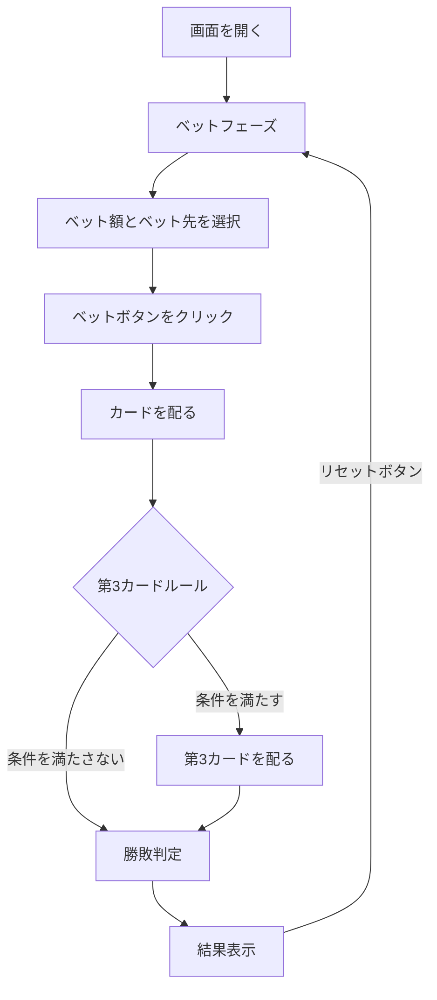

# バカラ（Web版）遊び方

## ゲーム概要

カジノの定番カードゲームです。プレイヤーとバンカーのどちらが勝つかを予想してベットします。カードの合計値の下一桁が9に近い方が勝ちです。

## 起動方法

```sh
go run ./cmd/cli web        # CLI経由でWebサーバーを起動
go run ./cmd/server         # 直接Webサーバーを起動
```

ブラウザで `http://localhost:8080` にアクセスし、ナビゲーションバーから「バカラ」を選択します。
ナビバーのJA/ENボタンで日本語・英語を切り替えられます。

## ルール

### 基本ルール

- 52枚のトランプ（ジョーカーなし）を使用
- カードの点数: A=1, 2〜9=額面通り, 10/J/Q/K=0
- ハンドの値は各カードの点数の合計の下一桁
- プレイヤーとバンカーにそれぞれ2枚ずつ配る
- 第3カードルール（サードカードルール）に従って追加カードが配られることがある

### ベットタイプと配当

| ベット先 | 条件 | 配当 |
|---------|------|------|
| プレイヤー | プレイヤーの勝ち | 2倍 |
| バンカー | バンカーの勝ち | 1.95倍（5%コミッション） |
| タイ | 引き分け | 9倍（8:1） |

### サイドベット

| ベット先 | 条件 | 配当 |
|---------|------|------|
| プレイヤーペア | プレイヤーの最初の2枚が同じ数字 | 12倍（11:1） |
| バンカーペア | バンカーの最初の2枚が同じ数字 | 12倍（11:1） |

### ナチュラル

- 最初の2枚の合計が8または9の場合「ナチュラル」となり、第3カードは配られない

### 第3カードルール

**プレイヤー側:**
- 合計0〜5: 1枚引く
- 合計6〜7: スタンド

**バンカー側:**（プレイヤーが第3カードを引いた場合）
- 合計0〜2: 必ず引く
- 合計3: プレイヤーの第3カードが8以外なら引く
- 合計4: プレイヤーの第3カードが2〜7なら引く
- 合計5: プレイヤーの第3カードが4〜7なら引く
- 合計6: プレイヤーの第3カードが6〜7なら引く
- 合計7: スタンド

## ゲームの流れ



## 画面の操作方法

### ベットフェーズ

1. **ベット額**: 数値入力欄でベット額を設定（10刻み、最低10、最大は所持チップ数）
2. **ベット先**: ドロップダウンから「プレイヤー」「バンカー」「タイ」を選択
3. **サイドベット（任意）**: プレイヤーペア・バンカーペアのベット額を設定（0で無効）
4. **「ベット」ボタン**: クリックでベットを確定し、ゲーム開始

### 結果フェーズ

1. プレイヤーとバンカーのカードが表示されます
2. 結果メッセージと配当が表示されます
3. サイドベットの結果（的中・不的中・配当）が表示されます
4. **「リセット」ボタン**: 新しいラウンドを開始
5. **「棋譜を見る」ボタン**: アクションログを表示

### Big Road（罫線）

画面下部にBig Roadが表示されます。各ラウンドの結果（プレイヤー勝ち・バンカー勝ち・タイ）が色分けされた丸印で記録され、勝敗の流れ（連勝・トレンド）を視覚的に確認できます。「履歴クリア」ボタンで罫線をリセットできます。

### キーボードショートカット

ゲーム中、以下のキーボードショートカットが使用できます。

| キー | アクション | 有効条件 |
|------|-----------|---------|
| `b` | ベット | ベットフェーズのみ |
| `r` | リセット | 結果フェーズのみ |

※ テキスト入力欄にフォーカスがある場合、ショートカットは無効になります。

## 画面構成

```
┌────────────────────────────────────────────┐
│           チップ: 1000                      │
├────────────────────────────────────────────┤
│  プレイヤーの勝ち！                         │
│                                            │
│  プレイヤー: 値: 9                          │
│  [♠9] [♥K]                                │
│                                            │
│  バンカー: 値: 7                            │
│  [♣5] [♦2]                                │
│                                            │
│  配当: 200                                  │
│  サイドベット: プレイヤーペア 的中 配当: 600  │
├────────────────────────────────────────────┤
│  [リセット] [棋譜を見る]                     │
├────────────────────────────────────────────┤
│  Big Road                                  │
│  🔵🔴🔴🟢🔵 ...                            │
│                        [履歴クリア]         │
└────────────────────────────────────────────┘
```

## 遊び方のコツ

- バンカーベットの方が統計的にわずかに有利です（ハウスエッジ約1.06%）
- プレイヤーベットのハウスエッジは約1.24%
- タイベットはハウスエッジが高い（約14.4%）ので控えめに
- ベット額の管理が重要です。一度に大きくベットせず、計画的にプレイしましょう
