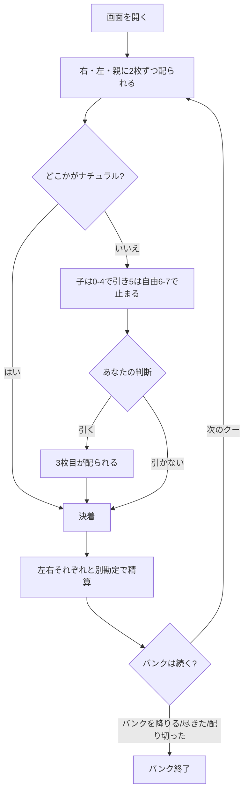

# バカラ・バンク（Web版）遊び方

## ゲーム概要

バカラ・バンク（Baccarat Banque、別名 **Baccarat à Deux Tableaux**）はフランスのカジノ・バンキングゲームで、**1 つのバンクが左右 2 つの子と同時に勝負する**のが最大の特徴です。シューは **3 組 156 枚**をまとめてシャッフルしたもの。あなたがバンカー（親）を務めます。

**バンクは負けても動きません。** シュメン・ド・フェールでは負けた瞬間にバンクが隣へ回りますが、バカラ・バンクの親は **シューを配り切るまで／自分から降りるまで／バンクが尽きるまで** 同じ席に座り続けます。1 回の負けは持ちチップを減らすだけで、席は取られません。ここがこの形式の存在理由です。

## 起動方法

```sh
go run ./cmd/trumpcards web  # CLI経由でWebサーバーを起動
go run ./cmd/server          # 直接Webサーバーを起動
```

ブラウザで `http://localhost:8080` にアクセスし、ナビゲーションバーから「バカラ・バンク」を選択します。
ナビバーのJA/ENボタンで日本語・英語を切り替えられます。

## ルール

### 配り

1 クーごとに **右の子 → 左の子 → バンカー** の順で 2 枚ずつ配ります。**札は全部表向き**です。

### 合計の数え方

| 札 | 点 |
|------|-----|
| A | 1 |
| 2〜9 | その数字 |
| 10・J・Q・K | **0** |

合計は **10 で割った余り**です（7 + 6 = 13 → **3**）。

### ナチュラル

**最初の 2 枚で 8 か 9** なら「ナチュラル」。そこで打ち止めで、どちらの側も 3 枚目を引きません。

### 子の引き際（**裁量があるのは 5 だけ**）

| 子の合計 | 3 枚目 |
|------|-----|
| **0〜4** | **必ず引く** |
| **5** | **自由**（CPU が判断します） |
| **6〜7** | **必ず止まる** |
| 8〜9 | ナチュラル（引かない） |

### バンカーの引き際（**どの合計でも自由**）

あなたは **左右の子が引き終わった結果を見てから**、自分の合計に関わらず引くか止まるかを選べます。**固定表はありません。** ナチュラルのときだけ引けません。

### 精算

左右それぞれと **別勘定**で勝負します。合計が大きいほうの勝ち、同数は引き分け（やり取りなし）。**片方に払いながらもう片方から取る**クーが普通に起こります。

### バンクの終わり

| 終わり方 | いつ |
|------|-----|
| 降りる | `retire` を打ったとき |
| 配り切る | シューに次のクーぶんの札が無くなったとき |
| 尽きる | バンクが賭け金を賄えなくなったとき |

配り切った時点でチップが増えていれば勝ちです。

## ゲームの流れ



## 画面の操作方法

- **引く / 引かない**: あなたの番になると 2 つのボタンが出ます。**どの合計でも自由**なので、押せる条件はありません。キーボードの `D` / `S` でも押せます。
- **次のクー**: 決着を読んだら押して次のクーへ進みます（`N`）。**負けていても席は動きません。**
- **バンクを降りる**: 決着のときだけ押せます（`R`）。チップを持ったまま終われます。
- **行動ログ**: 終局後に棋譜を開けます。途中では空です。
- **設定**: ヒントの ON/OFF を切り替えられます。
- **CLI モード**: ヘッダーの切り替えで端末風の画面になります。

## 画面構成

- **ヘッダー**: ゲーム名・フェーズ表示・**あなたのチップ**・CLI 切り替え
- **中央上**: 左右 2 つのタブロー（札・合計・チップ・賭け金）。2 枚で 8 か 9 の席には ★ が付きます
- **中央下**: あなた（バンカー）の札と合計
- **決着ブロック**: **左右それぞれ 1 行**の勝敗と増減、その下にバンクの差し引き
- **フッター**: 引く / 引かない、次のクー / バンクを降りる、行動ログ、リセット

## 画面の見方（CLI モード）

```
Phase: BANKER DRAW
Coup: 2
Held this bank: 2 coup(s) — a loss does not end it
Shoe: 141 card(s) left
----------
Banker (you): ♥J ♠5 = 5  chips 1100
Right tableau: ♣K ♦A ♥8 = 3  chips 950 stake 50
Left tableau: ♥6 ♥2 = 8 *natural  chips 950 stake 50
```

**`Held this bank`** がこの形式の要です。前のクーで負けていても席は動きません。

**`*natural`** の印が付いた側は 2 枚で 8 か 9 に達しており、そこで打ち止めです。

**`Shoe`** が次のクーぶんに足りなくなるとバンクは配り切りで終わります。
