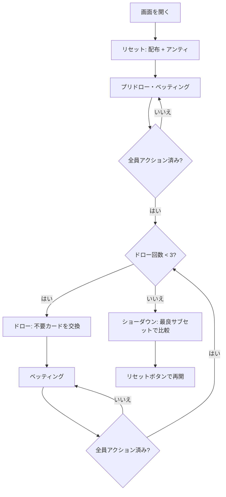

# バドゥーギ（Web版）遊び方

## ゲーム概要

バドゥーギ（Badugi）はアジア発祥の4枚ドローポーカーで、ランクとスートがすべて異なる最も低い4枚の組み合わせ（= バドゥーギ）を目指すローボールゲームです。各プレイヤーに4枚が配られ、最大3回のドロー（交換）を経てショーダウンします。エースは常にロー（1）として扱い、ストレート・フラッシュは役に影響しません。

## 起動方法

```sh
go run ./cmd/trumpcards web        # CLI経由でWebサーバーを起動
go run ./cmd/server                # 直接Webサーバーを起動
```

ブラウザで `http://localhost:8080` にアクセスし、ナビゲーションバーから「バドゥーギ」を選択します。ナビバーのJA/ENボタンで日本語・英語を切り替えられます。

## ルール

### 基本ルール

- 52枚のトランプを使用（ジョーカーなし）
- 各プレイヤーに4枚配布
- 最大3回のドロー（交換）
- ベッティングラウンドは計4回（ディール後・各ドロー後）
- 山が尽きたら**捨て札（マック）を切り直して**引く。4席だと配った時点の山は36枚しかなく、3回のドローで全員が4枚引くと最大48枚要るので、山切れは規則の範囲内で起きる（いま交換している席が捨てたばかりの札は、その交換のあいだマックに戻さない）
- ショーダウンでは「ランクもスートもすべて異なる」最大のサブセットを選び、最も低いものが勝ち
- サブセットサイズ順（4枚 > 3枚 > 2枚 > 1枚）、同サイズなら最高ランクから比較（低い方が勝ち）
- エースは常にロー（1）として扱う
- ストレート・フラッシュは役に影響しない

### ハンドの強さ

| サイズ | 表示名 | 説明 |
|--------|--------|------|
| 4 | Badugi | 4枚すべてのランク・スートが異なる（最強） |
| 3 | 3-card | 3枚がランク・スートともに異なる |
| 2 | 2-card | 2枚がランク・スートともに異なる |
| 1 | 1-card | 残りの1枚のみ評価対象 |

### ベッティングアクション

| アクション | 説明 |
|-----------|------|
| フォールド | 手札を捨ててラウンドから降りる |
| チェック | ベットせずにパスする（未ベット時のみ） |
| コール | 現在のベット額に合わせる |
| ベット | 新たにベットする（未ベット時のみ） |
| レイズ | 現在のベット額を上げる |
| オールイン | 全チップを賭ける |

### リミット

Fixed Limit / Pot Limit / No Limit の3種類から設定できます。Fixed Limit ではラウンド1〜2はスモールベット、ラウンド3〜4はビッグベット（= 2×）が適用されます。

## ゲームの流れ



## 画面の操作方法

### ベッティングフェーズ

自分の手番が来ると、画面下部にアクションボタンが表示されます。

**ベットが出ていない場合:**
- **「ベット」**: ベット額を入力してベットする
- **「チェック」**: パスする

**ベットが出ている場合:**
- **「コール」**: 現在のベット額に合わせる
- **「レイズ」**: ベット額を入力してレイズする
- **「フォールド」**: 降りる

### ドローフェーズ

- 交換したいカードをクリックして選択（選択中は金色のボーダーが付く）
- **「交換」** ボタンで選択枚数ぶんカードを引き直す
- **「スタンド」** ボタンは交換なし（スタンドパット）

### 設定

画面下部の「設定」パネルから次の項目を変更できます。変更後は「リセット」ボタンを押して新しい設定で開始してください。

- **ベッティングリミット**: Fixed / Pot Limit / No Limit
- **メタAI**: CPUがあなたのプレイスタイルを学習
- **ヒント**: 推奨アクションを表示

### キーボードショートカット

| キー | アクション | 有効条件 |
|------|-----------|---------|
| 数字 1-4 | カードの選択 | ドローフェーズ |
| Enter | 「交換」実行 | ドローフェーズ |
| Escape | 選択をクリア | ドローフェーズ |

## 画面構成

```
┌──────────────────────────────────────────────────────┐
│  フェーズインジケータ: ポット / ディーラー / ドロー #  │
├──────────────────────────────────────────────────────┤
│  CPU プレイヤー (1〜3) + 行動ログ                      │
│                                                      │
│  (ショーダウン時にCPUの手札と役が公開される)          │
├──────────────────────────────────────────────────────┤
│  あなたの手札 (4枚)                                    │
│  [メッセージ領域]                                      │
│  [ベットコントロール or 交換/スタンドボタン]           │
│  [設定パネル] [リセットボタン]                         │
└──────────────────────────────────────────────────────┘
```

## 遊び方のコツ

- 4枚バドゥーギが完成したら迷わずスタンドパット
- 3枚ローは中盤まで粘れる強さがあるのでコール中心に進める
- 2枚以下の手はフォールド候補。相手がスタンドパットしたら撤退を検討
- CPU の交換枚数は強さのシグナル — 0枚交換は完成手、3枚交換は完全なドロー
