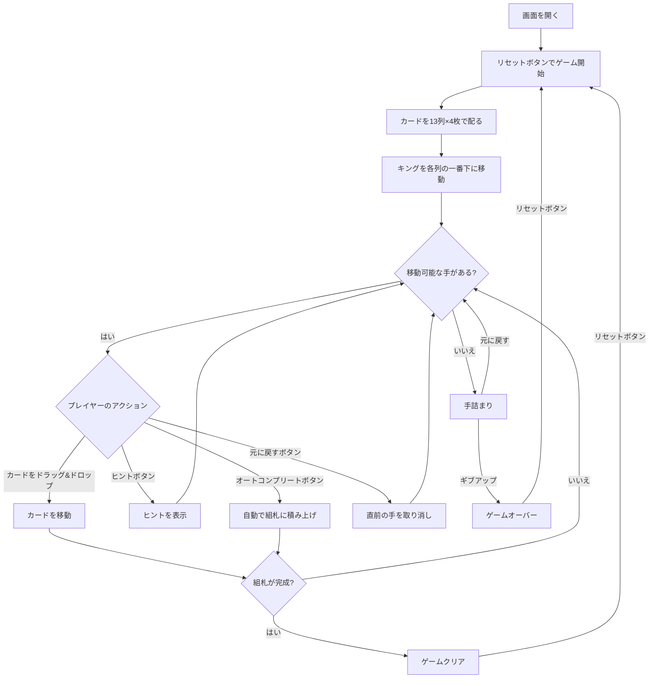

# ベーカーズ・ダズン（Web版）遊び方

## ゲーム概要

1人用のソリティアカードゲームです。1デッキ（52枚）を使い、13列のタブロー（各4枚）と4つの組札で構成されます。配られた時点で全てのカードが表向きで、ストックやウェイストはありません。組札にA→Kまでスート別に積み上げればクリアです。

## 起動方法

```sh
go run ./cmd/trumpcards web  # CLI経由でWebサーバーを起動
go run ./cmd/server          # 直接Webサーバーを起動
```

ブラウザで `http://localhost:8080` にアクセスし、ナビゲーションバーから「ベーカーズ・ダズン」を選択します。
ナビバーのJA/ENボタンで日本語・英語を切り替えられます。

## ルール

### 基本ルール

- 1デッキ（52枚、ジョーカーなし）を使用
- 13列のタブローに各4枚ずつ表向きで配る（計52枚）
- 配り直し時、各列のキング（K）は自動的に列の一番下（最初に配られた位置）へ移動する
- 4つの組札（ファンデーション）はスート別にA→Kの順に積み上げる
- タブローではスート関係なく、ランクが1つ下のカードに重ねる（例: ♠5の上に♣4または♦4または♥4）
- 移動できるのは1枚ずつのみ（複数枚の同時移動は不可）
- **空の列にはカードを置けない**

### ゲームクリア

- 4つの組札すべてにA→Kまで13枚ずつ積み上げるとゲームクリア

### ゲームオーバー

- これ以上移動可能な手がない場合は手詰まり（オートコンプリートやアンドゥで打開可能）

## ゲームの流れ



## 画面の操作方法

### カードを移動する

1. 移動元のカード（タブロー列の最上段）をクリックまたはドラッグして選択します
2. 移動先のカード（またはエリア）をクリックまたはドロップして移動を確定します
3. ランクが1つ下のカードにのみ重ねられます（スートは問わない）
4. 1枚ずつしか移動できません

### アンドゥ（元に戻す）

**「元に戻す」** ボタンまたは `z` キーで直前の操作を取り消せます。何度でも元に戻せます。

### ヒント・オートコンプリート

1. **「ヒント」** ボタンをクリックすると、次に可能な手を提案します
2. **「オートコンプリート」** ボタンをクリックすると、組札に安全に移動できるカードを自動で移動します

### キーボードショートカット

ゲーム中、以下のキーボードショートカットが使用できます。

| キー | アクション | 有効条件 |
|------|-----------|---------|
| `z` | 元に戻す（アンドゥ） | プレイ中 |
| `h` | ヒント | プレイ中 |
| `a` | オートコンプリート | プレイ中 |
| `g` | ギブアップ | プレイ中 |

※ テキスト入力欄にフォーカスがある場合、ショートカットは無効になります。

## 画面構成

```
┌────────────────────────────────────────────┐
│              ゲーム情報                     │
│  手数: 5                                    │
├────────────────────────────────────────────┤
│              組札エリア                     │
│  [♠] [♣] [♥] [♦]                          │
├────────────────────────────────────────────┤
│              タブロー (13列)               │
│ [1] [2] [3] [4] [5] [6] [7] [8] [9] [10] [11] [12] [13]│
│ ♠K  ♠K  ...                                │
│ ♠5  ♥3  ...                                │
│ ♥Q  ♦9  ...                                │
│ ♣8  ♥7  ...                                │
├────────────────────────────────────────────┤
│  [元に戻す] [ヒント] [オートコンプリート]   │
│  [ギブアップ] [リセット]                    │
└────────────────────────────────────────────┘
```

- **組札エリア**: 4つのスート別の組札（A→Kの順に積み上げ）
- **タブロー**: 13列のカード列（すべて表向き、最大4枚→任意の枚数）
  - 最上段カード: クリックで選択・移動
- **ボタン**:
  - 「元に戻す」: 直前の操作を取り消す
  - 「ヒント」: 次の一手を提案
  - 「オートコンプリート」: 自動で組札へ移動
  - 「ギブアップ」: 現在のゲームを終了
  - 「リセット」: 新しいゲームを開始

## 遊び方のコツ

- すべてのカードが表向きなので、先を見越した計画が重要です
- 早めにAを組札へ移動しましょう
- キングは初期配置で必ず列の底に来るため、その上のカードから順に動かす計画を立てます
- 空の列ができても**カードを置けない**ため、無闇に列を空にする必要はありません
- ヒントボタンで詰まった時のアドバイスを得られます
- 手詰まりになったら「元に戻す」で戻ってリトライしましょう
