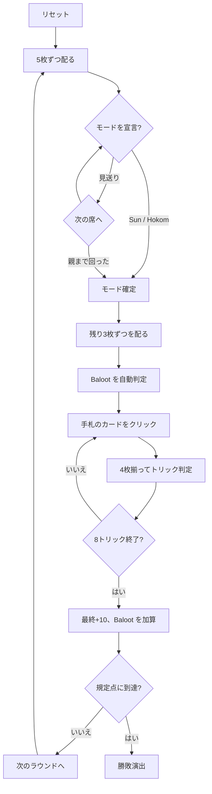

# バルート（Web版）遊び方

## ゲーム概要

サウジアラビアをはじめ湾岸諸国で最も遊ばれているトリックテイキング。フランスのベロートから派生した**2対2のパートナー戦**で、向かい合う席が味方。32枚を4人に8枚ずつ配ります。**宣言したモードによって札の序列そのものが入れ替わる**のがこのゲームの肝で、切り札なしの **Sun** と切り札ありの **Hokom** では、同じ32枚が2通りの強さと2通りの点数表を持ちます。

## 起動方法

```sh
go run ./cmd/trumpcards web  # CLI経由でWebサーバーを起動
go run ./cmd/server          # 直接Webサーバーを起動
```

ブラウザで `http://localhost:8080` にアクセスし、ナビゲーションバーから「バルート」を選択します。
ナビバーのJA/ENボタンで日本語・英語を切り替えられます。

## ルール

- **32枚**（A,7〜K × 4スート）、**4人2対2**（向かい合う席が味方）
- **配りは2段構え**: 5枚ずつ配ってモードを宣言し、決まってから残り3枚ずつを配る。5×4 + 3×4 = 32 で全員8枚
- 親の左隣から順に Sun / Hokom / パスを宣言。**親は見送れません**
- **Sun（切り札なし）**: 全スート A=11 > 10=10 > K=4 > Q=3 > J=2 > 9,8,7=0。合計**120点**
- **Hokom（切り札あり）**: 切り札だけ **J=20 > 9=14 > A=11 > 10=10 > K=4 > Q=3 > 8,7=0**、非切り札は Sun と同じ。合計**152点**
- どちらも**最終トリックに+10点**（Sun 130 / Hokom 162）
- **Baloot**（切り札の K+Q を同じ手に）=20点。**Hokom のときだけ**成立
- 規定点（既定152点）に先に達したチームの勝ち

## ゲームの流れ



## 画面の操作方法

| 操作 | 説明 |
|------|------|
| Sunボタン | 切り札なしを宣言する（宣言中のみ） |
| Hokomボタン（♠♣♥♦の4つ） | そのスートを切り札として宣言する（宣言中のみ） |
| 見送るボタン | 宣言を見送る（**親のときは表示されません**） |
| 手札のカードをクリック | そのカードを出す（出せる札だけ押せます） |
| 次のラウンドへボタン | ラウンド終了後、次のラウンドを配る |
| ヒントボタン | 宣言すべきモード、または打つべき札を提示する |
| ギブアップボタン | 投了する |
| リセットボタン | 確認ダイアログのうえで最初からやり直す |
| CLI トグル | 同じゲームをコマンド入力で操作するモードに切り替える |

## 画面構成

- **上部**: ラウンド数、トリック数、目標点、チーム得点
- **モード帯**: 宣言されたモードと、**そのモードで有効な序列だけ**。同じ札の強さがラウンドごとに変わるため、どちらが効いているかを毎回明示します
- **中央上**: 各プレイヤーのチーム番号（**T0があなたの味方**）と Baloot の有無。**相手の Baloot は「不明」**のままで、その席が切り札の K か Q を出した時点（またはラウンド終了）で判明します
- **中央**: 現在のトリック
- **下部**: 自分の手札。**フォロー義務を満たす札だけ**に印が付きます

## 遊び方のコツ

- **Sun か Hokom かは「厚みの形」で決める。** A と 10 が散らばっているなら Sun、1スートに J・9・A が固まっているなら Hokom
- **Hokom の J と 9 を数える。** この2枚で34点、1ラウンドの2割強
- **Sun では J と 9 はただの弱い札。** 同じ札の価値がモードで反転します
- **自分が親なら見送れない。** 長いスートを Hokom に選ぶのが無難です
- **味方が勝っているトリックには点を乗せる。** A(11)や10(10)を投げ込む
- **Baloot は Hokom 限定。** Sun を宣言したら切り札の K+Q でも 20点は付きません
