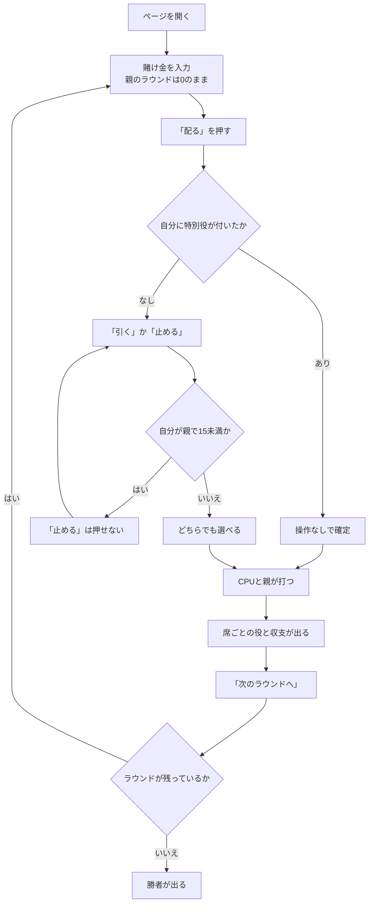

# バンラック（Web版）遊び方

## ゲーム概要

バンラック（チャイニーズ・ブラックジャック）は、シンガポールやマレーシアの旧正月に定番のカードゲームです。合計 21 を目指す点はブラックジャックと同じですが、**強さを決めるのは合計値だけではありません**。

**枚数が役を決めます。** A が 2 枚なら合計は 12 ですが、これが最強の役「バンバン」です。配られた 2 枚で 21 なら「バンラック」、5 枚で 21 以下なら「ファイブドラゴン」。**5 枚の 16 が 2 枚の 20 に勝ちます。**

もうひとつの柱が**親の義務**です。親は合計が 15 未満の間、止まることができません。子は何点でも自由に止められます。この不公平が、全員をまとめて相手にできる親の有利さを打ち消しています。

## 起動方法

```sh
go run ./cmd/trumpcards web  # CLI経由でWebサーバーを起動
go run ./cmd/server          # 直接Webサーバーを起動
```

サーバ起動後、ブラウザで `http://localhost:8080/banluck` を開きます。

## ルール

- 標準 52 枚。2〜6 席（既定 4 席）で、席 0 があなた、残りは CPU です。
- 各ラウンド、子は賭け金を置きます。**親は賭けません**。
- 全席に 2 枚ずつ配ります。A は 1 でも 11 でも数えられ、絵札は 10 です。
- 役は強い順に **バンバン**（A + A）> **バンラック**（2 枚で 21）> **ファイブドラゴン**（5 枚で 21 以下）> **通常** > **バスト**。
- **配られた時点で特別役が付いた席は、そのまま確定**です。操作は求められません。
- **親は 15 未満では止まれません。** 子にこの義務はありません。
- **親は最後に打ちます。**
- 手札は 5 枚が上限です。
- 勝敗は各席と親の一騎討ちで、**倍率は勝った側の役**で決まります（バンバン 3 倍 / バンラック 2 倍 / ファイブドラゴン 2 倍 / 通常 1 倍）。
- 特別役同士は引き分け、通常の手同士は合計で比べ、同点は引き分けです。
- **自分がバストしていたら、親が後でバストしても負け**です。
- **特別役で親を破った席が次の親**になります。居なければ次の席へ回ります。
- 既定のラウンド数を終えるか、チップの残る席が 2 未満になったら終了し、チップ最多の席の勝ちです。

## ゲームの流れ



## 画面の操作方法

| 操作 | 説明 |
|------|------|
| 賭け金入力 | 10〜500 で指定します。**親のラウンドは 0 のまま**で構いません |
| 「配る」 | 賭け金を確定して配ります |
| 「引く」 | 1枚引きます |
| 「止める」 | 打ち止めにします。**自分が親で 15 未満のときは押せません** |
| 「次のラウンドへ」 | 決着後、次のラウンドを始めます |
| ヒントボタン | いまの場面の定石を表示します |
| 棋譜ボタン | これまでの行動ログを表示します |
| リセットボタン | ゲームを最初からやり直します |

**親の義務も、いま誰が親かも、サーバが決めています。** 画面はその値に従うだけなので、止まれない場面ではボタンが押せません。

## 画面構成

- **フェーズ表示**: `BET`（賭け）/ `PLAY`（プレイ）/ `ROUND END`（決着）/ `GAME END`（終了）
- **ラウンド表示**: `ラウンド 4 / 12` の形で、いま何ラウンド目かと**全体のラウンド数**を出します（CUI と同じ形式）
- **親の表示**: いま親の席。ラウンドごとに移ります
- **義務の案内**: 自分が親で 15 未満のときだけ出ます
- **席の一覧**: 名前・チップ・賭け金・手札・合計。操作中の席が強調されます
- **決着**: 席ごとの役とそのラウンドの収支
- **勝者**: 最終ラウンドの後に表示されます

## 遊び方のコツ

- **親のときは慎重に。** 15 未満で止まれないので、13〜14 は引かされてバストしやすい形です。15 以上まで来れば、子の結果を見てから止められます。
- **子のときは低い点でも止まれます。** 親が 15 未満から引かされてバストするのを待つ、という選択が常にあります。
- **4 枚で 21 以下まで来たら、もう 1 枚引く価値があります。** ファイブドラゴンになれば合計に関係なく通常の手に勝てます。
- **A が 2 枚来たら動きません。** バンバンは最強の役で、操作自体を求められません。
