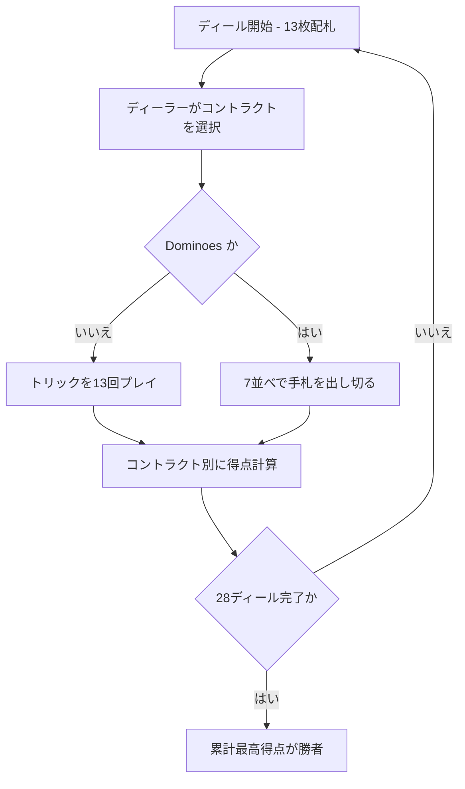

# バルブ（Web版）遊び方

## ゲーム概要

Barbu（バルブ／ひげおじさん）はフランス発祥のコンペンディウム型トリックテイキングゲームです。4 人・52 枚デッキでプレイし、各プレイヤーが順番にディーラーを務めて計 28 ディールを行います。ディーラーは 7 つのコントラクト（ミニゲーム）から毎回 1 つを選び、異なる得点ルールでプレイします。28 ディール終了時に累計得点が最も高いプレイヤーが勝者です。

## 起動方法

```sh
go run ./cmd/trumpcards web  # CLI経由でWebサーバーを起動
go run ./cmd/server          # 直接Webサーバーを起動
```

ブラウザで `http://localhost:8080` にアクセスし、ナビゲーションバーから「バルブ」を選択します。
ナビバーのJA/ENボタンで日本語・英語を切り替えられます。

## ルール

- プレイ人数: 4 人（あなた + CPU 3 人）。各プレイヤーに 13 枚配ります。
- 計 28 ディール。各プレイヤーがディーラーを 7 回務め、7 つのコントラクトを 1 回ずつ選びます。
- コントラクトと得点:
  1. **No Tricks** — 取ったトリック 1 つにつき −2。
  2. **No Hearts** — 取ったハート 1 枚につき −2。
  3. **No Queens** — 取った Q 1 枚につき −6。
  4. **Barbu** — K♥ を取ったプレイヤーが −20。
  5. **No Last Trick** — 最後のトリックを取ると −20。
  6. **Trumps** — 宣言者が切り札を決め、取ったトリック 1 つにつき +5。
  7. **Dominoes** — 7 並べ。早く上がるほど高得点。
- トリック系ではフォロースート（リードスートに従う義務）があります。

## ゲームの流れ



## 画面の操作方法

- **コントラクト選択**: あなたがディーラーのとき、7 つのコントラクトボタンから 1 つを選びます（使用済みは無効）。Trumps を選ぶと切り札スートのボタンが表示されます。
- **カードを出す**: 手札のカードをクリックして選択し、「出す」ボタンを押します。**フォロー義務で出せない札は薄く表示されて選べません**（判定はサーバー側のルールそのままです）。Dominoes では従来どおり場に付けられる札だけが選べます。
- **パス**: Dominoes で出せるカードがないときは「パス」ボタンが有効になります。
- **次のディール**: ディール終了後に「次のディール」ボタンで進みます。
- **設定**: CPU 難易度を変更できます。ヒント表示の ON/OFF も切り替えられます。
- **リセット**: 「リセット」ボタンで最初からやり直せます。

## 画面構成

- **上部**: ディール番号・ディーラー・現在のコントラクト（切り札）を表示。
- **中央上**: CPU 3 人の手札枚数・トリック数・累計得点。
- **中央**: コントラクト選択ボタン、またはトリック / 7 並べの場。
- **中央下**: あなたの手札（クリックで選択。Dominoes では出せないカードは淡色）。
- **下部**: 設定パネルと操作ボタン（出す / パス / 次のディール / リセット / ログ）。

## 遊び方のコツ

- ディーラーのときは手札に合った安全なコントラクトを早めに消化しましょう。
- 高ランク・長いスートが揃ったら Trumps で加点を狙えます。
- 負のコントラクトでは低いカードでトリックを避け、危険札（K♥・Q）はボイドで捨てます。
- Dominoes では端（A・K に近い）のカードを優先して出すと早く上がれます。
