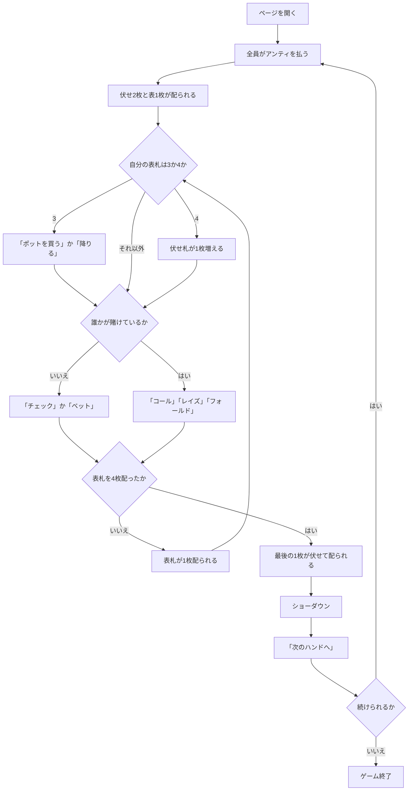

# ベースボールポーカー（Web版）遊び方

## ゲーム概要

ベースボールポーカーは、アメリカのホームポーカーで遊ばれるセブンカードスタッドのバリアントです。野球にちなんだ 2 つの名物ルールを持ちます。

1. **3 と 9 はいつでもワイルド。** 山に 8 枚あるので、役の相場がまるごと上がります。
2. **表向きに配られた札でイベントが起きます。**
   - **表の 4** … 伏せ札を 1 枚もらえます
   - **表の 3** … その時点のポットを払って続けるか、その場で降りるかを迫られます

**同じ 3 が「嬉しい札」と「請求書」の両方になります。** 違うのは札ではなく、**どちら向きに配られたか**です。

## 起動方法

```sh
go run ./cmd/trumpcards web  # CLI経由でWebサーバーを起動
go run ./cmd/server          # 直接Webサーバーを起動
```

サーバ起動後、ブラウザで `http://localhost:8080/baseballpoker` を開きます。

## ルール

- 標準 52 枚。2〜6 席（既定 4 席）で、席 0 があなた、残りは CPU です。
- 開始時に全員がアンティ（既定 10）を払います。
- 配り方はセブンカードスタッドと同じです。伏せ 2 枚 + 表 1 枚 → 表 1 枚ずつ 3 回 → 最後に伏せ 1 枚。
- **表札を配るたびにベットラウンド**が入ります（計 4 回）。**レイズは 1 ラウンド 3 回まで**です。
- **表の 4 が配られた席**は伏せ札を 1 枚受け取ります。手札が 8 枚以上になる席が出ます。
- **表の 3 が配られた席**は「ポットを買う」か「降りる」かを選びます。
  - **払う額は迫られた時点のポットで固定**です。
  - チップが足りなければ、あるだけ払う（実質オールイン）扱いです。
- ショーダウンでは、**手札全部から最良の 5 枚**を作って比べます。3 と 9 は好きな札として使えます。
- いちばん強い役の席がポットを取ります。同じ役なら山分けし、端数は若い席から配ります。
- チップが尽きた席は脱落し、あなたが賭けられなくなるか、残り 1 席になったら終了です。

## ゲームの流れ



## 画面の操作方法

| 操作 | 説明 |
|------|------|
| 「チェック」 | 賭けずに次へ。誰も賭けていないときだけ押せます |
| 「コール」 | 現在の賭け額に合わせます。必要額が表示されます |
| 「ベット」＋額入力 | 誰も賭けていないときに賭けます |
| 「レイズ」＋額入力 | 上乗せします。**1ラウンド3回まで**で、上限に達すると押せません |
| 「フォールド」 | 降ります |
| 「ポットを買う」 | 表の3が出たとき、表示された額を払って続けます |
| 「買わずに降りる」 | 表の3が出たとき、払わずに降ります |
| 「次のハンドへ」 | ショーダウン後、次のハンドを始めます |
| ヒントボタン | いまの場面の定石を表示します |
| 棋譜ボタン | これまでの行動ログを表示します |
| リセットボタン | ゲームを最初からやり直します |

**押せる手はサーバが決めています。** チェックできるか、レイズが残っているか、買い増しの返事を求められているかは場況で変わるので、押せないときはボタンが出ません。

## 画面構成

- **フェーズ表示**: `BETTING` / `BUY THE POT`（買い増しの返事待ち）/ `SHOWDOWN` / `GAME END`
- **ストリート表示**: 表札を何枚配り終えたか。残りの回数だけベットラウンドがあります
- **ワイルドの印**: 3 と 9 には印が付きます。**印も上の説明文もサーバが送る値から作っている**ので、規則を変えても片方だけ古くなりません
- **自分の手札**: 伏せ札も含めて全部見えます
- **CPU の席**: **表札は見えています**（スタッドの読み合いの材料です）。伏せ札だけが裏向きのままです
- **追加札の印**: 表の 4 でもらった枚数が席ごとに出ます
- **ポット**と**コールに必要な額**、買い増し中は**払う額**
- **ショーダウン**: 全員の手札、選ばれた最良の 5 枚、獲得額、ワイルドを使ったか

## 遊び方のコツ

- **相手の表札を読んでください。** 伏せ札は隠れていますが、表札は全員ぶん見えています。相手の表に 3 や 9 が並んでいたら、その席の役はあなたの想像より上です。
- **ワイルドが 8 枚あるぶん、相場が上がります。** ツーペアは、このゲームでは強い手ではありません。
- **表の 3 は諸刃です。** ワイルドは増えますが、その場でポットぶんの支払いを迫られます。**ポットが小さいうちなら安く買えます。**
- **買い増しの請求額は迫られた時点で決まります。** 後の席が買い増しても、あなたが払う額は増えません。
- **追加札をもらった席は手札が 1 枚多い**ことを忘れずに。
