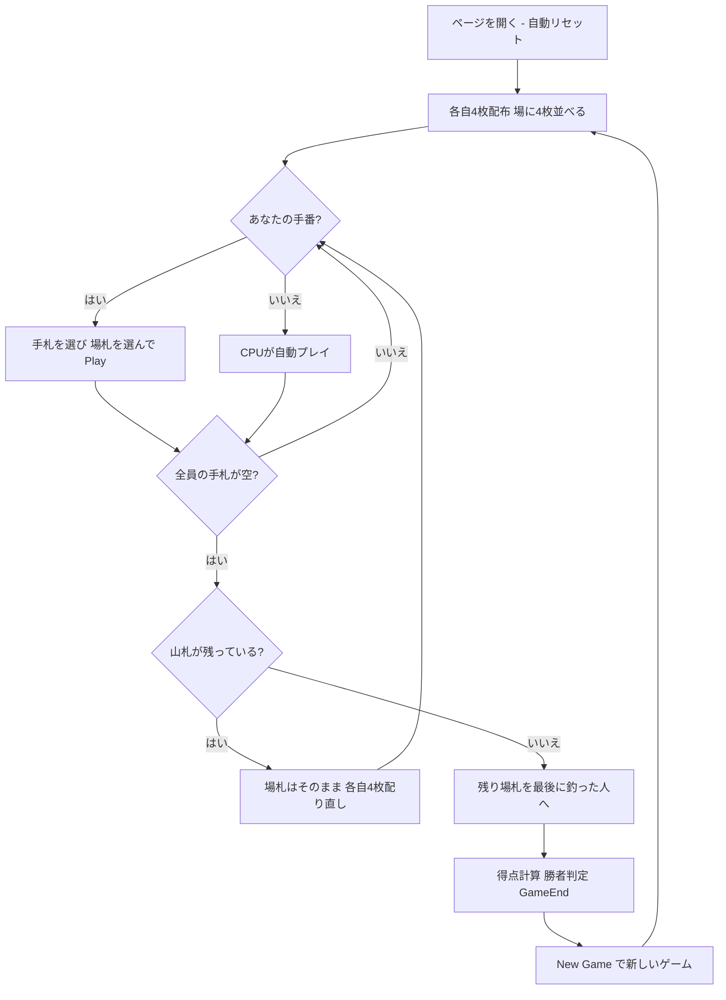

# バスラ（Web版）遊び方

## ゲーム概要

Basra（バスラ / Bastra）は、エジプトやレバント地方（シリア・レバノンなど）で親しまれている**フィッシング（釣り）系のカードゲーム**です。本実装は 4 人（あなた＝席0＋CPU3人）で個人戦としてプレイします。各プレイヤーは手札を 1 枚ずつ出し、**場札（テーブルの表向きの札）を釣り上げて（capture）**取り札を増やします。数札は**同じランク**や**合計値が一致する組み合わせ**をまとめて取れ、ジャック（J）は場を一掃します。1 枚の非ジャック札で場札を全て取り切ると **"Basra"（バスラ）** となり大きなボーナスになります。山札を配り切った後、取り札の内容で得点を計算し、最も高いプレイヤーが勝ちます。

## 起動方法

```sh
go run ./cmd/trumpcards web        # REST API + Web GUI サーバを起動
go run ./cmd/trumpcards web --open # 起動してブラウザを開く
```

ブラウザで `/basra` にアクセスします。ナビバーの JA/EN ボタンで日本語・英語を切り替えられます。

## ルール

### デッキと配布

- **デッキ**: 標準52枚（A〜K × 4スート）。
- **プレイヤー**: 4人（あなた = 席0、CPU1〜3）。それぞれ個人で得点を競います。
- **配布**: 各プレイヤーに **4枚**、さらに場（テーブル）に **4枚**を表向きに並べます。

### 手番と釣り（capture）

- 自分の手番では手札から **1枚**を出します。Web では手札を 1 枚選び、任意で場札を選んで「Play」します。
- **数札（A=1〜10）**: 場札のうち、**同じランク**の札、および**合計値が出した札の値と一致する組み合わせ**を**まとめて**取れます（複数グループ同時取り可）。
- **Q・K**: **同じランクの札とのマッチのみ**で取れます。
- **ジャック（J）**: **他のジャックを除くすべての場札**を一掃して取ります（スイープ）。
- **釣れない場合**: 出した札はそのまま**場に残ります（トレイル）**。

### バスラ（Basra）

- **ジャック以外の1枚**で場札を**すべて取り切った**とき、**Basra（+10点）**のボーナスになります。
- **ジャックのスイープは Basra ではありません**。

### ラウンド進行と札切れ

- 全員の手札がなくなると、**場札は追加せず**、山札から改めて**各自4枚ずつ配り直します**。これを**山札が尽きるまで**繰り返します。
- 最後に場に残った札は、**最後に釣りを行ったプレイヤー**が取ります。

### 得点計算（ゲーム終了時）

- 取った札が最も多いプレイヤー（単独）= **+3**
- ダイヤの7（7♦）= **+3**、ダイヤの10（10♦）= **+2**
- エース（A）1枚につき **+1**
- Basra 1回につき **+10**
- 合計点が最も高いプレイヤーが勝ち（同点なら複数人が勝者）。目標点レースはなく、「New Game」で新しいゲームを最初から始めます。

## ゲームの流れ



## 画面の操作方法

- **手札の選択**: 手札から出す札を **1枚**選びます。
- **場札の選択**: 釣り取りたい場札を選びます（任意）。何も選ばなければトレイル（場に残す）、ジャックは選択に関わらず場を一掃します。
- **プレイ**: 「Play」ボタンでカードを出して釣ります。
- **ゲーム終了時**: 「New Game」ボタンで新しいゲームを始めます。
- **その他**: 難易度セレクタで CPU の強さを選び、ヒントをONにすると推奨アクション（出す札・釣る場札）が表示されます。

### キーボードショートカット

| キー | アクション | 有効条件 |
|------|-----------|---------|
| `Enter` | 次へ進む（New Game） | ゲーム終了表示中 |
| `R` | リセット | 常時 |

## 画面構成

```
┌────────────────────────────────────────────┐
│ Basra (バスラ)   Phase = Play   Deck 32     │ ← ヘッダー
├──────────────┬─────────────────────────────┤
│ P1 (CPU)     │                             │
│ Captured 4   │      場札（Table）           │
│ P2 (CPU)     │   ♠7  ♥3  ♦A  ♣10           │
│ Captured 2   │                             │
│ P3 (CPU)     │   （選んで釣り取る）          │
│ Captured 0   │                             │
├──────────────┴─────────────────────────────┤
│ あなたの手札（1枚選択）                       │ ← フッター
│ [♠10][♥3][♠K][♦J]  [Play][New Game]        │
└────────────────────────────────────────────┘
```

- **ヘッダー**: ゲーム名・フェーズ表示（Play / GameEnd）・山札残り・CLI 切り替え。
- **情報サイドバー**: 各プレイヤーの取り札枚数（Captured）・Basra 回数。
- **中央**: 場札（テーブル）。釣り取る札を選択します。
- **フッター**: あなたの手札（1枚選択）・アクションボタン（Play / New Game / Reset）。

## 遊び方のコツ

- 数札は同じランクだけでなく、合計値が一致する複数枚をまとめて取れます。複数グループの同時取りで一気に稼ぎましょう。
- 場札が少ないときは、非ジャックの 1 枚で全て取り切って **Basra（+10）** を狙いましょう。
- ジャックはいつでも場を一掃できます（Basra にはなりません）。相手に取られそうな場札の回収に有効です。
- 7♦（+3）、10♦（+2）、各エース（+1）、取り札の総数（最多で +3）が得点源です。これらを含む場札は優先的に釣りましょう。
- ヒント（設定でON）は、出す札と釣る場札の推奨を提示します。慣れないうちは難易度 Easy から始めましょう。
