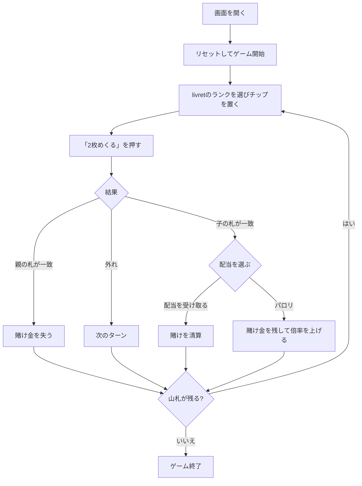

# バセット（Web版）遊び方

## ゲーム概要

バセットは17世紀のヴェネツィアやフランス宮廷で流行した銀行ゲームで、ファロの先祖にあたります。13ランクの livret にチップを置き、銀行の2枚の札のうち2枚目が一致したときに勝ちます。

## 起動方法

```sh
go run ./cmd/trumpcards web
go run ./cmd/server
```

ブラウザで `http://localhost:8080` にアクセスし、ナビゲーションバーから「バセット」を選択します。ナビバーのJA/ENボタンで日本語・英語を切り替えられます。

## ルール

1. 13ランクの livret からランクを選び、チップを張ります。
2. 銀行が2枚をめくります。1枚目（親の札）が賭けたランクと一致すると親の総取りで負け、2枚目（子の札）が一致すると勝ちです。
3. 勝った後は「配当を受け取る」か「パロリ」を選びます。パロリは賭け金を残し、倍率を **1 → 7 → 15 → 33 → 67** と上げます。倍率を上げた先で1枚目に当たると、積み上げた分ごと失います。

的中後に降りるか続けるかを毎回選べることが、ファロとの大きな違いです。山札が尽きるまでプレイします。

## ゲームの流れ



## 画面の操作方法

### ベットフェーズ

- livret の13ランクからランクをタップし、ベット額を指定して「賭ける」を押します。
- チップ、ターン数、山札の残り枚数、現在のベット段階を確認できます。

### ターンフェーズ

- 「2枚めくる」で親の札と子の札を公開します。親の札が先、子の札が後です。

### 的中後の選択

- 子の札が一致したら「配当を受け取る」または「パロリ」を押します。パロリを選ぶと、賭け金を残したまま次の倍率に進みます。

### ラウンド終了

- 山札が尽きるとラウンドが終了します。表示された「次のディール」で次へ進み、「リセット」で新しいゲームを始められます。

## 画面構成

```
┌────────────────────────────────────────────┐
│  バセット       チップ / ターン / 残り枚数     │
├────────────────────────────────────────────┤
│  livret（A 2 3 4 5 6 7 8 9 10 J Q K）        │
│  選択中のランク・ベット額・paroli 段階          │
├────────────────────────────────────────────┤
│  親の札                  子の札                 │
│  メッセージ / 直前の結果                       │
├────────────────────────────────────────────┤
│  [賭ける] [2枚めくる] [配当を受け取る] [パロリ] │
│  [次のディール] [リセット]                     │
└────────────────────────────────────────────┘
```

## 遊び方のコツ

- 的中したら、確実に配当を受け取るか、パロリで大きな倍率を狙うかを選びます。
- パロリを続けるほど、次に親の札が一致した場合の損失も大きくなります。
