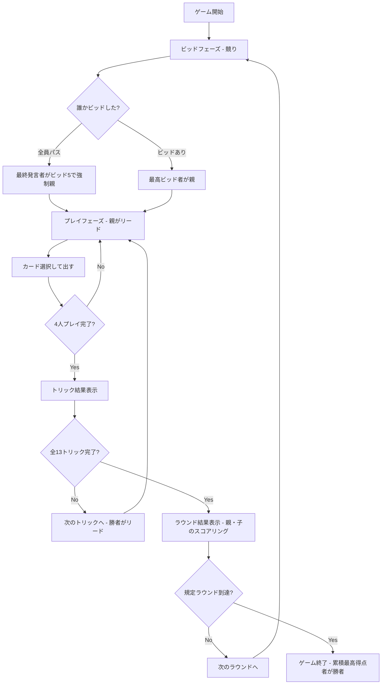

# バタック（Web版）遊び方

## ゲーム概要

Batak（バタック）はトルコを中心に広く親しまれている 4 人プレイのトリックテイキングゲームです。スペードが常時切り札（トランプ）ですが、全員がビッドを行うのではなく、**競り（オークション）で最高額を宣言した 1 人だけが「親（デクレアラー）」**となり、親と子で非対称な得点ルールで勝負します。標準では 5 ラウンド固定で対戦し、累積スコアが最も高いプレイヤーが勝者となります。

## 起動方法

```sh
go run ./cmd/trumpcards web  # CLI経由でWebサーバーを起動
go run ./cmd/server          # 直接Webサーバーを起動
```

ブラウザで `http://localhost:8080` にアクセスし、ナビゲーションバーから「バタック」を選択します。
ナビバーのJA/ENボタンで日本語・英語を切り替えられます。

## ルール

### 基本ルール

- 4 人プレイ（人間 1 + CPU 3）、52 枚デッキから各 13 枚配られます。
- **スペードが常に切り札（トランプ）**です。
- **ビッドフェーズ（競り）**:
  - 時計回りに各プレイヤーが 1 回ずつ宣言します。
  - 宣言できる値は **5〜13**、または **パス（0）** です。
  - ビッドを行う場合は、現在の最高ビッドより厳密に大きい値を宣言する必要があります。
  - 最高ビッドを宣言した 1 人が**親（デクレアラー）**となります。
  - **全員がパスした場合**: 最後に発言した席が最低額の 5 で強制的に親になります。
- **プレイフェーズ**:
  - **第 1 トリックのリードは親**が行います。
  - **マストフォロー**: リードスートのカードを持っていれば、必ずそのスートを出さなければなりません。
  - **マストトランプ**: リードスートを持たない（ボイド）場合、**スペードを持っていれば必ずスペードで切らなければなりません**。スペードも持たない場合のみ、任意のカードを捨てることができます。
  - **スペードブレイク**: スペードがまだ場に出ていない（ブレイクされていない）間は、手札にスペード以外のカードがある限りスペードでリードすることはできません。
  - トリックの勝者は、最も強いスペードを出したプレイヤー、スペードが出ていなければリードスートの最も強いカードを出したプレイヤーです（強さは A > K > Q > J > 10 > ... > 2）。
  - トリック勝者が次のトリックをリードします。全 13 トリック行います。

### 得点計算

得点は**素の整数**で計算されます（小数や内部 ×10 などのスケールはありません。また、バッグのペナルティもありません）。

- **親（デクレアラー）**:
  - 獲得トリック数 ≥ ビッド数の場合: **+ビッド数**（例: ビッド 5 で 6 トリック獲得 → +5 点）
  - 獲得トリック数 < ビッド数の場合: **-ビッド数**（例: ビッド 5 で 4 トリック獲得 → -5 点）
- **子（ディフェンダー）**:
  - **獲得したトリック数がそのまま加点**されます（例: 3 トリック獲得 → +3 点）。ビッド達成／未達の成否判定はありません。

### ゲーム終了

- 設定されたラウンド数（標準 5 ラウンド）終了時に累積スコアが最も高いプレイヤーが勝者となります。

## ゲームの流れ



## 画面の操作方法

- **ビッド入力**: ビッド手番時、有効なビッド値（現在の最高ビッドを超える 5〜13）を選択して「ビッド」ボタンを押すか、「パス」ボタンを押します。
- **カードを出す**: 手札カードをタップ/クリックで選択し、「出す」ボタンで確定。ルール上出せないカード (リードスートを持っているのに違反、ボイドでスペードを切らない、など) は薄く表示され押せない状態となり、ツールチップで理由が示される。
- **次のトリック / 次のラウンド**: トリック/ラウンド終了時に表示されるボタンで次へ進む。
- **設定**: 上部の設定パネルで CPU 難易度と総ラウンド数を変更できる。変更を反映するにはゲームのリセットが必要。
- **CLI モード**: 右上の CLI トグルでターミナル風 UI に切替可能。

## 画面構成

- **ヘッダー**: ゲーム名、現在フェーズ、設定、CLI トグル、リセットボタン。
- **メインエリア (左)**: 現在のトリック表示。親や各プレイヤーが出したカードが順に並ぶ。
- **メインエリア (右)**: 各プレイヤーの状況（親マーク、手札枚数、ビッド値、獲得トリック数、ラウンドスコア、累積スコア）、スコア表、ラウンドスコアアナウンス。
- **フッター**: あなたの手札 (横スクロール対応)、アクションボタン (ビッド/パス/出す/次へ/リセット)。

## 遊び方のコツ

- **競りの見極め**: 親は達成すれば +bid 点ですが、失敗すると -bid 点の大きな減点になります。強い絵札やスペードの枚数が十分にあるときに競り勝ちましょう。
- **子としての得点積み上げ**: 子はリスクなく獲得したトリック数がそのまま加点されます。親のビッド阻止だけでなく、着実に自分のトリックを稼ぎましょう。
- **マストトランプの強制**: ボイドかつスペードを持つプレイヤーはスペードを出さなければならないため、相手のボイドを利用して切り札を削るなどの駆け引きが重要です。
