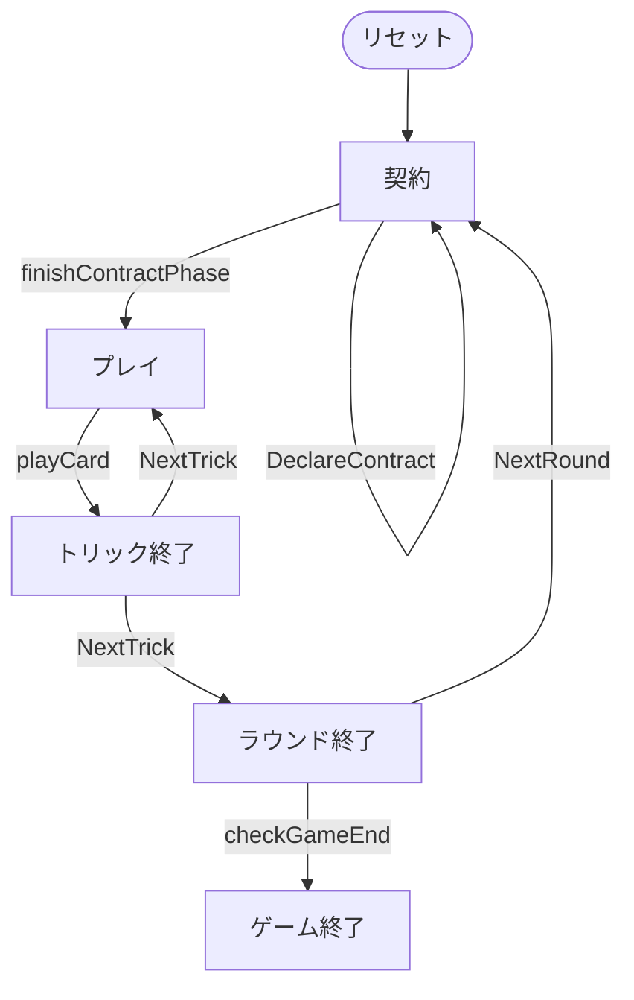

# バウエルンシュナプセン（Web版）遊び方

## ゲーム概要

Bauernschnapsen（バウエルンシュナプセン）はオーストリアの伝統的なトリックテイキングゲームで、シュナプセン（66）の系統に属します。20枚デッキ（A,10,K,Q,J × 4スート）を使う4人2チーム制です。**カードは20枚すべてを配り切る**ため山札は無く、**最初のトリックからフォロー義務**があります。各ラウンドはまず契約（通常 / 同スート縛り / ベテル）の宣言から始まり、宣言した契約を達成できたかで点が動きます。先に24点に達したチームが勝利します。Web版では3つのCPUと自動的に組み合わせられ、ボタン操作でプレイできます。

## 起動方法

```sh
go run ./cmd/trumpcards web  # CLI経由でWebサーバーを起動
go run ./cmd/server          # 直接Webサーバーを起動
```

ブラウザで `http://localhost:8080` にアクセスし、ナビゲーションバーから「バウエルンシュナプセン」を選択します。
ナビバーのJA/ENボタンで日本語・英語を切り替えられます。

## ルール

### 基本ルール

- プレイヤーは4人（人間1 + CPU3）。プレイヤー0と2、プレイヤー1と3が同チーム（人間はプレイヤー0）。
- 20枚デッキ（A,10,K,Q,J × 4スート）を使用。各プレイヤーに5枚ずつ配って**配り切る**。山札も表向きの切り札表示カードもありません。
- 山札が無いので**第1トリックからフォロー義務**（マストフォロー）があります。出せない札は淡く表示され、押せません。

### 契約の宣言

ラウンドの最初にディーラーの左隣から順に、各席が1回ずつ宣言します。一番高い契約が採用され、それを宣言した席が「宣言者」になります。

| 契約 | 内容 | 点 |
|------|------|----|
| パス | 宣言しない | — |
| 通常（Rufer） | 切り札スートを指定し、自チームがカード点の過半（61点以上）を取る | 2 |
| 同スート縛り（Farbenzwang） | 切り札スートを指定し、**相手に1トリックも渡さない** | 6 |
| ベテル（Bettel） | **切り札なし**で、**宣言者自身が1トリックも取らない** | 5 |

全員がパスした場合は、ディーラーの左隣が手札で一番枚数の多いスートを切り札にして通常契約を行います。ベテルでは宣言者が第1トリックをリードします。

### マリッジ

リード時に同一スートの K+Q を持っていれば「マリッジ」を宣言し、自チームに20点（切り札なら40点）を加算できます。この点は通常契約の「61点以上」の判定に効きます。**ベテルでは宣言できません**（切り札が無く、トリックを取らない契約なので意味を持ちません）。

### カード点とトリックの強さ

- カード点: A=11, 10=10, K=4, Q=3, J=2（1ラウンドの合計は120点）
- トリックの強さ: A > 10 > K > Q > J

### 勝敗

**カード点そのものではなく契約の点**が加算されます。宣言した契約を達成すれば宣言側チームがその点を得て、落とせば同じ点が相手チームに入ります。先に24点（変更可）に達したチームが勝利します。

## ゲームの流れ

ゲームの進行は `internal/domain/Bauernschnapsen.go` のフェーズ機械そのものです。各ノードは同ファイルの `BauernschnapsenPhase` 定数、矢印ラベルはその遷移を行うメソッド名です。



## 画面の操作方法

- ラウンドの最初は契約フェーズです。「パス」「通常 ♠/♣/♥/♦」「同スート縛り ♠/♣/♥/♦」「ベテル」のボタンから宣言します。
- 自分の手番では、出すカードを選択して「出す」でプレイします。**フォロー義務があるため、出せない札は淡く表示されて押せません。**
- 同一スートの K+Q を持ってリードする場面では、対象カードを選ぶと「マリッジ」ボタンが表示され、宣言できます（ベテルを除く）。
- トリック終了後は「次のトリック」、ラウンド終了後は「次のラウンド」ボタンで進めます。
- 「ヒント」ボタンで推奨手を確認できます。ベテルの宣言者には「トリックを取らない札」が推奨されます。

## 画面構成

上から順に、ページのコンポーネント構成そのままの並びです。

```
┌──────────────────────────────────────────────────┐
│  バウエルンシュナプセン                          │
│  ラウンド: 1  トリック: 1  切り札: ♠             │
│  契約: 通常 (CPU 1)                              │
├──────────────────────────────────────────────────┤
│  設定パネル（CPU難易度・目標点など）             │
├──────────────────────────────────────────────────┤
│  CPUプレイヤーの情報（チーム・残り手札・獲得トリック）
├──────────────────────────────────────────────────┤
│  場（現在のトリック）                            │
│    CPU1 [♠A]   CPU2 [♠10]   CPU3 [♠J]            │
├──────────────────────────────────────────────────┤
│  チームスコア / ラウンド得点アナウンス           │
├──────────────────────────────────────────────────┤
│  メッセージ / ヒント                             │
├──────────────────────────────────────────────────┤
│  棋譜（アクションログ）                          │
├──────────────────────────────────────────────────┤
│  あなたの手札                                    │
│  [♠K][♠Q][♣Q][♣10][♥J]                          │
│  [契約ボタン群（契約フェーズのみ）]              │
│  [出す] [マリッジ] [次のトリック] [ヒント]       │
│  [リセット]                                      │
└──────────────────────────────────────────────────┘
```

- **ヘッダー**: ラウンド数・トリック数・切り札スート
- **契約**: 採用された契約と宣言者。宣言中は「契約: 宣言中」と表示されます
- **CPUプレイヤーの情報**: 各席のチーム・残り手札枚数・獲得トリック数
- **マリッジ宣言**: 同スートの K と Q を持っているときに宣言して加点します（💍 バッジが目印）
- **ラウンド得点アナウンス**: ラウンド終了時の内訳
- **メッセージ / ヒント**: 直前の操作の結果と、ヒントボタンを押したときの推奨手
- **棋譜（アクションログ）**: これまでの手の履歴。折りたたみ式
- **あなたの手札**: 出せるカードだけが押せます。フォロー義務で出せない札は淡く表示されます
- **リセット**: 新しいゲームを開始します
