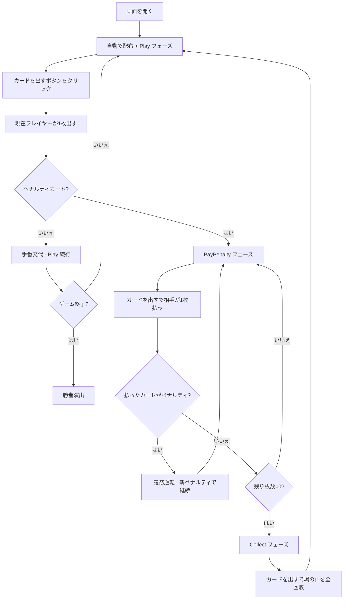

# ビガー・マイ・ネイバー（Web版）遊び方

## ゲーム概要

プレイヤー1人対CPU 1人で遊ぶ、古典的なイギリスの2人用カードゲーム。52枚のデッキを半分ずつに分け、交互に1枚ずつ場の山に出します。J・Q・K・Aのペナルティカードが出ると相手が枚数分のカードを払わなければなりませんが、支払い中に新たなペナルティカードが出ると義務が逆転します。全52枚を集めた方が勝ちです。

## 起動方法

```sh
go run ./cmd/trumpcards web     # CLI経由でWebサーバーを起動
go run ./cmd/server             # 直接Webサーバーを起動
```

ブラウザで `http://localhost:8080` にアクセスし、ナビゲーションバーから「ビガー・マイ・ネイバー」を選択します。ナビバーのJA/ENボタンで日本語・英語を切り替えられます。

## ルール

### 基本ルール

- 52枚のトランプ（ジョーカーなし）を使用
- シャッフル後、26枚ずつプレイヤーとCPUに配布
- 「カードを出す」ボタンで各ターンを進行
- 現在の手番プレイヤーが山札のトップを場の山に表向きに出す
- 数字カード（2〜10）: 手番が相手に移り、通常プレイを続ける
- ペナルティカード: J=1枚、Q=2枚、K=3枚、A=4枚

### ペナルティの連鎖

- ペナルティカードが出ると相手が指定枚数を場の山に支払う
- 支払い中に新たなペナルティカードが出ると、義務が元のプレイヤーに逆転する
- 支払いが完了すると、最後にペナルティカードを出したプレイヤーが場の山を全て回収する

### ゲーム終了

- どちらかが全52枚を保有したら勝利
- 相手が総枚数0になった場合も勝利
- 「最大ラウンド数」設定（既定2000）に達した場合、総枚数の多い側を勝者とする

## ゲームの流れ



## 画面の操作方法

### プレイフェーズ

1. **「カードを出す」ボタン**: 現在の手番プレイヤーが山札のトップを場の山に出す
2. 数字カードなら手番が移り通常プレイが続く
3. ペナルティカードが出たら相手が「カードを出す」で枚数分払う
4. 支払い中にまたペナルティカードが出ると義務が逆転する
5. 支払い完了でペナルティ所有者が「カードを出す」で場の山を全回収
6. **「自動進行」ボタン**: 決着がつくまで自動で進める
7. **「リセット」ボタン**: 現在の設定で新しいゲームを開始
8. **設定パネル**: 最大ラウンド数（10〜50000）を変更可能

## 画面構成

```
┌────────────────────────────────────────────┐
│  CPU 山札/捨札 (残り枚数)                     │
│                                            │
│  場の山エリア: [枚数] [最後のカード]           │
│              残りペナルティ枚数 (支払い中)     │
│                                            │
│  あなた 山札/捨札 (残り枚数)                  │
│                                            │
│  [カードを出す] [自動進行] [リセット]          │
└────────────────────────────────────────────┘
```

- **CPU 山札/捨札**: 画面上部、CPUの残りカード枚数
- **場の山エリア**: 中央、積まれたカード総枚数と最後に出たカード
- **残りペナルティ**: ペナルティ支払い中、残り枚数を表示
- **あなた 山札/捨札**: 画面下部、自分の残りカード枚数
- **操作ボタン**: カードを出す、自動進行、リセット
- **設定パネル**: 最大ラウンド数（10〜50000）

## 遊び方のコツ

- 完全な運ゲームなので戦略はありません。ペナルティ連鎖のドキドキを楽しみましょう
- ペナルティが連続すると場の山が膨らみ、回収したプレイヤーが一気に有利になります
- 長引く場合は「最大ラウンド数」を下げて短期決戦にすることもできます
- 「カードを出す」を1枚ずつ押すのが面倒な場合は「自動進行」で決着まで一気に進められます
