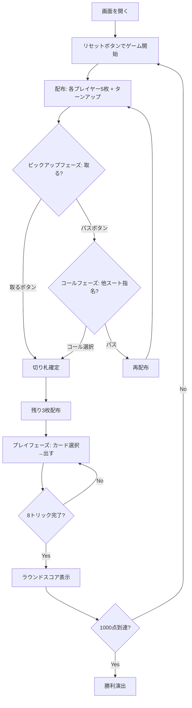

# ベロート（Web版）遊び方

## ゲーム概要

Belote（ベロート）はフランスの国民的トリックテイキングゲームです。32枚デッキを使う4人2チーム制で、切り札のJ（=20点）を最強とする独自の得点体系で先に1000点を取ったチームが勝利します。Web版では3つのCPUと自動的に組み合わせられ、ボタン操作でビッドとプレイができます。

## 起動方法

```sh
go run ./cmd/trumpcards web  # CLI経由でWebサーバーを起動
go run ./cmd/server          # 直接Webサーバーを起動
```

ブラウザで `http://localhost:8080` にアクセスし、ナビゲーションバーから「ベロート」を選択します。
ナビバーのJA/ENボタンで日本語・英語を切り替えられます。

## ルール

### 基本ルール

- 4プレイヤー2チーム制（あなた + パートナー vs CPU2人組）。
- 32枚デッキ（7,8,9,10,J,Q,K,A × 4スート）。
- 各ラウンド8トリック、先に1000点（設定で変更可）に到達したチームが勝利。

### ビッドフェーズ

1. **取る（ピックアップ）**: ターンアップカードのスートを切り札として取るかパスを選びます。
2. 全員パスなら **コール**: ターンアップ以外の3スートを切り札として指名できます。
3. 全員パスならディーラーを1つ右へ移し再配布します。

### カードの強さと得点

- 切り札: J=20, 9=14, A=11, 10=10, K=4, Q=3, 8=0, 7=0
- 非切り札: A=11, 10=10, K=4, Q=3, J=2, 9=0, 8=0, 7=0
- 1ラウンドのカード合計は 152点 + Dix de Der 10点 = 162点。

### プレイ義務

- リードスートを持っていれば必ず出す（フォロースート義務）。
- リードスートを持たないなら切り札があれば必ず出す（obligation à couper）。
- 切り札を出すなら可能な限りオーバートランプする（obligation à monter）。
- パートナーが現在の勝者の場合、切り札義務は免除される。

### スコアと特別ボーナス

- 通常: 取得トリックのカード点合計をチームスコアに加算。
- 最終トリックの勝者に Dix de Der +10。
- K+Q of trumps を両方持つプレイヤーが両方を出すと **Belote/Rebelote +20**。
- メイカーが防衛側より点が低い、または同点（litige）= **dedans**: 防衛チームがメイカーの得点を総取り。
- 全8トリック獲得 = **capot +90**。

## ゲームの流れ



## 画面の操作方法

### ピックアップフェーズ（あなたの番）

- フッターに「取る」「パス」ボタンが表示されます。
- ターンアップカードは画面上部の中央に表示されます。

### コールフェーズ（あなたの番）

- フッターに3つの切り札スート選択ボタンと「パス」ボタンが表示されます。
- ターンアップのスートは選択不可です。

### プレイフェーズ（あなたの番）

- 手札の中からカードを1枚クリックして選択。
- 「出す」ボタンで確定。
- 「ヒント」ボタンでバックエンドAIによるおすすめ手を表示できます。
- フロントエンドヒントを設定でONにすると、選択時に推奨理由をツールチップで表示します。

### トリック終了 / ラウンド終了

- 「次のトリック」「次のラウンド」ボタンで次へ進みます。
- ラウンド終了時はスコア演出が表示されます。

### キーボードショートカット

| キー | アクション | 有効条件 |
|------|-----------|---------|

（ベロート専用ショートカットはありません。共通のESCで設定パネルなどを閉じることができます。）

## 画面構成

```
+--------------------------------------------------+
| NavBar [ベロート]   [JA/EN] [チュートリアル] etc |
+--------------------------------------------------+
| 設定パネル: CPU難易度 / ターゲットスコア /       |
|   ベロート・レベロート / フロントエンドヒント   |
+--------------------------------------------------+
| ラウンド 1 トリック 1  切り札: ♠ スペード        |
| 表向きカード: HEART 11 (ビッド時のみ)            |
+--------------------------------------------------+
| CPU 1 / CPU 2 / CPU 3 (チーム + 残カード数 +     |
|                       獲得トリック数)            |
+--------------------------------------------------+
|                  [現在のトリック]                 |
|             (4方向にプレイされたカード)           |
+--------------------------------------------------+
| チームスコア                                     |
|   チーム0: 245   チーム1: 198                   |
|   ラウンド: 62点  ラウンド: 90点                |
|   ベロート/レベロート +20 (適用時のみ表示)       |
+--------------------------------------------------+
| メッセージ / フロントエンドヒント / 棋譜          |
+--------------------------------------------------+
| あなたの手札 (横並び8枚, クリックで選択)         |
| [取る][パス] or [♠][♣][♦][パス] or [出す]         |
|                  [ヒント] [リセット]              |
+--------------------------------------------------+
```

## 遊び方のコツ

- **取るかの判断**: ターンアップが切り札になった想定で手札を評価。J が含まれれば積極的に取る。
- **コールは確信があるときだけ**: 不利なスートを名乗ると dedans のリスクが高い。
- **オーバートランプ義務を意識**: 切り札を出すなら一番強いのを「必ず」出さなければいけない場面が多い。
- **Belote/Rebelote**: K+Q of trumps を握ったらできるだけ早く順番に出して +20 を確定させる。
- **Dix de Der の取り合い**: 最終トリックで強い切り札を残しておくと逆転チャンスがある。
