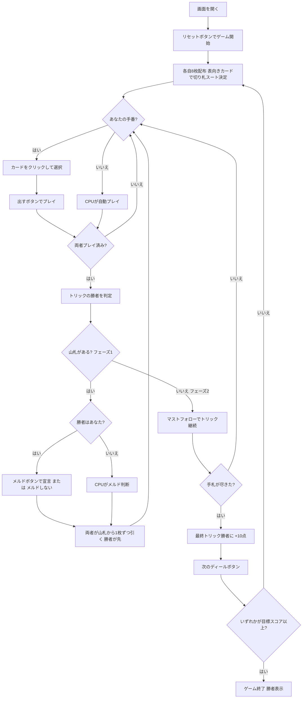

# ベジーク（Web版）遊び方

## ゲーム概要

Bezique（ベジーク）はピノクルの直接の祖先にあたる2人用のフランス系トリックテイキングゲームです。**64枚のデッキ**（A,7,8,9,10,J,Q,K × 4スート × 2セット）を使い、各自8枚を持って戦います。山札がある間（フェーズ1）はトリックに勝つたびに**メルド（役）**を1つ宣言して得点でき、山札が尽きた後（フェーズ2）はマストフォローのトリック戦になります。スコアはディールをまたいで累積し、先に**目標スコア（既定1000点）**へ達したプレイヤーの勝利です。あなたは人間プレイヤーとして CPU と対戦します。

## 起動方法

```sh
go run ./cmd/trumpcards web         # CLI経由でWebサーバーを起動
go run ./cmd/trumpcards web --open  # サーバー起動 + ブラウザを開く
go run ./cmd/server                 # 直接Webサーバーを起動
```

ブラウザで `http://localhost:8080` にアクセスし、ナビゲーションバーから「ベジーク」を選択します。
ナビバーのJA/ENボタンで日本語・英語を切り替えられます。

## ルール

### デッキと配布

- **デッキ**: 64枚（A,7,8,9,10,J,Q,K × 4スート × 2セット）
- **プレイヤー**: 2人（あなた vs CPU）
- **配布**: 各プレイヤー8枚。残りは山札となり、次の1枚を表向きにして**切り札スート**を決めます。

### カードの強さ

- トリック内の強さ（強い順）は A > 10 > K > Q > J > 9 > 8 > 7。
- 切り札はすべての非切り札を上回ります。

### フェーズ1（山札がある間）

- **フォロー義務なし**: リードに対して任意のカードを出せます。
- トリックに勝つと、勝者は**メルドを1つ宣言**して得点できます（または「メルドしない」を選びます）。
- メルド宣言の後、両者が山札から1枚ずつ引きます（勝者が先）。

#### メルド（役）と得点

| メルド | 構成 | 得点 |
|--------|------|------|
| 結婚（Marriage） | 同じスートの K + Q | 20 |
| ロイヤル結婚（Royal Marriage） | 切り札の K + Q | 40 |
| ベジーク（Bezique） | ♠Q + ♦J | 40 |
| フォア・エース | A 4枚 | 100 |
| フォア・キング | K 4枚 | 80 |
| フォア・クイーン | Q 4枚 | 60 |
| フォア・ジャック | J 4枚 | 40 |

### フェーズ2（山札が尽きた後）

- **マストフォロー**: リードスートを持っていれば必ず出し、勝てるなら勝たなければなりません。リードスートを持たない場合は切り札を出します。
- このフェーズでは**メルドは宣言できません**。
- **最終トリック**を取ったプレイヤーに **+10点** が加算されます。

### カードポイント（捕獲点）

A=11、10=10、K=4、Q=3、J=2、9/8/7=0。

### 勝利条件

- メルド得点・カードポイント・最終トリック+10点が累積します。
- スコアはディールをまたいで累積し、先に**目標スコア（既定1000点。古典では1500点）**へ達したプレイヤーの勝ちです。

## ゲームの流れ



## 画面の操作方法

### PLAYフェーズ（トリックフェーズ）

- あなたの手番のとき、手札のカードをクリックして選択します。
- **「出す」ボタン**: 選択したカードをプレイします。フェーズ2ではマストフォロー義務に従う必要があります（義務に反するカードは選択できません）。

### MELDフェーズ（メルド宣言フェーズ）

トリックに勝った直後（フェーズ1のみ）、宣言できるメルドのボタンが表示されます。

- 宣言したいメルドのボタンをクリックすると、そのメルドの得点が加算されます。
- メルドを宣言しないときは**「メルドしない」**ボタンを押します。
- 宣言（またはスキップ）後、両者が山札から1枚ずつ引いて次のトリックに進みます。

### ディール終了時

- **「次のディール」ボタン**: スコアを集計して次のディールへ進みます。目標スコアに達していればゲーム終了です。

## 画面構成

```
┌─────────────────────────────────────────────────────────┐
│  Bezique (ベジーク) [JA/EN] [CLI]                        │
├─────────────────────────────────────────────────────────┤
│  ディール: 1  フェーズ: PLAY                             │
│  切り札: ♥  山札: 47枚                                   │
│  あなた=0  CPU=0                                         │
├──────────┬──────────────────────────────────────────────┤
│  CPU     │                                               │
│  手札:8枚 │     現在のトリック表示エリア                  │
│          │     （両プレイヤーの出したカード）             │
│          │                                               │
├──────────┼──────────────────────────────────────────────┤
│  メッセージ・結果表示                                     │
├──────────┴──────────────────────────────────────────────┤
│  あなたの手札（クリックで選択）                           │
│  [A♠][10♥][K♥][Q♥][Q♠][J♦][9♣][7♠]                     │
│  [出す]                          ← PLAYフェーズ          │
│  [ロイヤル結婚][ベジーク][メルドしない] ← MELDフェーズ   │
│  [次のディール]                  ← ディール終了時        │
└─────────────────────────────────────────────────────────┘
```

- **ヘッダー**: ゲーム名・フェーズ表示・言語切り替えトグル・CLI切り替えトグル。
- **ディール／フェーズ表示**: 現在のディール番号とフェーズ。
- **切り札・山札行**: 表向きカードで決まった切り札スートと、山札の残り枚数。
- **スコア**: あなたと CPU の累積スコアをリアルタイムで表示。
- **プレイヤー表示エリア（左）**: CPU の手札枚数を表示。
- **トリック表示エリア（中央）**: 場に出ているカード。
- **メッセージボックス**: フェーズ・メルド宣言・ディール結果・勝敗の案内。
- **フッター（手札エリア）**: あなたの手札と操作ボタン（PLAYは出す、MELDはメルドボタン群＋メルドしない、ディール終了時は次のディール）。
- **メルドフェーズの読み上げ**: メルド宣言の番になると、宣言できるメルドの件数（0件のときはその旨）がスクリーンリーダーへ通知されます。画面上には表示されません。

## 遊び方のコツ

- **ベジークと役を狙う**: ♠Q と ♦J のベジーク（40点）、A4枚（100点）など高得点メルドはゲームを大きく動かします。トリックに勝った後の宣言を意識して手札を温存しましょう。
- **切り札の温存**: 序盤は切り札を温存し、相手が出した得点の高いカード（A や 10）を切り札で奪う展開を狙いましょう。
- **メルド材料を捨てない**: フェーズ1ではフォロー義務がないため、K・Q・A・♠Q・♦J などメルドに使えるカードは安易に捨てないようにします。
- **フェーズ2の最終トリック**: 山札が尽きた後はマストフォロー。最終トリックの +10点は接戦で効くので、終盤の切り札管理が重要です。
- **目標スコアを意識**: 既定の目標は1000点。高得点メルドを1回決めるだけで大きく前進できるため、役の完成を最優先に組み立てましょう。
