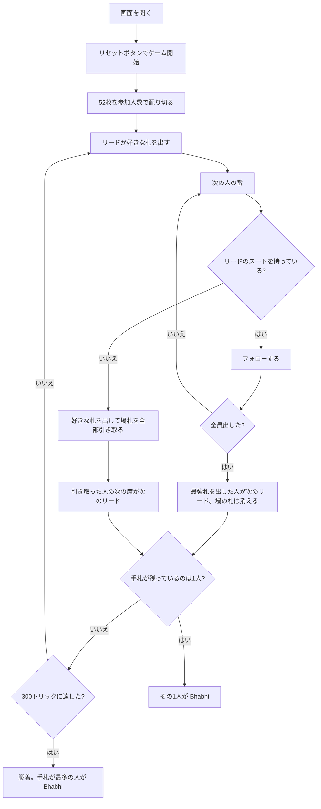

# バービー（Web版）遊び方

## ゲーム概要

インド・パキスタンの家庭で遊ばれる**回避型**カードゲーム。52枚を3〜7人で配り切り、リードのスートに**フォローできなかった人が場に出ている札を全部手札に引き取ります**。手札を出し切った人から抜けていき、**最後に手札が残った1人が Bhabhi（敗者）**。勝者を決めるのではなく敗者を決めるゲームです。

## 起動方法

```sh
go run ./cmd/trumpcards web  # CLI経由でWebサーバーを起動
go run ./cmd/server          # 直接Webサーバーを起動
```

ブラウザで `http://localhost:8080` にアクセスし、ナビゲーションバーから「バービー」を選択します。
ナビバーのJA/ENボタンで日本語・英語を切り替えられます。

## ルール

- **52枚**、**3〜7人**（設定パネルで変更可、既定4人）。配り切りで山札は残りません
- 最初の人が好きな札をリードし、以降は**リードのスートを持っていれば必ずそれを出す**
- 持っていなければ何を出してもよく、そのかわり**場の札を全部（自分がいま出した1枚も含めて）手札に引き取る**
- **全員がフォローできたトリックは場から消えます**（引き取りではありません）。最強札を出した人が次のリード
- **切り札はありません。** 別スートの A を出してもトリックは取れません。強さは A > K > Q > J > 10 > … > 2
- **引き取った人は次のリードを取りません**（その次の席がリード）。取らせると同じ札が2人のあいだを往復し続けて終わらなくなるためです
- 手札を出し切った人から抜け、**最後に1人だけ残ったらその人が Bhabhi**。何番目に抜けたかに優劣はありません
- **300トリックに達したら膠着として打ち切り、手札がいちばん多い人を Bhabhi とします**（決着する局は実測で中央値22〜41トリック・最大86なので、通常の対局では発生しません）

## ゲームの流れ



## 画面の操作方法

| 操作 | 説明 |
|------|------|
| 手札のカードをクリック | そのカードを出す（出せる札には緑の枠が付きます） |
| ヒントボタン | 打つべき札を提示する |
| ギブアップボタン | 投了する（投了した人が Bhabhi） |
| リセットボタン | 確認ダイアログのうえで最初からやり直す |
| 設定パネルの「参加人数」 | 3〜7人。変更するとその人数で配り直します |
| CLI トグル | 同じゲームをコマンド入力で操作するモードに切り替える |

**次のハンドへ進むボタンはありません。** 配り切りの1ゲームで最後の1人が決まるまで続きます。

### キーボードショートカット

| キー | アクション | 有効条件 |
|------|-----------|---------|

（このゲーム固有のキーボードショートカットはありません）

## 画面構成

```
┌────────────────────────────────────────────┐
│ 目的は勝つことではなく Bhabhi にならないこと │
├────────────────────────────────────────────┤
│  トリック: 6        残り 3 / 4 人           │
│  リード: ♥（場に 2 枚。全部引き取ります）    │
├────────────────────────────────────────────┤
│  あなた: 手札7枚 / 引き取り1回              │
│  CPU1 : 3番目に上がり / 引き取り0回         │
│  CPU2 : 手札5枚 / 引き取り2回               │
│  CPU3 : 手札9枚 / 引き取り3回               │
├────────────────────────────────────────────┤
│              場札                           │
│  直前に CPU3 が 4 枚引き取りました           │
├────────────────────────────────────────────┤
│  あなたの手札（出せる札に緑の枠）            │
└────────────────────────────────────────────┘
```

- **最上部**: このゲームの目的。**勝者ではなく敗者を決めます**
- **リード行**: 場に何枚積まれているか。**フォローできないとこれを全部引き取ります**
- **中央上**: 各プレイヤーの手札枚数、抜けた人の順位、引き取り回数
- **中央**: 場札
- **引き取り通知**: 直前に誰が何枚引き取ったか（盤面に痕跡が残らないため）
- **下部**: 自分の手札。**フォロー義務を満たす札だけ**に緑の枠が付きます

## 遊び方のコツ

- **短いスートを早めに使い切る。** 1枚しかないスートを抱えていると、そこをリードされたときに引き取ります
- **リードは枚数の多いスートから。** 全員がフォローできれば札が場から消え、手札が減ります
- **フォローできないと分かったら高い札を落とす。** どのみち場札は引き取るので、抱えたくない A や K をそこで処分するのが得です
- **場が厚いときは慎重に。** 3人が出したあとの4枚目でフォローできないと、一気に4枚増えます
- **他人の引き取り回数を見る。** 引き取りが多い人はスートが偏っています
- **抜けるのに早いも遅いも無い。** 残らなければ全員同じです
