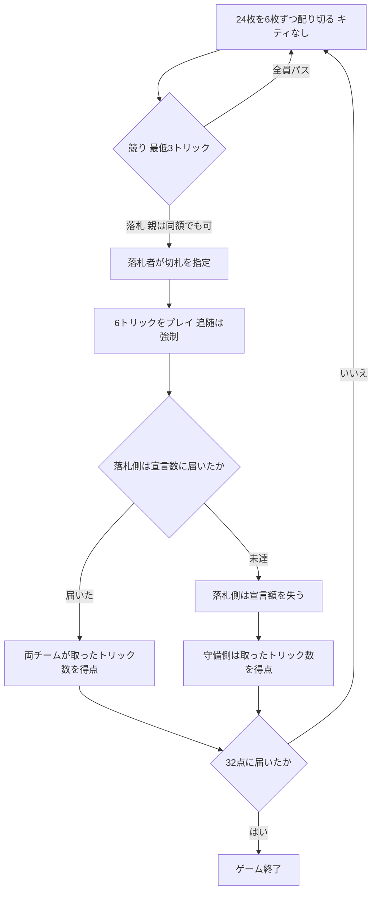
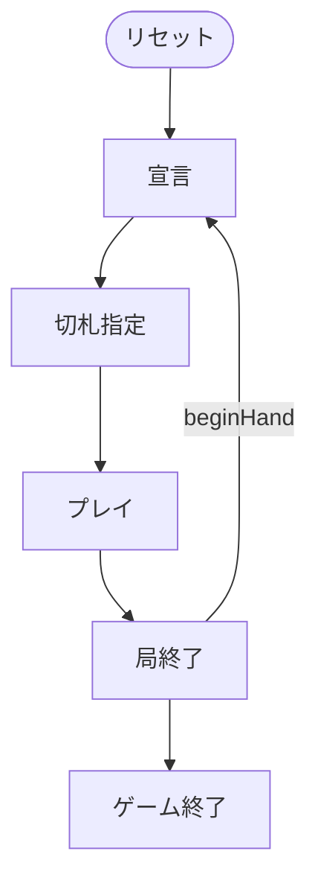

# ビッド・ユーカー（Web版）遊び方

## ゲーム概要

ユーカーを 24 枚・4 人 2 対 2 に仕立てた競り付きのトリックテイキング。各スート **A K Q J 10 9** の 24 枚を、**4 人にちょうど 6 枚ずつ配り切ります**。

出典: [pagat.com: Bid Euchre](https://www.pagat.com/euchre/bideuch.html) ／ [Wikipedia: Bid Euchre](https://en.wikipedia.org/wiki/Bid_euchre)

## 起動方法

```sh
go run ./cmd/trumpcards web  # CLI経由でWebサーバーを起動
go run ./cmd/server          # 直接Webサーバーを起動
```

ブラウザで `http://localhost:8080` にアクセスし、ナビゲーションバーから「ビッド・ユーカー」を選択します。
ナビバーのJA/ENボタンで日本語・英語を切り替えられます。

## ルール

### 配り切り（**キティはありません**）

24 ÷ 4 = 6 で余りが出ません。したがって**キティも表向きカードも無く**、切札は競りに勝った人が口頭で指定します。ここが普通のユーカー（24 枚から 20 枚を配り、残り 4 枚がキティ）との最大の違いです。

### 競り

- **最低宣言は 3 トリック**、最高は 6 トリック（全トリック）
- 通常は**直前の宣言を上回らないと**宣言できません
- ただし **親（ディーラー）だけは同額でも奪えます**

親が最後に「同額で奪う」権利を持つので、親の直前に高く宣言しても安全とは限りません。

### 切札の指定（**ノートランプが 2 種類あります**）

落札者が次の 6 つから 1 つを選びます。

| 番号 | 宣言 | 序列 |
|---|---|---|
| 0 | ♠ | 切札あり |
| 1 | ♣ | 切札あり |
| 2 | ♦ | 切札あり |
| 3 | ♥ | 切札あり |
| 4 | NT ハイ | 切札なし、**A が最強** |
| 5 | NT ロー | 切札なし、**序列が逆転し 9 が最強** |

**NT ローでは A K Q J 10 9 の強弱がそっくり逆になります。**9 > 10 > J > Q > K > A です。

### ボワー（切札スート宣言のときだけ）

| 呼び名 | 札 | 強さ |
|---|---|---|
| ライト・ボワー | 切札スートの J | **最強** |
| レフト・ボワー | **同色**のもう一方の J | 2 番目 |

**レフト・ボワーは、追随の判定を含めてすべての場面で切札スートの札として扱います。**例えば切札が ♠ のとき、♣ の J は「♠ の札」です。♣ がリードされても追随には使えず、逆に ♠ がリードされたら出さなければなりません。

ノートランプ宣言ではボワーはありません。J はただの J です。

### 得点（**未達で失うのは宣言額**）

- **達成した場合**: 両チームが、**それぞれ取ったトリック数**を得点します
- **未達の場合**: 宣言側は **宣言額ぶん**を失います。**取ったトリック数ではありません**（5 宣言で 2 トリックなら −5 であって −2 ではない）
- **未達でも守備側は、自分が取ったトリック数を得点します**

### ゲームの終わり

**先に 32 点**に達したチームの勝ちです。同時に超えた場合は落札側の勝ちとします。



## ゲームの流れ

ゲームの進行は `internal/domain/BidEuchre.go` のフェーズ機械そのものです。各ノードは同ファイルの `BidEuchrePhase` 定数、矢印ラベルはその遷移を行うメソッド名です。



## 画面の操作方法

| 操作 | 説明 |
|------|------|
| **3〜6** のボタン | 宣言するトリック数を選びます。**3 が最低**です |
| **パス** ボタン | 宣言を見送ります |
| **切札** の選択 | 落札後に表示されます。**♠ ♣ ♦ ♥ / NT ハイ / NT ロー** の 6 択です |
| 手札のカードをクリック | 出す 1 枚を選びます。**出せない札は押せません** |
| **出す** ボタン | 選択中の 1 枚を出します |
| **次の局へ** ボタン | 精算を読んだあと、次の局へ進みます |
| **CLI** トグル | ターミナル風の操作に切り替えます |

## 画面構成

- **ヘッダー**: 局数、契約トリック数、切札
- **スコア**: 両チームの得点。**32 点**でゲーム終了です
- **プレイヤー**: チーム（T0 / T1）、`[親]` `[宣言]`、取得トリック数。**キティが無く、他家の手札は最後まで伏せられます**
- **場**: 出ている札
- **精算**: 両チームの得点と取得トリック数。**未達側は宣言額ぶん引かれている**ことが読めます
- **アクションログ**: 進行を後から追えます

## 遊び方のコツ

- **手札は 6 枚しかありません。**3 宣言は「半分取る」で、見た目より重い約束です
- **切札スート宣言ではボワー 2 枚が最上位に来ます。**つまり自分の切札スートは実質 7 枚、隣の同色スートは 5 枚です
- **親の同額奪取を勘定に入れてください。**親より前の席から高い宣言を出しても、同額で持っていかれます
- **NT ローは弱い手の逃げ道です。**9 と 10 ばかりでも最強札の束になります
- **未達は宣言額ぶん引かれます。**取れる見込みが薄いなら、無理に競り上げるより降りるほうが安いことが多いです
- **守備でもトリックは価値があります。**潰せなくても取った数がそのまま点になります
