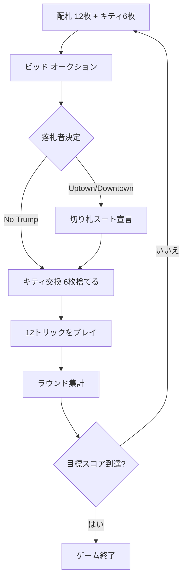

# ビッド・ホイスト（Web版）遊び方

## ゲーム概要

Bid Whist（ビッド・ホイスト）は、アメリカで愛される4人2チーム制のトリックテイキングゲームです。2枚のジョーカーを加えた54枚デッキを使い、オークション（ビッド）で「獲得目標トリック数」と「カードの強さの向き（Uptown=A最強 / Downtown=2最強 / No Trump）」を競います。落札者は切り札スートを宣言し、伏せられた6枚のキティと手札を交換してから12回のトリックを戦います。先に既定スコア（標準7点）に到達したチームの勝ちです。

## 起動方法

```sh
go run ./cmd/trumpcards web  # CLI経由でWebサーバーを起動
go run ./cmd/server          # 直接Webサーバーを起動
```

ブラウザで `http://localhost:8080` にアクセスし、ナビゲーションバーから「ビッド・ホイスト」を選択します。
ナビバーのJA/ENボタンで日本語・英語を切り替えられます。

## ルール

- **デッキ**: 54枚（標準52枚＋ジョーカー2枚）。切り札契約ではビッグジョーカー＞リトルジョーカーが最強の切り札です。
- **配札**: 各プレイヤーに12枚、残り6枚を「キティ（場札）」とします。
- **ビッド**: 目標トリック数1〜7 ×（Uptown / Downtown / No Trump）またはパス。各ビッドは現在の最高ビッドより強くする必要があります（同数ならUptown＜Downtown＜No Trump）。全員パスなら配り直します。
- **切り札宣言**: 落札者は（Uptown/Downtownのとき）切り札スートを宣言します。No Trumpでは切り札がなく、ジョーカーは死札になります。
- **キティ交換**: 落札者がキティ6枚を手札に加え、不要な6枚を捨てます。
- **強さの向き**: Uptownは A＞K＞…＞2、Downtownは 2＞3＞…＞K＞A（逆順）。切り札ゲームではジョーカーがすべての切り札の上に立ちます。
- **得点**: ブック（6トリック）を超えた分を集計します。落札チームが「6＋ビッド」以上取れば獲得トリック−6点、未達ならビッド数を失います（セット）。守備チームは6を超えたトリック分を加点します。
- **勝敗**: 先に目標スコア（標準7点）に到達したチームが勝利します。

## ゲームの流れ



## 画面の操作方法

- **ビッド**: 目標トリック数を選び、「Uptown / Downtown / No Trump」のいずれかのボタンを押します。パスボタンもあります。
- **切り札宣言**: 落札者になったら、スートボタン(♠♣♦♥)を押して切り札を決めます（No Trumpではこの手順はありません）。
- **キティ交換**: 手札からカードを6枚選び、「交換」を押します。
- **プレイ**: 出すカードを1枚選び、「出す」を押します。
- **次のトリック / 次のラウンド**: トリックやラウンドが終わると表示されるボタンで進めます。
- **「ヒント」ボタン**: 自分の手番で押すと、サーバーが今の局面での推奨（パス／ビッド／切り札／キティの捨て札／出すべき札）を返します。押したときだけ表示されます。
- **設定**: CPU難易度と目標スコアを変更できます。ヒントのオン/オフも切り替えられます。

## 画面構成

- 上部に現在のラウンド・契約・チームスコアを表示します。
- 中央に対戦相手の手札枚数と、現在のトリックに出されたカードが並びます。
- 下部にあなたの手札と、フェーズに応じた操作ボタンが表示されます。
- メッセージボックスに現在の状況や結果が表示されます。

## 遊び方のコツ

- 長いスートが手札にあるときは、そのスートを切り札にしたUptown/Downtownのビッドが有利です。
- 2枚のジョーカーは切り札契約で最強です。勝負所まで温存しましょう。
- 2・3・4などの低い札が多いときはDowntownが効果的です。手札の向きを見極めましょう。
- No Trumpではジョーカーが死札になるため、エース中心の高い札が揃っているときに選びます。
- 守備側はブック（6）を超えるトリックを取ると加点できます。確実に勝てる札で相手の契約を崩しましょう。
