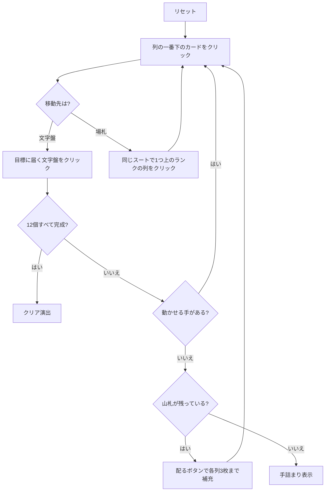

# ビッグ・ベン（Web版）遊び方

## ゲーム概要

12 個の基礎札を時計の文字盤に見立てた 2 デッキのソリティア。**9 時の ♣2 から時計回り**に 1 ランクずつ上がり、8 時の ♦K で一周する。各文字盤は「**その位置の時刻**」のランクで完成 — 9 時の文字盤は 9、12 時の文字盤は Q で止まる。

**枚数がちょうど閉じている。** 9〜12 時の 4 本が 8 枚、残り 8 本が 9 枚で 4×8 + 8×9 = 104。だから「全札が文字盤へ乗る」と「各文字盤が自分の時刻を表示する」は同じことを言っている。

## 起動方法

```sh
go run ./cmd/trumpcards web  # CLI経由でWebサーバーを起動
go run ./cmd/server          # 直接Webサーバーを起動
```

ブラウザで `http://localhost:8080` にアクセスし、ナビゲーションバーから「ビッグ・ベン」を選択します。
ナビバーのJA/ENボタンで日本語・英語を切り替えられます。

## ルール

- 52 枚 2 組（104 枚）。固定の 12 枚が文字盤に置かれ、続く 40 枚が 8 列×5 枚に、**残り 52 枚が山札**になる
- 文字盤は**同じスートで昇順**、**K の次は A に折り返す**
- 各文字盤の目標ランクは**その時刻**: 添字 0 が 9 時→9、添字 3 が 12 時→Q、添字 4 が 1 時→A、添字 11 が 8 時→8。カードの下に `→数字` で表示される
- **目標に達した文字盤は完成**（`✔` が付く）で、それ以上カードを受け付けない
- タブローは**同じスートで降順**に 1 枚ずつ。**空いた列は二度と埋められない**
- 手が尽きたら「配る」で補充する。**各列が 3 枚になるまで**、全列 3 枚以上なら 1 巡だけ。**再配りは無い**
- 12 個すべて完成でクリア

> 補足: 出典が割れる。Wikipedia は「12 山×3 枚 + 捨て札」と書くが、それだと「各山 3 枚になるまで補充」が空振りになる。PySolFC の「8 山×5 枚・捨て札なし」を採用した。

## ゲームの流れ



## 画面の操作方法

| 操作 | 説明 |
|------|------|
| 列の一番下のカードをクリック | そのカードを移動元として選択する（もう一度押すと解除） |
| 文字盤をクリック | 選択中のカードをその文字盤に置く。完成済みの文字盤は押せない |
| 別の列をクリック | 選択中のカードをその列に重ねる（**同じスートで**降順） |
| 配るボタン | 山札から各列 3 枚まで補充する。残り枚数がボタンに出る |
| ドラッグ＆ドロップ | クリック 2 回と同じ移動をドラッグでも行える |
| ヒントボタン | 文字盤 → 場札の順に手を 1 つ提示する |
| 自動完成ボタン | 文字盤へ送れる札がなくなるまで自動で送る |
| 元に戻すボタン | 直前の 1 手を取り消す |
| 手詰まり脱出ボタン | 手詰まりから抜けるのに必要な手数だけまとめて戻す |
| ギブアップ / リセットボタン | 確認ダイアログのうえで投了 / やり直す |
| CLI トグル | 同じゲームをコマンド入力で操作するモードに切り替える |

キーボードショートカット: `d` 配る / `h` ヒント / `a` 自動完成 / `z` 元に戻す / `g` ギブアップ（確認あり）。

## 画面構成

- **上部**: フェーズ表示、手数、完成した文字盤の数（`完成 3/12`）
- **中央上段**: 12 個の文字盤。上に時刻（**添字 0 が 9 時**）、下に目標ランク `→数字` と完成印
- **中央下段**: 8 列の場札。列番号 `#0`〜`#7` はヒント表示の列番号と一致する
- **下部**: ヒント表示、アクションログ、設定、キーボードショートカット一覧

## 遊び方のコツ

- **1〜8 時の文字盤は K→A の折り返しを通る。** A や 2 を折り返し先として残す
- **空けた列は戻らない。** このゲームの空き列は足場ではなく損失なので、狙って作るものではない
- **補充は各列 3 枚まで。** 浅い列があるほど 1 回の補充で多く引ける
- 同じランクのカードでも行き先の文字盤が複数ありうる。どちらに送るかで後半の詰まり方が変わる
- ヒントは文字盤への手を優先して 1 つ返すだけで最善手ではない。詰まったら元に戻すで分岐をやり直す
