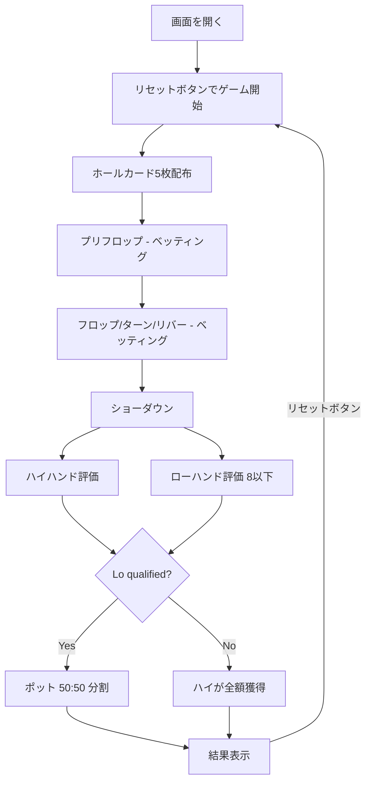

# 5カードオマハ ハイロー (Big O)（Web版）遊び方

## ゲーム概要

5カードオマハ ハイロー（Big O Hi-Lo / 8 or Better）のWeb GUI版です。5カードオマハ（Big O）のバリアントで、ショーダウン時にハイハンドとローハンドでポットを分割するスプリットポットゲームです。各プレイヤーに**5枚**のホールカードが配られ、必ずホールカードから2枚、コミュニティカードから3枚を使ってハイ・ローそれぞれの5枚の役を作ります。

ハイ／ロー双方を同一プレイヤーが取った場合は "scoop" となり、ポット全額を獲得します。qualified なローが存在しない場合はハイ側がポット全額を獲得します。手札が5枚あるため、ハイ・ローともに組み合わせが多く、scoop も発生しやすい高ボラティリティなゲームです。

## 起動方法

```sh
go run ./cmd/trumpcards web  # CLI経由でWebサーバーを起動
go run ./cmd/server          # 直接Webサーバーを起動
```

ブラウザで `http://localhost:8080` にアクセスし、ナビゲーションバーから「5カードオマハ ハイロー (Big O)」を選択します。
ナビバーのJA/ENボタンで日本語・英語を切り替えられます。

## ルール

### 基本ルール

- 52枚のトランプを使用
- 各プレイヤーに**5枚**のホールカードを配布
- フロップ（3枚）、ターン（1枚）、リバー（1枚）の合計5枚のコミュニティカードを共有
- **ハイハンド**：ホールカードから必ず2枚、コミュニティカードから必ず3枚で5枚を作り、最強の役を競う（通常の Big O と同じ）
- **ローハンド**：ホールカードから必ず2枚、コミュニティカードから必ず3枚で5枚を作り、すべて 8 以下（A=1）かつランクの重複が無い場合のみ qualified。最も "高いカード" が低い手が勝つ（A-5 ローボール）
- ホールから 2 枚／コミュニティから 3 枚という制約は、ハイとローで **別々の組み合わせ** を選んで構わない
- 各サイドポットを ハイ：ロー = 50：50 で分配（奇数チップは Hi 側に寄る）。qualified なローが居なければハイが全額獲得

### ローの強さ

最強のロー: A-2-3-4-5（"ホイール"）／最弱の qualified ロー: 8-7-6-5-4。ハイ側の判定（ロイヤルストレートフラッシュ〜ハイカード）と役名は通常のオマハと同一。

### ゲーム終了

- チップが0になったプレイヤーは脱落（トーナメントモードではリバイ可能）
- 最後の1人になったらゲーム終了

### CPU難易度

- 各CPUは異なるプレイスタイル（TAG/LAP/TAP/LAG/GTO）を持つ
- ブラフを含む戦略的なプレイを行う

## ゲームの流れ



## 画面の操作方法

### ベッティング

1. **「コール」** ボタン: 相手のベットに合わせる
2. **「レイズ」** ボタン: ベット額を上げる（スライダーで金額指定）
3. **「ベット」** ボタン: 最初にベットする
4. **「チェック」** ボタン: パスする（ベットなしで次へ）
5. **「フォールド」** ボタン: 降りる
6. **「オールイン」** ボタン: 全チップを賭ける

### ショーダウン

1. **「ショー」** ボタン: 手札を公開する
2. **「マック」** ボタン: 手札を伏せる

### キーボードショートカット

| キー | アクション | 有効条件 |
|------|-----------|---------|
| `C` | コール | ベッティング中 |
| `R` | レイズ / ベット | ベッティング中 |
| `K` | チェック | ベッティング中 |
| `F` | フォールド | ベッティング中 |
| `A` | オールイン | ベッティング中 |

### 学習モード

画面下部のトグルで学習モードを有効にすると、エクイティ（勝率）とポットオッズが表示されます。

## 画面構成

```
┌────────────────────────────────────────────┐
│  ▶ 設定 (クリックで展開)                   │
│    ベッティングリミット / テーブルサイズ等   │
├────────────────────────────────────────────┤
│           CPU プレイヤーエリア              │
├────────────────────────────────────────────┤
│       コミュニティカード & ポット            │
│  [♠A] [♥K] [♣9] [??] [??]  ポット: 200   │
├────────────────────────────────────────────┤
│     フッター: あなたの手札（5枚）            │
│  [♠Q] [♥J] [♣10] [♦8] [♣2]               │
│  [フォールド][チェック][コール][レイズ ▼]    │
│  結果: Two Pair / Low → 獲得 (Hi / Lo)     │
└────────────────────────────────────────────┘
```

## 遊び方のコツ

- **A-2 を含むホールカードは強力**：ホイール（A-2-3-4-5）の半分がすでに揃っている。ロー狙いの基本ハンド
- 手札が5枚あるため、ハイ・ローを両狙いできる組み合わせが作りやすく、scoop の機会が増えます
- **コミュニティに 8 以下が 3 枚出ない局面ではローは無効**：ハイ専用と判断したら通常の Big O 戦略で OK
- **scoop を狙えるハンドにはより強くベット**：相手がハイかローのどちらかしか持っていない時、scoop の期待値が大きい
