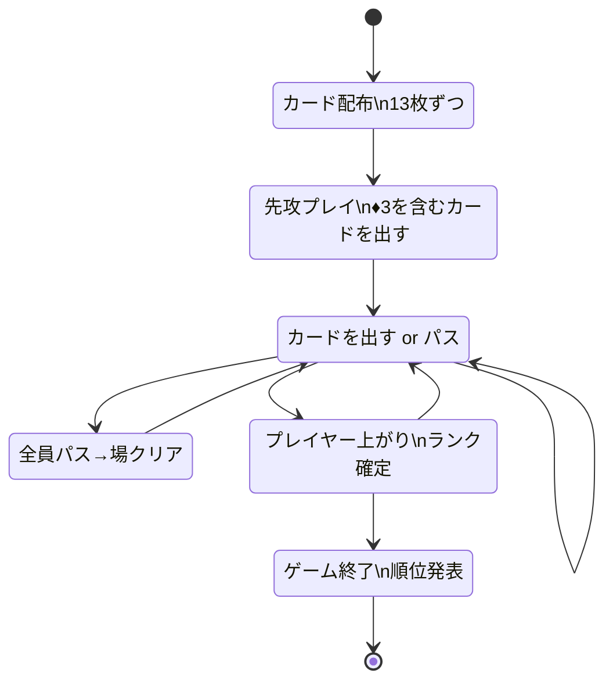

# 大老二（Web版）遊び方

## ゲーム概要

大老二 (Big Two) は、4人で遊ぶトランプの手札消化 (シェディング) ゲームです。中華圏・東南アジアで絶大な人気を誇ります。手札を最も早く出し切ったプレイヤーが勝者です。

## 起動方法

Web GUI のサイドバーから「大老二」を選択してアクセスします。ゲーム開始時にリセットボタンを押すと新しいゲームが始まります。

## ルール

- **デッキ**: 52枚（ジョーカーなし）を4人に13枚ずつ配ります。
- **カードの強さ**: 数字 `3 < 4 < 5 < 6 < 7 < 8 < 9 < 10 < J < Q < K < A < 2`、スート `♦ < ♣ < ♥ < ♠`。
- **先攻**: ♦3を持つプレイヤーが最初にプレイし、♦3を含むカードを出す必要があります。
- **出し方**: 前の人と同じ枚数・種類で、より強いカードを出します。出せない・出したくない場合はパス。
- **場のリセット**: 全員がパスすると場がクリアされ、最後にカードを出したプレイヤーが自由に出せます。
- **5枚役**: ストレート < フラッシュ < フルハウス < フォーカード < ストレートフラッシュ の順で強くなります。上位の役は下位の役に勝ちます。
- **勝利条件**: 最初に手札を全て出し切ったプレイヤーが1位。

## ゲームの流れ

## 画面の操作方法

1. 手札のカードをクリックして選択します（複数選択可）。
2. 「選択したカードを出す」ボタンを押してカードを出します。
3. パスしたい場合は「パス」ボタンを押します。
4. 設定パネルからCPU難易度を変更できます。

## 画面構成

- **上部**: CPUプレイヤーの残り枚数とカード裏面。
- **中央**: 場に出されたカード。
- **下部**: あなたの手札（クリックで選択）と操作ボタン。
- **フッター**: リセットボタン、設定、棋譜。

## 遊び方のコツ

- 弱いカードから出して、強いカード（特に2やA）を温存しましょう。
- ペアやトリプルで出すことで、相手が出しにくくなります。
- 5枚役（ストレートやフラッシュ）を組み立てると有利です。
- 相手の残り枚数に注意し、残り少ない相手には強いカードで対抗しましょう。
