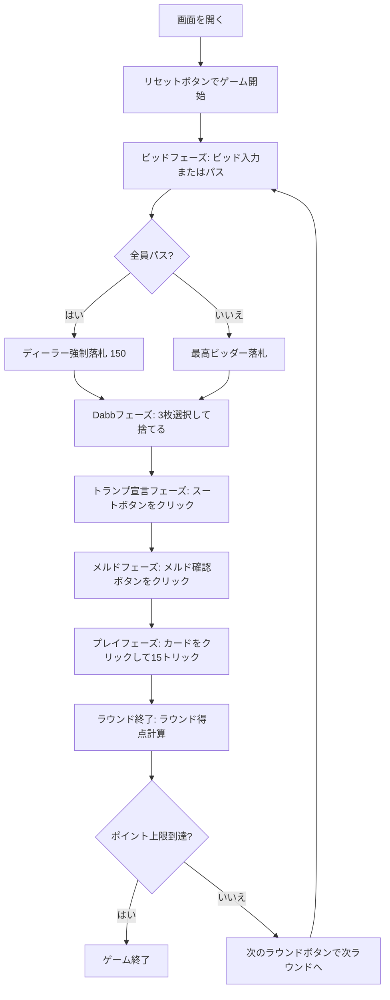

# ビノクル（Web版）遊び方

## ゲーム概要

3人個人戦（プレイヤー vs CPU 2人）のトリックテイキング＋メルドゲーム。48枚の専用デッキ（各スート7, 10, J, Q, K, Aが2枚ずつ）を使用。ビッド、Dabb（伏せ札）交換、トランプ宣言、メルド（役の公開）、トリックプレイのフェーズで構成され、先にポイント上限（デフォルト1000点）に到達したプレイヤーが勝利。

## 起動方法

```sh
go run ./cmd/trumpcards web        # CLI経由でWebサーバーを起動
go run ./cmd/server                # 直接Webサーバーを起動
```

ブラウザで `http://localhost:8080` にアクセスし、ナビゲーションバーから「ビノクル」を選択します。
ナビバーのJA/ENボタンで日本語・英語を切り替えられます。

## ルール

### デッキ

各スート（スペード、クラブ、ハート、ダイヤ）の7, 10, J, Q, K, Aが2枚ずつ、計48枚。

### カードランク

A > 10 > K > Q > J > 7（10がKより強い。最弱は7）

### カードポイント

- A = 11点
- 10 = 10点
- K = 4点
- Q = 3点
- J = 2点
- 7 = 0点
- 最終トリックボーナス = 10点
- ラウンド合計 = 250点

### 手札とDabb

各プレイヤーに15枚の手札が配られ、場に3枚の伏せ札（Dabb）が置かれます。

### ビッドフェーズ

ディーラーの左隣から順に、予想合計点（メルド点＋トリック点）をビッドします。
- 最低ビッドは150点、10点刻み。
- パスするか、現在の最高ビッドより10以上高くビッド。
- 全員がパスした場合は最後の発言者（ディーラー）が150点で強制落札。
- 最高ビッダーが落札者となります。

### Dabbフェーズ

落札者は場に伏せられていたDabb 3枚を手札に取り込んで計18枚とし、不要なカード3枚を選んでDabbに捨てます（手札は15枚に戻ります）。
捨てた3枚のカードポイントは落札者のトリック獲得点に加算されます。

### トランプ宣言フェーズ

落札者が切り札スート（スペード/クラブ/ハート/ダイヤ）を宣言します。

### メルドフェーズ

全プレイヤーが手札のメルド（役）を公開します。

| メルド | ポイント | 構成 |
|--------|----------|------|
| ディクス (Dix) | 10 | 切り札の7 |
| コモンマリッジ (Common marriage) | 20 | 非切り札のK-Q |
| ロイヤルマリッジ (Royal marriage) | 40 | 切り札のK-Q |
| ビノクル (Binokel) | 40 | J♦ + Q♠ |
| ジャックアラウンド (Jacks around) | 40 | 各スートのJ各1枚 |
| クイーンアラウンド (Queens around) | 60 | 各スートのQ各1枚 |
| キングアラウンド (Kings around) | 80 | 各スートのK各1枚 |
| エースアラウンド (Aces around) | 100 | 各スートのA各1枚 |
| 非切り札ファミリー (Non-trump family / run) | 100 | 非切り札スートのA-10-K-Q-J |
| 切り札ファミリー (Trump family / run) | 150 | 切り札スートのA-10-K-Q-J |
| ルントガング (Rundgang) | 240 | 全4スートのK-Q（成立時は個々のマリッジを二重計上しない） |
| ダブルビノクル (Double binokel) | 300 | 2組のJ♦ + Q♠ |
| ダブルジャックアラウンド (Double jacks around) | 400 | 各スートのJ各2枚 |
| ダブルクイーンアラウンド (Double queens around) | 600 | 各スートのQ各2枚 |
| ダブルキングアラウンド (Double kings around) | 800 | 各スートのK各2枚 |
| ダブルエースアラウンド (Double aces around) | 1000 | 各スートのA各2枚 |
| ダブル非切り札ファミリー (Double non-trump family) | 1000 | 非切り札スートのA-10-K-Q-J各2組 |
| ダブル切り札ファミリー (Double trump family) | 1500 | 切り札スートのA-10-K-Q-J各2組 |

※同一スートのファミリー（Run）に含まれるK-Qはファミリーに包含されるため、個別のマリッジは重複加算されません。

### トリックフェーズ

手札15枚による計15トリック。以下のフォロー規則に従います:
1. **マストフォロー**: リードスートのカードを持っていれば必ず出す。
2. **マストウィン**: リードスートで現在勝っているカードよりも強いカードを持っていれば勝てるカードを出さなければならない。
3. **マストトランプ**: リードスートを持っておらず切り札を持っていれば必ず切り札を出す（すでに切り札が出ている場合はそれより強い切り札を出す）。
4. リードスートも切り札も持っていない場合は任意のカードを出せる。
プレイ可能なカードのみ選択可能になります。

### 得点計算

- **落札者**: メルド点＋トリック点（＋Dabb捨て札の点）の合計が入札額以上なら全得点を加算。届かなければ入札額分を減点（−入札額）。
- **落札者以外**: 自分のメルド点＋トリック点をそのまま加算。
- **ゲーム終了**: いずれかのプレイヤーの累計スコアがポイント上限（デフォルト1000点）に到達したラウンドで終了。最高スコアのプレイヤーが勝利（同点の場合は落札者が優先）。

## ゲームの流れ



## 画面の操作方法

### ビッドフェーズ

- 数値入力欄にビッド額を入力し、「ビッド」ボタンをクリックします（最低150、10刻み、かつ現在の最高ビッドより10以上）。
- 「パス」ボタンをクリックするとビッドを降ります。

### Dabbフェーズ

- 自分が落札した場合、Dabbの3枚が手札に加わり18枚になります。
- 手札から不要なカードを3枚クリックして選択し、「Dabbへ捨てる」ボタンをクリックします。手札は15枚に戻ります。

### トランプ宣言フェーズ

- スートボタン（♠ ♣ ♥ ♦）をクリックして切り札スートを決定します。

### メルドフェーズ

- 各プレイヤーの手札の役と点数が表示されます。
- 「メルド確認」ボタンをクリックするとプレイフェーズへ進みます。

### プレイフェーズ

- ルール上出せる合法カードが強調表示されます。
- 出したいカードをクリックしてプレイします。
- トリック終了後は「次のトリック」ボタン、ラウンド終了後は「次のラウンド」ボタンをクリックします。

### 設定

- CPU難易度: Easy / Normal / Hard
- ポイント上限: 500 / 1000 / 1500 / 2000 / 3000（デフォルト1000）

## 画面構成

```
┌────────────────────────────────────────────────────────┐
│  ヘッダー（フェーズ、ラウンド、トリック、切り札、最高ビッド、スコア）│
│                                                        │
│       CPU 1 (手札裏 15枚)         CPU 2 (手札裏 15枚)    │
│                                                        │
│  中央エリア:                                           │
│  - トリック場札 / Dabb表示                             │
│  - メルド表示 / メルド早見表                           │
│                                                        │
│  あなた: [♠A] [♠10] ... (手札表 15枚/18枚)              │
│                                                        │
│  操作パネル:                                           │
│  [ビッド入力] [ビッド] [パス]                          │
│  [Dabbへ捨てる(3枚選択)] [♠ ♣ ♥ ♦]                     │
│  [メルド確認] [次のトリック] [次のラウンド] [リセット] │
└────────────────────────────────────────────────────────┘
```

- **ヘッダー**: フェーズ名、ラウンド番号、トリック番号、切り札スート、最高ビッド、各プレイヤーの累計スコアを表示。
- **CPUエリア**: CPU 1、CPU 2の手札枚数や状態を表示。
- **中央エリア**: トリック進行中の場札、落札後のDabbカード、メルドフェーズでの公開役一覧、メルド早見表を表示。
- **自分の手札**: 画面下部に表向きで並び、プレイ可能カードがハイライト。Dabbフェーズでは捨て札として選択可能。
- **操作パネル**: 現在のフェーズに必要な操作ボタン（ビッド・パス、捨てる、スート選択、メルド確認等）が表示。

## 遊び方のコツ

- Dabbの伏せ札3枚を取り込める落札者は大きなアドバンテージがあるため、メルドとトリックの勝算があれば積極的にビッドに参加しましょう。
- 不要な高ランクカード（Aや10）をDabbに捨てると、落札者の確定トリック点として安全に得点化できます。
- ルントガング（240点）やファミリー（150点/100点）が揃っている場合は大量得点のチャンスです。
- マストウィン規則があるため、相手の強力な切り札やAを強制的に出させる展開を作ると終盤のトリックで優位に立てます。
