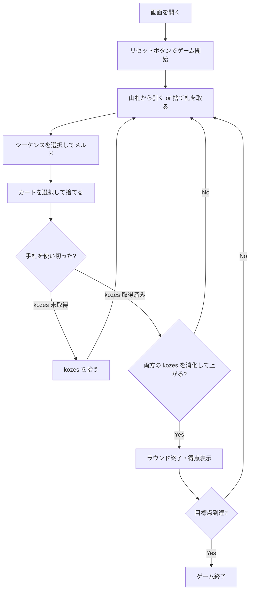

# ビリバ（Web版）遊び方

## ゲーム概要

ビリバはギリシャで広く親しまれている、4人（2対2）のパートナーシップ制ラミーです。106枚のカードで同じスートのシーケンスを作り、純ビリバと kozes の消化による得点を競います。

## 起動方法

```sh
go run ./cmd/trumpcards web
go run ./cmd/server
```

ブラウザで `http://localhost:8080` にアクセスし、ナビゲーションバーから「ビリバ」を選択します。

## ルール

### 基本ルール

- 2組の標準52枚とジョーカー2枚（計106枚）を使います。
- 4人（2対2）で遊び、各プレイヤーに11枚、伏せた買い手札（kozes）を2組配ります。
- メルドは同じスートの連続したランクによるシーケンスです。ジョーカーと2はワイルドです。
- 最初の手札を使い切った側は kozes を拾って続行します。
- 7枚以上でワイルドを1枚も使わないシーケンスは純ビリバとして高得点です。
- 両方の kozes を消化して上がると追加点を得ます。

### Burraco との違い

Burraco は同ランクの組を作るルールですが、Biriba は同じスートのシーケンスを作るルールです。両者は単なる別名ではありません。

## ゲームの流れ



## 画面の操作方法

### ドローフェーズ

「山札から引く」をクリックします。または手札から自然札2枚を選び、「捨て札を取る」をクリックします。

### メルドフェーズ

同じスートの連続列になるカードを3枚以上選び、「メルド」をクリックします。出さない場合は「スキップ」をクリックします。

### ディスカードフェーズ

カードを1枚選び、「捨てる」をクリックします。条件を満たしたら「上がる」をクリックします。

### キーボードショートカット

| キー | アクション | 有効条件 |
|------|-----------|----------|
| ← → | カード選択移動 | 人間の手番 |
| Space | カード選択/解除 | 人間の手番 |
| Enter | 確定 | カード選択中 |
| Escape | 選択解除 | カード選択中 |

## 画面構成

```
┌──────────────────────────────────┐
│ ビリバ / フェーズ / ラウンド      │
│ 山札・捨て札・kozes 残り           │
├──────────────────────────────────┤
│ チーム得点 / プレイヤー・メルド     │
│ CPU情報 / 純ビリバ表示             │
├──────────────────────────────────┤
│ 手札エリア（カード選択）            │
│ アクションボタン                   │
└──────────────────────────────────┘
```

## 遊び方のコツ

- ワイルドを使わない7枚以上のシーケンスを作ると高得点です。
- パートナーのメルドとスートを見ながら、kozes を安全に拾いましょう。
