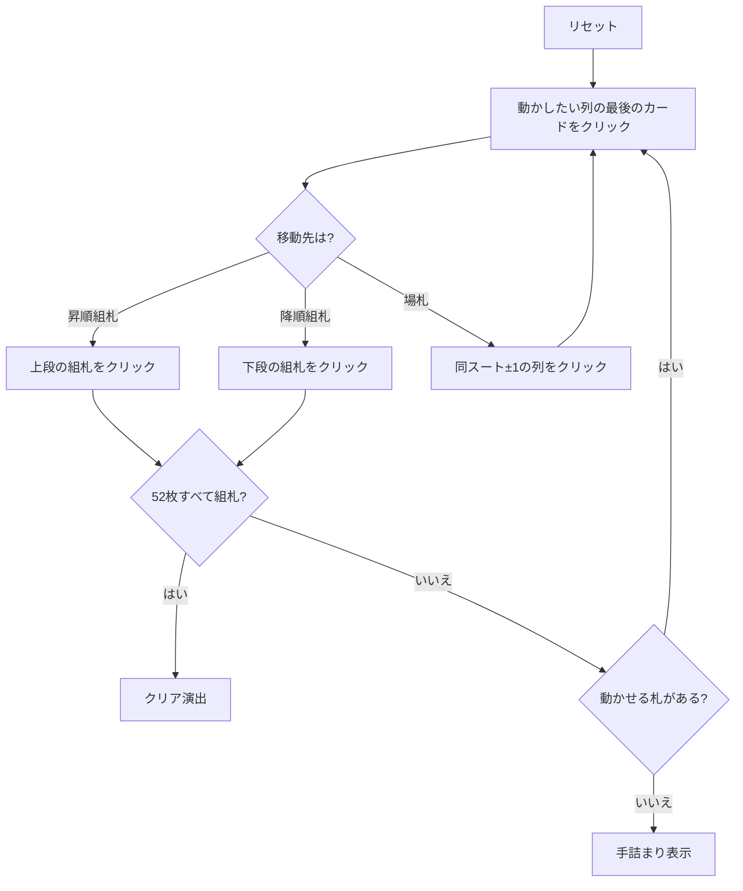

# ビズリー（Web版）遊び方

## ゲーム概要

52 枚すべてが最初から表向きに並ぶオープンソリティア。組札が **2 組**あるのが最大の特徴で、4 枚の A は最初から置かれた昇順 (A→K) の組札、キングの組札は降順 (K→A) で、自分でキングを上げたときに開く。

情報は完全に公開されている。それでも場札に重ねられるのが「同じスートでランクが 1 つ違う」札に限られるため、先を読まないとすぐ手詰まりになる。

## 起動方法

```sh
go run ./cmd/trumpcards web  # CLI経由でWebサーバーを起動
go run ./cmd/server          # 直接Webサーバーを起動
```

ブラウザで `http://localhost:8080` にアクセスし、ナビゲーションバーから「ビズリー」を選択します。
ナビバーのJA/ENボタンで日本語・英語を切り替えられます。

## ルール

- 52 枚 1 組。4 枚の A は昇順組札に置かれ、残り 48 枚が 13 列に表向きで配られる
- 昇順組札は同じスートで A→K、降順組札は同じスートで K→A に積む
- 降順組札は最初は空で、キングを上げたときに開く
- 動かせるのは各列の**最後の 1 枚だけ**
- 場札の上には**同じスートでランクが 1 つ違う**札のみ重ねられる（上下どちらでもよい）
- **空になった列には何も置けない**
- 52 枚すべてを組札に乗せれば勝ち。動かせる札がなくなれば手詰まり

## ゲームの流れ



## 画面の操作方法

| 操作 | 説明 |
|------|------|
| 列の最後のカードをクリック | そのカードを移動元として選択する（もう一度押すと解除） |
| 昇順組札をクリック | 選択中のカードを昇順 (A→K) の組札に置く |
| 降順組札をクリック | 選択中のカードを降順 (K→A) の組札に置く |
| 別の列をクリック | 選択中のカードをその列に重ねる（同スート±1） |
| ドラッグ＆ドロップ | クリック 2 回と同じ移動をドラッグでも行える |
| ヒントボタン | 組札へ送れる手を 1 つ提示する |
| 自動完成ボタン | 組札へ送れる札がなくなるまで自動で送る |
| 元に戻すボタン | 直前の 1 手を取り消す |
| 手詰まり脱出ボタン | 手詰まりから抜けるのに必要な手数だけまとめて戻す |
| ギブアップ / リセットボタン | 確認ダイアログのうえで投了 / やり直す |
| CLI トグル | 同じゲームをコマンド入力で操作するモードに切り替える |

キーボードショートカット: `h` ヒント / `a` 自動完成 / `z` 元に戻す / `g` ギブアップ（確認あり）。

## 画面構成

- **上部**: フェーズ表示（プレイ中 / 手詰まり / クリア）と手数
- **中央上段**: 昇順組札 4 列と降順組札 4 列。列はスートで固定
- **中央下段**: 13 列の場札。空き列は枠線のみで、置き場にはならない
- **下部**: ヒント表示、アクションログ、設定、キーボードショートカット一覧

## 遊び方のコツ

- **どちらの組札に送るかを決め打ちしない。** ♥7 を昇順に送るか降順に送るかで、後半に残る札がまったく変わる
- 同じスートが縦に並んでいる列は掘りやすい。同じスートが 1 枚もない列は最後まで動かない
- 空き列を作っても得はしない（置き場にならない）。列を空にすること自体を目標にしない
- ヒントは組札へ送れる手を 1 つ返すだけで最善手ではない。組札へ急ぐと下の札が塞がることもある
- 詰まったら元に戻すで分岐をやり直す。全札が見えている以上、読み直せば別の手順が見つかる
