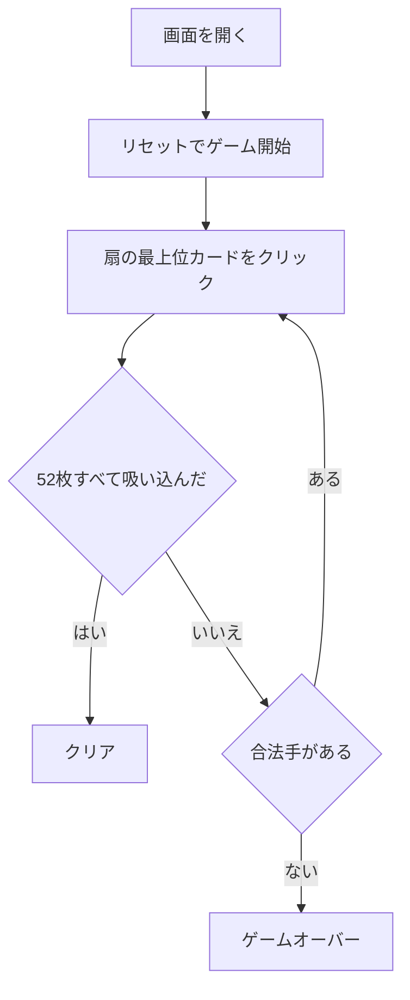

# ブラックホール（Web版）遊び方

## ゲーム概要

ブラックホール（Black Hole）は、イギリスのゲームデザイナー David Parlett 考案の論理パズル系ソリティアです。標準 52 枚デッキの **♠A を中央のブラックホール** に固定し、残り **51 枚を 17 の 3 枚扇** に配ります。各扇の最上位カードを、ブラックホール最上位と **±1 ランク（スート不問・K と A はつながりなし）** ならブラックホールへ吸い込めます。**全 52 枚を吸い込めばクリア** です。

## 起動方法

```sh
go run ./cmd/trumpcards web  # CLI経由でWebサーバーを起動
go run ./cmd/server          # 直接Webサーバーを起動
```

ブラウザで `http://localhost:8080` にアクセスし、ナビゲーションバーから「ブラックホール」を選択します。
ナビバーのJA/ENボタンで日本語・英語を切り替えられます。

## ルール

1. **吸い込む**: 各扇の最上位カードをクリックすると、ブラックホール最上位と ±1 ランクならブラックホールへ吸い込まれます（スート不問）。
2. **配置条件**: K と A はラップしません。一度積んだカードは戻せません。
3. **勝敗**: 全 52 枚を吸い込めばクリア。合法手がなくなると失敗です。

## ゲームの流れ



## 画面の操作方法

- 上部に中央のブラックホール、下に 17 の扇が並びます。
- 吸い込める扇の最上位カードをクリックして積み上げます。
- フッターの「ヒント」「元に戻す」「ギブアップ」で操作します。

## 画面構成

```
┌──────────────────────────────────────────────┐
│  ブラックホール                              │
│        [ ♠7 ]        手数: 12                │
│  受け入れ可能: 6 / 8                         │
│  合法手: 4                                   │
├──────────────────────────────────────────────┤
│  ブラックホールに吸い込む扇の最上位カードを  │
│  選んでください（±1ランク・スート不問）      │
├──────────────────────────────────────────────┤
│  扇（17 個 × 3 枚）                          │
│  [1]  [2]  [3]  [4]  [5]  [6]  [7]  [8]  [9] │
│  ♦2   ♣9   ♥K   ♠4   ♦J   ♣3   ♥6   ♠10  ♦8 │
│  ...                                         │
│  [10] [11] [12] [13] [14] [15] [16] [17]     │
├──────────────────────────────────────────────┤
│  設定 / 棋譜（アクションログ）               │
├──────────────────────────────────────────────┤
│  [元に戻す] [ヒント] [ギブアップ] [リセット]  │
└──────────────────────────────────────────────┘
```

- **ブラックホール**: 中央の吸い込み先。最上位カードだけが表示され、次に置けるランクを決める
- **受け入れ可能**: いま吸い込めるランクの一覧（ブラックホール最上位の ±1、スートは問わない）
- **合法手**: いま選べる扇の数。0 になると手詰まり
- **手数**: これまでに吸い込んだ枚数
- **扇**: 17 個の扇に 3 枚ずつ。各扇の**最上位カードだけ**が操作対象で、クリックでブラックホールへ送る
  - 画面幅に応じて 6 列（モバイル）／9 列（タブレット以上）で折り返す
  - ヒントを押すと、吸い込める扇に枠が付き、推奨手には別の印が付く
- **設定 / 棋譜**: 難易度などの設定と、これまでの手の履歴
- **ボタン**: 「元に戻す」は直前の吸い込みを取り消し、「ヒント」は次の一手を提案、「ギブアップ」は投了、「リセット」は新しいゲームを開始

## 遊び方のコツ

- 全カードが見えています。ブラックホール最上位がどのランクへ伸びるか、複数手先まで読みましょう。
- 「ヒント」は次に積める扇を教えてくれます。手詰まりを避ける手順を考える助けになります。
