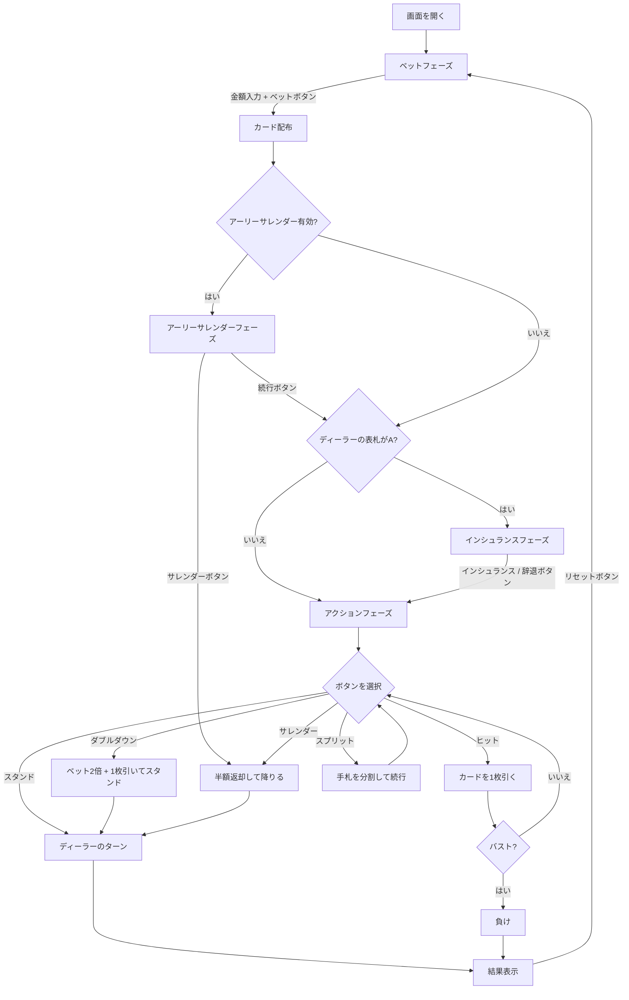

# ブラックジャック（Web版）遊び方

## ゲーム概要

ディーラーとプレイヤーが1対1で対戦するカードゲームです。手札の合計値を21に近づけ、21を超えずにディーラーより高い点数を目指します。

## 起動方法

```sh
go run ./cmd/trumpcards web  # CLI経由でWebサーバーを起動
go run ./cmd/server          # 直接Webサーバーを起動
```

ブラウザで `http://localhost:8080` にアクセスし、ナビゲーションバーから「BlackJack」を選択します。
ナビバーのJA/ENボタンで日本語・英語を切り替えられます。

## ルール

### カードの点数

| カード | 点数 |
|--------|------|
| 2〜10 | 数字どおり |
| J, Q, K | 10 |
| A | 11（合計が21を超える場合は1） |

### チップシステム

- 初期チップ: 1000
- 最低ベット: 10（10の倍数で指定）
- チップが10未満になると自動的に1000にリセットされます

### 勝敗判定

- プレイヤーの手札がディーラーより21に近ければ勝ち（賭け金と同額を獲得）
- ナチュラルブラックジャック（最初の2枚で21）の場合、3:2の配当
- バスト（21超過）した場合は即負け
- 引き分けの場合、賭け金はそのまま返却

## ゲームの流れ



## 画面の操作方法

### ベットフェーズ

1. 画面上部にプレイヤー・ディーラーのチップとデッキ数が表示されます
2. 数値入力欄にベット額を入力します（最低10、10の倍数）
3. **「PP:」** 入力欄でPerfect Pairsサイドベット額を指定（0で賭けない）
4. **「ポーカー役ベット:」** 入力欄でポーカー役サイドベット額を指定（0で賭けない）
5. **「デッキ数:」** ドロップダウンでシューのデッキ数を選択（1/2/4/6/8）
6. **「ヒント OFF/ON」** ボタンでベーシックストラテジーヒントを切り替え
7. **「H17/S17」** トグルでディーラーのソフト17ルールを切り替え（H17: ソフト17でヒット / S17: ソフト17でスタンド）
8. **「カウンティング OFF/ON」** トグルでカードカウンティング表示を切り替え
9. **「カウンティング方式」** セレクターでカウンティングシステムを選択（Hi-Lo / KO / Zen Count / Omega II）
10. **「DAS ON/OFF」** トグルでスプリット後のダブルダウン許可を切り替え
11. **「ペネトレーション:」** セレクターでデッキペネトレーション率を選択（50% / 75%）
12. **「CPU人数:」** セレクターでCPUプレイヤー数を選択（0〜3名）
13. **「ハンド数:」** セレクターで同時にプレイするハンド数を選択（1/2/3）
14. **「サレンダー:」** セレクターでサレンダールールを選択（レイトサレンダー / アーリーサレンダー / サレンダー禁止）
15. **「自動進行:」** セレクターで結果フェーズの自動進行タイマーを選択（OFF/3秒/5秒/10秒）
16. **「ベット」** ボタンをクリックしてゲーム開始

### インシュランスフェーズ

ディーラーの表向きカードがAの場合に表示されます。

- **「インシュランス」** ボタン: ベットの半額を支払い保険をかける
- **「辞退」** ボタン: インシュランスを辞退する（ヒントON時: 基本戦略で推奨される場合にボタンがハイライト）

### アクションフェーズ

| ボタン | 説明 | 表示条件 |
|--------|------|----------|
| **ヒット** | カードを1枚引く | 常に表示 |
| **スタンド** | カードを引かずにターン終了 | 常に表示 |
| **ダブルダウン** | ベットを2倍にし1枚だけ引く | 手札が2枚かつチップ >= ベット額（DAS OFF時はスプリット後のハンドでは非表示） |
| **スプリット** | 同点数の手札を分割 | `canSplit` が true かつチップ >= ベット額 |
| **サレンダー** | ベットの半額を返却して降りる | 手札が2枚 (`canSurrender` が true) |

ヒントON時は基本戦略が推奨するボタンが白いリングでハイライトされ、「推奨: ○○」バナーが画面に表示されます。

### 結果フェーズ

- 勝敗メッセージが画面に表示されます
- サレンダーしたハンドには `SURRENDER` バッジが表示されます
- サイドベットの結果バナーが表示されます（勝ち: 黄色、負け: グレー）
- **「リセット」** ボタン（パルスアニメーション付き）をクリックして次のラウンドへ
- 自動進行が設定されている場合、カウントダウン後に自動的にリセットされます

### キーボードショートカット

ゲーム中、以下のキーボードショートカットが使用できます。

| キー | アクション | 有効条件 |
|------|-----------|---------|
| `h` | ヒット | アクションフェーズ |
| `s` | スタンド | アクションフェーズ |
| `d` | ダブルダウン | アクションフェーズ（ダブルダウン可能時のみ） |
| `p` | スプリット | アクションフェーズ（スプリット可能時のみ） |
| `u` | サレンダー | アクションフェーズ（サレンダー可能時のみ） |

※ テキスト入力欄にフォーカスがある場合、ショートカットは無効になります。

## 画面構成

```
┌───────────────────────────────────────────────┐
│ Player: 950 chips  デッキ: 1デッキ  Dealer: 1000 chips │
│ H17/S17: S17  カウンティング: ON  Hi-Lo RC=+3 TC=+1.5   │
├───────────────────────────────────────────────┤
│         ディーラーエリア                      │
│    [カード画像] [裏向きカード]                │
│         Score: ???                            │
├───────────────────────────────────────────────┤
│       インシュランス: 25 (表示時のみ)         │
│   推奨: ヒット (ヒントON かつ提案あり時)      │
├───────────────────────────────────────────────┤
│         CPUプレイヤーエリア (0〜3名)          │
│   CPU1: Score: 18  Bet: 50  Chips: 900       │
│    [カード画像] [カード画像]                  │
├───────────────────────────────────────────────┤
│         プレイヤーエリア                      │
│   ハンド1 (*) Score: 15  Bet: 50             │
│    [カード画像] [カード画像]                  │
├───────────────────────────────────────────────┤
│  [ヒット] [スタンド] [ダブルダウン]           │
│      [スプリット] [サレンダー]                │
└───────────────────────────────────────────────┘
```

- ディーラーのカードはゲーム中、2枚目が裏向き（スコア非表示）
- 結果フェーズで全カードが表向きになりスコアが表示されます
- 複数ハンド（スプリット後）の場合、アクティブなハンドに `(*)` マークが付きます
- ステータスタグ: `[BUST]` バスト / `[DD]` ダブルダウン / `[BJ]` ナチュラルBJ / `SURRENDER` サレンダー

## 特殊ルール

### インシュランス

ディーラーの表向きカードがAの場合に提示されます。ベットの半額を支払い、ディーラーがブラックジャックなら2:1の配当を受け取ります。

### ダブルダウン

最初の2枚の状態でのみボタンが表示されます。ベットが2倍になり、カードを1枚だけ引いて自動的にスタンドします。

### スプリット

最初の2枚が同じブラックジャック点数の場合にボタンが表示されます。手札を2つに分割し、それぞれに元のベットと同額が賭けられます。シングルハンド時は最大4ハンド、マルチハンド時は合計最大8ハンドまで分割できます。Aをスプリットした場合、各手札に1枚ずつ配られて自動スタンドとなります。

### サレンダー

アクションフェーズの最初の2枚の状態でのみ「サレンダー」ボタンが表示されます。クリックするとベットの半額が返却され、そのハンドは終了します。

### サレンダールール設定

ベットフェーズの「サレンダー:」セレクターでサレンダールールを選択できます。

| ルール | 説明 |
|--------|------|
| レイトサレンダー（デフォルト） | ディーラーのBJ確認後にサレンダー可能 |
| アーリーサレンダー | ディーラーのBJ確認前にサレンダー可能（アーリーサレンダーフェーズが追加） |
| サレンダー禁止 | サレンダーボタンが非表示 |

アーリーサレンダーが有効な場合、カード配布後にアーリーサレンダーフェーズが表示されます。このフェーズでは「サレンダー」ボタンと「続行」ボタンが表示され、ディーラーのBJ確認前にサレンダーするかどうかを選択できます。設定はセッション内で維持されます。

### ベーシックストラテジーヒント

ベットフェーズの「ヒント OFF/ON」ボタンで切り替えます。ONにすると、各アクション時にベーシックストラテジー（標準マルチデッキ、ディーラーはソフト17でスタンド）に基づく推奨アクションが表示されます。推奨ボタンは白いリングでハイライトされ、画面上部に「推奨: ○○」バナーが表示されます。ヒント設定はセッション内で維持されます。

### デッキ数（シュー）設定

ベットフェーズの「デッキ数:」ドロップダウンから 1 / 2 / 4 / 6 / 8 デッキを選択できます。選択すると即座にサーバーに送信され、次のラウンドから新しいシューが使用されます。

### ソフト17ルールトグル

ベットフェーズの「H17/S17」トグルでディーラーのソフト17ルールを切り替えます。H17ではディーラーはソフト17（Aを11と数えて合計17）でもう1枚引きます。S17ではソフト17でスタンドします。設定はセッション内で維持されます。

### カードカウンティング練習

ベットフェーズの「カウンティング OFF/ON」トグルでカードカウンティング表示を切り替えます。ONにすると画面上部にランニングカウント（RC）とトゥルーカウント（TC）が表示されます。カウントは配られたカードに応じてリアルタイムに更新されます。

「カウンティング方式」セレクターで使用するカウンティングシステムを選択できます（カウンティングON時のみ有効）。

| システム | タイプ | TCの表示 |
|----------|--------|----------|
| Hi-Lo | バランス型 | TC表示あり |
| KO | アンバランス型 | TC=N/A |
| Zen Count | バランス型 | TC表示あり |
| Omega II | バランス型 | TC表示あり |

KOシステムはアンバランス型のため、トゥルーカウント（TC）は `N/A` と表示されます。

### DAS（スプリット後のダブルダウン）

ベットフェーズの「DAS ON/OFF」トグルでスプリット後のダブルダウン（Double After Split）の許可/禁止を切り替えます。デフォルトはON（DAS許可）です。OFFにすると、スプリットで分割されたハンドではダブルダウンボタンが表示されなくなります。設定はセッション内で維持されます。

### デッキペネトレーション設定

ベットフェーズの「ペネトレーション:」セレクターでデッキペネトレーション率を選択できます。50%または75%を選択でき、デフォルトは75%です。75%ではカードの75%が使用された時点でシューが再構築されます。50%ではカードの50%が使用された時点で再構築されます。設定はセッション内で維持されます。

### マルチプレイヤーCPU席

ベットフェーズの「CPU人数:」セレクターで0〜3名のCPUプレイヤーを追加できます。CPUプレイヤーはベーシックストラテジーに基づいて自動的にプレイし、各CPUの手札・チップ・ベット状況が画面に表示されます。

カウンティングが有効な場合、CPUプレイヤーはカードカウンティングAIを使用します:

- **ベットスプレッド**: カウント値に応じてベット額を変動させます（基本50チップ）

| カウント | 倍率 | ベット額 |
|----------|------|----------|
| <= 1 | 1x | 50 |
| 2 | 2x | 100 |
| 3 | 4x | 200 |
| 4 | 8x | 400 |
| >= 5 | 16x | 800 |

- **インシュランス判断**: カウント >= 3 のときインシュランスを取ります（CPUのインシュランスベット額がUI上に表示されます）
- バランス型システム（Hi-Lo/Zen/Omega II）ではトゥルーカウント、KOではランニングカウントを使用します
- ベット額は所持チップを上限とし、10の倍数に丸められます

### サイドベット

ベットフェーズで「PP:」と「ポーカー役ベット:」の入力欄にサイドベット額を入力できます。メインベットと同時に賭け、カード配布直後に自動的に評価されます。結果はサイドベット結果バナーとして表示されます。

#### Perfect Pairs（プレイヤーの最初の2枚）

| 結果 | 条件 | 配当 |
|------|------|------|
| Perfect Pair | 同じスート・同じ値 | 25:1 |
| Colored Pair | 同じ色・同じ値 | 12:1 |
| Mixed Pair | 異なる色・同じ値 | 6:1 |

#### ポーカー役ベット（プレイヤーの2枚＋ディーラーのアップカード）

| 結果 | 条件 | 配当 |
|------|------|------|
| Suited Trips | 同じスート・同じ値 | 100:1 |
| Straight Flush | 同じスート・連続値 | 40:1 |
| Three of a Kind | 同じ値・異なるスート | 30:1 |
| Straight | 連続値 | 10:1 |
| Flush | 同じスート | 5:1 |

### マルチハンド

ベットフェーズの「ハンド数:」セレクターで1〜3ハンドを選択できます。各ハンドに同額のベットが賭けられ、カードはインターリーブ方式で配られます。

- **総コスト**: ベット額 × ハンド数 + サイドベット額
- **サイドベット**: ハンド0のみに適用
- **インシュランス**: ハンド0のベット額に基づいて1回のみ
- **ナチュラルBJ**: ディーラーがBJなら即終了。全プレイヤーハンドがBJなら即終了。一部のみBJの場合はBJハンドを自動スタンドして続行
- **スプリット上限**: マルチハンド時は合計最大8ハンド（シングルハンド時は最大4ハンド）
- **BJ配当**: マルチハンドで配られた初期ハンドでのBJは3:2配当。スプリットで生じたBJは1:1配当

### 自動進行（オートアドバンス）

ベットフェーズの「自動進行:」セレクターでOFF/3秒/5秒/10秒を選択できます。ONにすると、結果フェーズでカウントダウン後に自動的に次のラウンドへ進みます。リセットボタンにはパルスアニメーションが表示され、カウントダウン秒数がボタンに表示されます。
