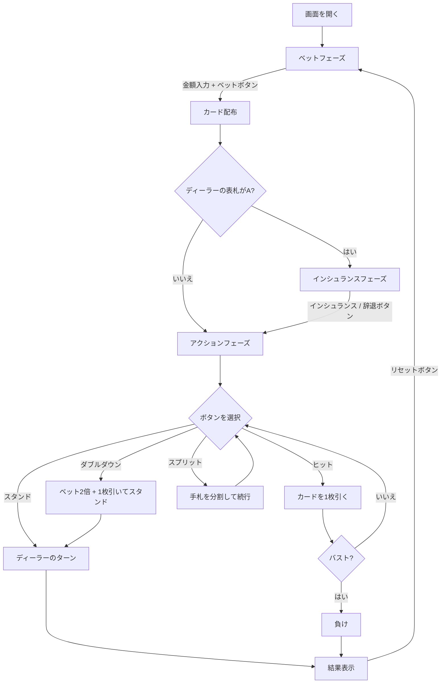

# ブラックジャック（Web版）遊び方

## ゲーム概要

ディーラーとプレイヤーが1対1で対戦するカードゲームです。手札の合計値を21に近づけ、21を超えずにディーラーより高い点数を目指します。

## 起動方法

```sh
go run ./cmd/cli web        # CLI経由でWebサーバーを起動
go run ./cmd/server         # 直接Webサーバーを起動
```

ブラウザで `http://localhost:8080` にアクセスし、ナビゲーションバーから「BlackJack」を選択します。

## ルール

### カードの点数

| カード | 点数 |
|--------|------|
| 2〜10 | 数字どおり |
| J, Q, K | 10 |
| A | 11（合計が21を超える場合は1） |

### チップシステム

- 初期チップ: 1000
- 最低ベット: 10（10の倍数で指定）
- チップが10未満になると自動的に1000にリセットされます

### 勝敗判定

- プレイヤーの手札がディーラーより21に近ければ勝ち（賭け金と同額を獲得）
- ナチュラルブラックジャック（最初の2枚で21）の場合、3:2の配当
- バスト（21超過）した場合は即負け
- 引き分けの場合、賭け金はそのまま返却

## ゲームの流れ



## 画面の操作方法

### ベットフェーズ

1. 画面上部にプレイヤーとディーラーのチップが表示されます
2. 数値入力欄にベット額を入力します（最低10、10の倍数）
3. **「ベット」** ボタンをクリックしてゲーム開始

### インシュランスフェーズ

ディーラーの表向きカードがAの場合に表示されます。

- **「インシュランス」** ボタン: ベットの半額を支払い保険をかける
- **「辞退」** ボタン: インシュランスを辞退する

### アクションフェーズ

| ボタン | 説明 | 表示条件 |
|--------|------|----------|
| **ヒット** | カードを1枚引く | 常に表示 |
| **スタンド** | カードを引かずにターン終了 | 常に表示 |
| **ダブルダウン** | ベットを2倍にし1枚だけ引く | 手札が2枚かつチップ >= ベット額 |
| **スプリット** | 同点数の手札を分割 | `canSplit` が true かつチップ >= ベット額 |

### 結果フェーズ

- 勝敗メッセージが画面に表示されます
- **「リセット」** ボタンをクリックして次のラウンドへ

## 画面構成

```
┌─────────────────────────────────────────┐
│ Player Chips: 950    Dealer Chips: 1000 │
├─────────────────────────────────────────┤
│         ディーラーエリア                │
│    [カード画像] [裏向きカード]          │
│         Score: ???                      │
├─────────────────────────────────────────┤
│       インシュランス: 25 (表示時のみ)   │
├─────────────────────────────────────────┤
│         プレイヤーエリア                │
│   ハンド1 (*) Score: 15  Bet: 50       │
│    [カード画像] [カード画像]            │
├─────────────────────────────────────────┤
│  [ヒット] [スタンド] [ダブルダウン]     │
│              [スプリット]               │
└─────────────────────────────────────────┘
```

- ディーラーのカードはゲーム中、2枚目が裏向き（スコア非表示）
- 結果フェーズで全カードが表向きになりスコアが表示されます
- 複数ハンド（スプリット後）の場合、アクティブなハンドに `(*)` マークが付きます
- ステータスタグ: `[BUST]` バスト / `[DD]` ダブルダウン / `[BJ]` ナチュラルBJ

## 特殊ルール

### インシュランス

ディーラーの表向きカードがAの場合に提示されます。ベットの半額を支払い、ディーラーがブラックジャックなら2:1の配当を受け取ります。

### ダブルダウン

最初の2枚の状態でのみボタンが表示されます。ベットが2倍になり、カードを1枚だけ引いて自動的にスタンドします。

### スプリット

最初の2枚が同じブラックジャック点数の場合にボタンが表示されます。手札を2つに分割し、それぞれに元のベットと同額が賭けられます。最大4ハンドまで分割できます。
