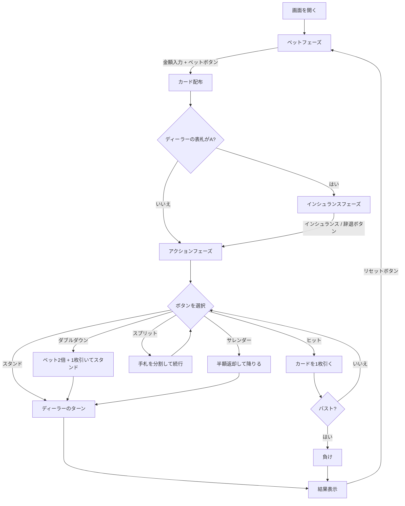

# ブラックジャック（Web版）遊び方

## ゲーム概要

ディーラーとプレイヤーが1対1で対戦するカードゲームです。手札の合計値を21に近づけ、21を超えずにディーラーより高い点数を目指します。

## 起動方法

```sh
go run ./cmd/cli web        # CLI経由でWebサーバーを起動
go run ./cmd/server         # 直接Webサーバーを起動
```

ブラウザで `http://localhost:8080` にアクセスし、ナビゲーションバーから「BlackJack」を選択します。

## ルール

### カードの点数

| カード | 点数 |
|--------|------|
| 2〜10 | 数字どおり |
| J, Q, K | 10 |
| A | 11（合計が21を超える場合は1） |

### チップシステム

- 初期チップ: 1000
- 最低ベット: 10（10の倍数で指定）
- チップが10未満になると自動的に1000にリセットされます

### 勝敗判定

- プレイヤーの手札がディーラーより21に近ければ勝ち（賭け金と同額を獲得）
- ナチュラルブラックジャック（最初の2枚で21）の場合、3:2の配当
- バスト（21超過）した場合は即負け
- 引き分けの場合、賭け金はそのまま返却

## ゲームの流れ



## 画面の操作方法

### ベットフェーズ

1. 画面上部にプレイヤー・ディーラーのチップとデッキ数が表示されます
2. 数値入力欄にベット額を入力します（最低10、10の倍数）
3. **「デッキ数:」** ドロップダウンでシューのデッキ数を選択（1/2/4/6/8）
4. **「ヒント OFF/ON」** ボタンでベーシックストラテジーヒントを切り替え
5. **「H17/S17」** トグルでディーラーのソフト17ルールを切り替え（H17: ソフト17でヒット / S17: ソフト17でスタンド）
6. **「カウンティング OFF/ON」** トグルでカードカウンティング表示を切り替え
7. **「CPU人数:」** セレクターでCPUプレイヤー数を選択（0〜3名）
8. **「ベット」** ボタンをクリックしてゲーム開始

### インシュランスフェーズ

ディーラーの表向きカードがAの場合に表示されます。

- **「インシュランス」** ボタン: ベットの半額を支払い保険をかける
- **「辞退」** ボタン: インシュランスを辞退する（ヒントON時: 基本戦略で推奨される場合にボタンがハイライト）

### アクションフェーズ

| ボタン | 説明 | 表示条件 |
|--------|------|----------|
| **ヒット** | カードを1枚引く | 常に表示 |
| **スタンド** | カードを引かずにターン終了 | 常に表示 |
| **ダブルダウン** | ベットを2倍にし1枚だけ引く | 手札が2枚かつチップ >= ベット額 |
| **スプリット** | 同点数の手札を分割 | `canSplit` が true かつチップ >= ベット額 |
| **サレンダー** | ベットの半額を返却して降りる | 手札が2枚 (`canSurrender` が true) |

ヒントON時は基本戦略が推奨するボタンが白いリングでハイライトされ、「推奨: ○○」バナーが画面に表示されます。

### 結果フェーズ

- 勝敗メッセージが画面に表示されます
- サレンダーしたハンドには `SURRENDER` バッジが表示されます
- **「リセット」** ボタンをクリックして次のラウンドへ

## 画面構成

```
┌───────────────────────────────────────────────┐
│ Player: 950 chips  デッキ: 1デッキ  Dealer: 1000 chips │
│ H17/S17: S17  カウンティング: ON  RC: +3 TC: +1.5      │
├───────────────────────────────────────────────┤
│         ディーラーエリア                      │
│    [カード画像] [裏向きカード]                │
│         Score: ???                            │
├───────────────────────────────────────────────┤
│       インシュランス: 25 (表示時のみ)         │
│   推奨: ヒット (ヒントON かつ提案あり時)      │
├───────────────────────────────────────────────┤
│         CPUプレイヤーエリア (0〜3名)          │
│   CPU1: Score: 18  Bet: 50  Chips: 900       │
│    [カード画像] [カード画像]                  │
├───────────────────────────────────────────────┤
│         プレイヤーエリア                      │
│   ハンド1 (*) Score: 15  Bet: 50             │
│    [カード画像] [カード画像]                  │
├───────────────────────────────────────────────┤
│  [ヒット] [スタンド] [ダブルダウン]           │
│      [スプリット] [サレンダー]                │
└───────────────────────────────────────────────┘
```

- ディーラーのカードはゲーム中、2枚目が裏向き（スコア非表示）
- 結果フェーズで全カードが表向きになりスコアが表示されます
- 複数ハンド（スプリット後）の場合、アクティブなハンドに `(*)` マークが付きます
- ステータスタグ: `[BUST]` バスト / `[DD]` ダブルダウン / `[BJ]` ナチュラルBJ / `SURRENDER` サレンダー

## 特殊ルール

### インシュランス

ディーラーの表向きカードがAの場合に提示されます。ベットの半額を支払い、ディーラーがブラックジャックなら2:1の配当を受け取ります。

### ダブルダウン

最初の2枚の状態でのみボタンが表示されます。ベットが2倍になり、カードを1枚だけ引いて自動的にスタンドします。

### スプリット

最初の2枚が同じブラックジャック点数の場合にボタンが表示されます。手札を2つに分割し、それぞれに元のベットと同額が賭けられます。最大4ハンドまで分割できます。Aをスプリットした場合、各手札に1枚ずつ配られて自動スタンドとなります。

### サレンダー

アクションフェーズの最初の2枚の状態でのみ「サレンダー」ボタンが表示されます。クリックするとベットの半額が返却され、そのハンドは終了します。

### ベーシックストラテジーヒント

ベットフェーズの「ヒント OFF/ON」ボタンで切り替えます。ONにすると、各アクション時にベーシックストラテジー（標準マルチデッキ、ディーラーはソフト17でスタンド）に基づく推奨アクションが表示されます。推奨ボタンは白いリングでハイライトされ、画面上部に「推奨: ○○」バナーが表示されます。ヒント設定はセッション内で維持されます。

### デッキ数（シュー）設定

ベットフェーズの「デッキ数:」ドロップダウンから 1 / 2 / 4 / 6 / 8 デッキを選択できます。選択すると即座にサーバーに送信され、次のラウンドから新しいシューが使用されます。

### ソフト17ルールトグル

ベットフェーズの「H17/S17」トグルでディーラーのソフト17ルールを切り替えます。H17ではディーラーはソフト17（Aを11と数えて合計17）でもう1枚引きます。S17ではソフト17でスタンドします。設定はセッション内で維持されます。

### カードカウンティング練習

ベットフェーズの「カウンティング OFF/ON」トグルでカードカウンティング表示を切り替えます。ONにすると画面上部にHi-Loシステムに基づくランニングカウント（RC）とトゥルーカウント（TC）が表示されます。カウントは配られたカードに応じてリアルタイムに更新されます。

### マルチプレイヤーCPU席

ベットフェーズの「CPU人数:」セレクターで0〜3名のCPUプレイヤーを追加できます。CPUプレイヤーはベーシックストラテジーに基づいて自動的にプレイし、各CPUの手札・チップ・ベット状況が画面に表示されます。
