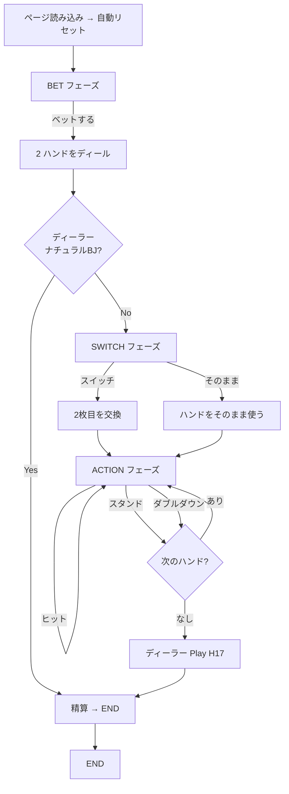

# ブラックジャック・スイッチ（Web版）遊び方

## ゲーム概要

Blackjack Switch（ブラックジャック・スイッチ）は、プレイヤーが2つのハンドを同時にプレイする
ブラックジャックのバリアント。ディール直後にハンド間で2枚目のカードを交換できる「スイッチ」
アクションが追加されている代わりに、(1) ナチュラルブラックジャックの配当が 1:1（通常は 3:2）、
(2) ディーラーが22で終了した場合は（ナチュラルBJを除き）バーストではなく **プッシュ** 扱いと
なる。

## 起動方法

```sh
go run ./cmd/trumpcards web  # CLI経由でWebサーバーを起動
go run ./cmd/server          # 直接Webサーバーを起動
```

ブラウザで `http://localhost:8080` にアクセスし、ナビゲーションバーから「ブラックジャック・スイッチ」を選択します。
ナビバーのJA/ENボタンで日本語・英語を切り替えられます。

## ルール

### 基本ルール

- プレイヤーは常に2ハンドをディールされる（1ハンドあたりのベット額 × 2 を消費）
- ディーラーは2枚（うち1枚はホールカード、伏せて表示）を配る
- ディール直後、プレイヤーは「スイッチ」または「そのまま」を選ぶ
- 以降は各ハンドを順にヒット/スタンド/ダブルダウンでプレイ
- スプリット・サレンダー・インシュランス・サイドベットは未実装

### スイッチアクション

ハンド0とハンド1の **2枚目のカード** を相互交換する。スイッチで作ったハンドも
ナチュラルBJ扱い（ただし配当は 1:1）。

### 特殊ルール

- **ディーラー22プッシュ**: ディーラーが22で終了した場合、ナチュラルBJ以外のプレイヤーハンドは
  プッシュ。プレイヤーが2枚で21を持っている場合のみ、ディーラー22に勝てる。
- **ナチュラルBJ配当 1:1**: 通常BJの 3:2 配当ではなく、勝利時と同じ 1:1。

### ディーラールール

ディーラーは標準的な H17（Hit Soft 17）。

## ゲームの流れ



## 画面の操作方法

| 操作 | 説明 |
|------|------|
| **ベットする** | BET フェーズで1ハンドあたりのベット額を入力して開始 |
| **スイッチ** | SWITCH フェーズでハンド間の2枚目を交換 |
| **そのまま** | SWITCH フェーズで交換せずに進む |
| **ヒット** | ACTION フェーズで現在のハンドにカード追加 |
| **スタンド** | ACTION フェーズで現在のハンドを確定 |
| **ダブルダウン** | ACTION フェーズでベット倍化＋1枚追加で確定 |
| **リセット** | END フェーズで新しいラウンドへ |
| **棋譜を見る** | END フェーズでアクションログをパネル表示 |

## 画面構成

- **ヘッダー**: チップ残高 / フェーズ表示 / CLI モード切替
- **メインエリア**: ディーラーハンド + プレイヤーハンド0 / ハンド1 を並列表示。アクション中の
  ハンドはアクセントカラーの枠で強調
- **ディーラーホールカード**: BET〜ACTION フェーズでは伏せ、END フェーズで公開
- **エンドサマリー**: 各ハンドの結果（勝ち/プッシュ/負け）と払戻し、合計払戻し、総合勝敗。
  ディーラー22プッシュが発生した場合は黄色のバナーで通知
- **フッター**: フェーズに応じたアクションボタン

## 遊び方のコツ

- スイッチは「両方のハンドを同時に良くする」アクション。例: 「10/5」「6/J」を「10/J」「6/5」に
  並べ替えると 20 + 11 となり、片方がBJに近い高得点に化ける
- ナチュラルBJ配当が 1:1 のため、自然に 2枚 21 が出やすい組み合わせを優先する
- ディーラー22プッシュは強力な救済だが、プレイヤーが先にバーストすると恩恵を受けられない。
  ハードな手はスタンド寄りに調整する
