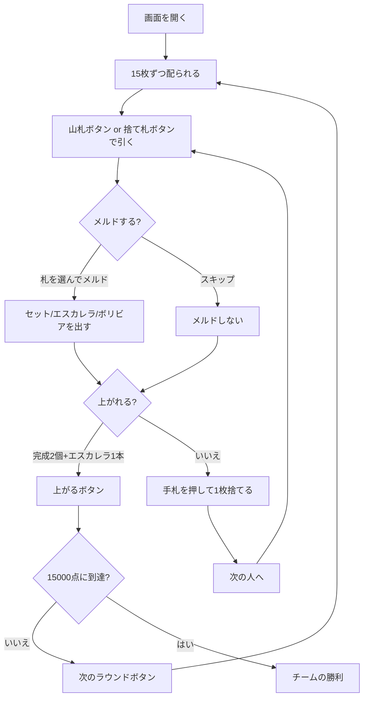

# ボリビア（Web版）遊び方

## ゲーム概要

ボリビア（Bolivia）は南米で遊ばれるカナスタ系のパートナーシップゲームです。**4 人 2 組**（席 0・2 対 席 1・3）で、**3 組 + ジョーカー 6 枚（162 枚）**を使い、1 人 15 枚を配ります。

**独自のメルドが 2 つあります。**

- **ボリビア**: **ワイルド 7 枚**（2 とジョーカー、混ぜてよい）だけのメルド。**2500 点**でゲーム名の由来。
- **エスカレラ**: **ワイルドを含まない同スートの 7 枚連番**。**1500 点**。スペイン語で「梯子」。

## 起動方法

```sh
go run ./cmd/trumpcards web  # CLI経由でWebサーバーを起動
go run ./cmd/server          # 直接Webサーバーを起動
```

ブラウザで `http://localhost:8080` にアクセスし、ナビゲーションバーから「ボリビア」を選択します。
ナビバーのJA/ENボタンで日本語・英語を切り替えられます。

## ルール

### メルドの種類

| 種類 | 中身 | 完成（7枚）の点 |
|------|------|-----|
| セット | 同ランク 3 枚以上（ワイルド可、ナチュラルが多いこと） | ナチュラル 500 / ミックス 300 |
| **エスカレラ** | **同スートの連番、ワイルド不可** | **1500** |
| **ボリビア** | **ワイルドだけ** | **2500** |

**ワイルドだけのメルドを認めるのがこの形式の要**です。完成したボリビアには**もうカードを足せません**。

### 3 の扱い

**3 はメルドの材料ではありません。**

- **赤 3**（♥3 / ♦3）は引いた時点で場に置かれ、1 枚 100 点（6 枚すべてで 800 点）。
- **黒 3**（♠3 / ♣3）はメルドできず、捨てると捨て札の山を凍らせます。

> **`escalera` は「3 だけで作るメルド」ではありません。** スペイン語の「梯子」＝連番のことで、3 とは無関係です。

### 上がり

**完成メルド 2 個以上、かつそのうち最低 1 本がエスカレラ**であることが必要です。**カナスタ 2 個では上がれません。** チームで数えるので、パートナーのエスカレラでも構いません。

### 勝敗

先に **15000 点**に到達したチームの勝ちです（サンバの 10000 ではありません）。

## ゲームの流れ



## 画面の操作方法

- **引く**: 「山札から引く」か「捨て札の山を取る」を選びます。捨て札の山を取るには手札から同ランク 2 枚を示す必要があります（凍結中は必須）。
- **メルド**: 手札を選んで出します。**ワイルドだけを選べばボリビアの作りかけ**、同スート連番を選べばエスカレラです。
- **上がる**: **完成メルド 2 個以上＋エスカレラ 1 本**が揃うと押せます。カナスタ 2 個では押せません。
- **次のラウンド**: 決着を読んだら押して次へ進みます。
- **設定**: CPU難易度、ポイント上限を切り替えられます。

## 画面構成

- **ヘッダー**: ゲーム名・フェーズ表示・**ラウンドとチーム得点**・CLI 切り替え
- **中央**: 山札と捨て札、各席の手札枚数・赤 3・完成メルドの印
- **メルド表示**: 種類（セット / シーケンス＝エスカレラ / ワイルド＝ボリビア）と中身
- **フッター**: あなたの手札と、引く／メルド／捨てる／上がるのボタン

## 画面の見方（CLI モード）

```
ラウンド: 1  山札: 99枚  廃棄山: 1枚
チーム0: 0点  チーム1: 0点
捨て札: SPADE 10
あなた (チーム0): 累積0点 ラウンド0点 15枚
CPU 1 (チーム1): 累積0点 ラウンド0点 15枚 赤3: 1枚
----------
手番: あなた (ドローフェーズ)
```

**席の後ろに付く印**がメルドの完成を教えます ── `★カナスタ` / `★エスカレラ`（**上がりに必要**） / `★ボリビア`（**2500 点**）。
