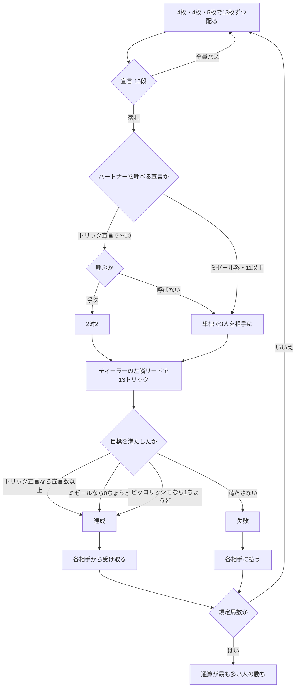

# ボストン（Web版）遊び方

## ゲーム概要

18 世紀のホイストから派生したトリックゲーム。52 枚・4 人、各自 13 枚。**15 段の宣言表**があり、トリック数の宣言の**間にミゼールが挟まる**のが最大の特徴です。

出典: [Wikipedia: Boston (card game)](https://en.wikipedia.org/wiki/Boston_(card_game)) ／ [pagat.com: Boston Group](https://www.pagat.com/boston/)

## 起動方法

```sh
go run ./cmd/trumpcards web  # CLI経由でWebサーバーを起動
go run ./cmd/server          # 直接Webサーバーを起動
```

ブラウザで `http://localhost:8080` にアクセスし、ナビゲーションバーから「ボストン」を選択します。
ナビバーのJA/ENボタンで日本語・英語を切り替えられます。

## ルール

### 配り方

各自 **13 枚**。ただし一度に配らず、**4 枚・4 枚・5 枚**の 3 回に分けます。

### 宣言表（**ここが最重要**）

**トリック数の宣言の間にミゼールが挟まります。**「トリック宣言をひととおり並べたあとにミゼール」ではありません。

| 段 | 宣言 | 目標 | 切札 | 味方 |
|---|---|---|---|---|
| 1 | 5 トリック | 5 以上 | あり | 呼べる |
| 2 | 6 トリック | 6 以上 | あり | 呼べる |
| 3 | **リトル・ミゼール** | **0** | なし | 単独 |
| 4 | 7 トリック | 7 以上 | あり | 呼べる |
| 5 | **ピッコリッシモ** | **ちょうど 1** | なし | 単独 |
| 6 | 8 トリック | 8 以上 | あり | 呼べる |
| 7 | **グランド・ミゼール** | **0** | なし | 単独 |
| 8 | 9 トリック | 9 以上 | あり | 呼べる |
| 9 | **リトル・ミゼール（公開）** | **0** | なし | 単独 |
| 10 | 10 トリック | 10 以上 | あり | 呼べる |
| 11 | **グランド・ミゼール（公開）** | **0** | なし | 単独 |
| 12 | 11 トリック | 11 以上 | あり | 単独 |
| 13 | 12 トリック | 12 以上 | あり | 単独 |
| 14 | **シュレム**（13 トリック） | 13 | あり | 単独 |
| 15 | **シュレム（公開）** | 13 | あり | 単独 |

**リトル・ミゼールは 7 トリックより下**、**グランド・ミゼールは 9 トリックより下**です。

### ピッコリッシモ

**ちょうど 1 トリックだけ取る**という宣言です。**0 トリックでも失敗**します。ミゼール（0 ちょうど）ともトリック宣言（宣言以上）とも違う第 3 の型です。

### 「公開」の宣言

*on the Table* は「オプションで公開できる」のではなく、**それ自体が 1 つ上の独立した宣言**です。**第 1 トリックのあと**に落札者が手札を全部公開します。

### パートナー

**トリック数の宣言（5〜10）では、落札者はパートナーを 1 人指名できます。**指名すれば **2 対 2**、しなければ **1 対 3** です。ミゼール系・ピッコリッシモ・11 以上は**常に単独**です。

### プレイ

**追随は強制**、切札は強制ではありません。リードは**ディーラーの左隣**（落札者ではありません）。

### 精算

**達成なら各相手から受け取り、失敗なら各相手に払います。**額は宣言の段が高いほど大きくなります。パートナーがいる場合、パートナーは払いも受け取りもしません（相手 2 人とだけやり取りします）。

規定局数を終えた時点で通算が最も多い人の勝ちです。

## ゲームの流れ

ゲームの進行は `internal/domain/Boston.go` のフェーズ機械そのものです。各ノードは同ファイルの `BostonPhase` 定数、矢印ラベルはその遷移を行うメソッド名です。



## 画面の操作方法

| 操作 | 説明 |
|------|------|
| **宣言表**のボタン | 15 段の宣言から選びます。**表の並び順がそのまま序列**です |
| **♠ ♣ ♥ ♦** ボタン | 切札ありの宣言でスートを選びます |
| **パス** ボタン | 宣言を見送ります |
| **味方に呼ぶ / 単独で戦う** ボタン | トリック宣言のとき、2 対 2 か 1 対 3 かを決めます |
| 手札のカードをクリック | 出す 1 枚を選びます。**出せない札は押せません** |
| **出す** ボタン | 選択中の 1 枚を出します |
| **次の局へ** ボタン | 精算を読んだあと、次の局へ進みます |
| **CLI** トグル | ターミナル風の操作に切り替えます |

## 画面構成

- **ヘッダー**: 局数 / 規定局数、契約と切札
- **宣言表**: 15 段を序列どおりに表示します。**ミゼールがトリック宣言の間に挟まっている**ことが一目で判ります
- **プレイヤー**: 取得トリック数、通算、`[親]` `[宣言]` `[味方]`。**相手の手札は精算まで伏せられます**（公開宣言では第 1 トリック後に落札者の手札が見えます）
- **場**: 出ている札
- **精算**: 達成か失敗か、落札側が取ったトリック数
- **アクションログ**: 進行を後から追えます

## 遊び方のコツ

- **ミゼールの位置を覚えてください。**「6 トリックは通ったがリトル・ミゼールで被せられた」は起こりますが、「7 トリックにリトル・ミゼールで被せる」はできません
- **ピッコリッシモは 0 でも負けます。**弱すぎる手では成立しないので、確実に 1 つ取れる札が要ります
- **パートナーを呼ぶと配当の相手が 2 人に減ります。**取りやすくなる代わりに実入りも減ります
- **公開宣言は配当が跳ね上がります。**手札が読まれる不利と釣り合うかを見極めます
- **リードはディーラーの左隣です。**落札者が先手ではないので、宣言してもリードは選べません
