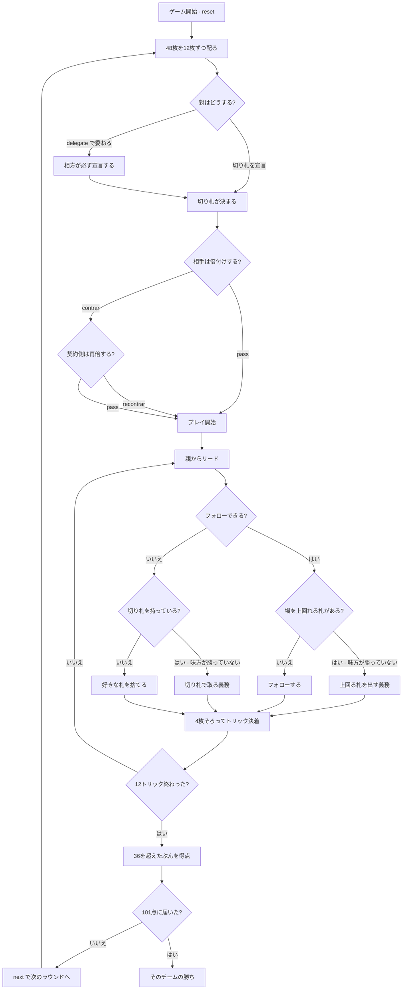

# ボティファラ（Web版）遊び方

## ゲーム概要

カタルーニャ地方で日常的に遊ばれる**2対2のパートナー制トリックテイキング**。スペイン式48枚（10を含まない）を12枚ずつ配ります。**競りはありません**——親が切り札を宣言するか、相方に委ねるかの二択だけです。あなたは席0、**相方は向かいの席2**です。

## 起動方法

```sh
go run ./cmd/trumpcards web  # CLI経由でWebサーバーを起動
go run ./cmd/server          # 直接Webサーバーを起動
```

ブラウザで `http://localhost:8080` にアクセスし、ナビゲーションバーから「ボティファラ」を選択します。
ナビバーのJA/ENボタンで日本語・英語を切り替えられます。

## ルール

### 配りと席

スペイン式48枚（A,2〜9,J,Q,K × 4スート、**10は無し**）を4人に12枚ずつ配ります。ちょうど配り切れて山札は残りません。

| 席 | 誰 | 組 |
|----|----|----|
| 0 | あなた | あなたの組 |
| 1 | CPU | 相手の組 |
| 2 | CPU | **あなたの相方** |
| 3 | CPU | 相手の組 |

### 宣言（競りではありません）

親が**切り札のスートを宣言する**か、**相方に委ねます（delegate）**。委ねられた相方は**必ず宣言します**——降りる選択肢はありません。切り札なし（ボティファラ）も宣言できます。

宣言のあと、相手の組は**倍付け（contrar、2倍）**を宣言できます。倍にされた側は**再倍（recontrar、4倍）**で返せます。

### 札の強さ

**マニラ（9）がいちばん強い**という独特の序列です。

| 強さ | 9 | A | K | Q(騎士) | J(ソタ) | 8 | 7 | … | 2 |
|------|---|---|---|---------|---------|---|---|---|---|
| 点 | 5 | 4 | 3 | 2 | 1 | 0 | 0 | 0 | 0 |

**点札がそのまま上位5枚**です。強い札を取れば点も入ります。

### 勝てるなら勝たなければならない

このゲームのいちばんの特徴です。フォロー義務に加えて、

- リードのスートを持っていれば**フォローします**
- そのうえで**場を上回れる札があるなら、それを出さなければなりません**
- フォローできず、**味方が勝っていなければ切り札で取る義務**があります
- 場が切り札で取られているなら、**上から被せられるときは被せます**

**味方が勝っているときだけ自由**です。「安い札を温存する」という選択が効きません。CUIでは出せる札に `*` が付きます。

### 得点

1スート15点 × 4 = **60点**、これに**各トリック1点**（12点）が加わって、1ラウンドで動くのは**ちょうど72点**です。

**36点はちょうど半分**なので、**37点以上取った側だけ**が「取った点 − 36」を得点します。倍付けが掛かっているとその倍率が乗ります。101点先取で勝ちです。

**倍付けが4倍だと1ラウンドで決着することがあります**（72点取れば (72−36)×4 = 144点）。

## ゲームの流れ



## 画面の操作方法

| 操作 | 説明 |
|------|------|
| 手札のカード | 出せる札（強調表示）をクリックして出す |
| 切り札を選ぶ | スペード / クラブ / ハート / ダイヤ / 切り札なし から宣言する |
| 相方に委ねる | 宣言を相方に渡す（相方は必ず宣言します） |
| 倍付け / 見送り | contrar・recontrar するか、そのまま進める |
| 次のラウンド | ラウンド終了後に次を配る |
| ヒント | 宣言すべき切り札、または出すべき札を表示する |
| 投了 | ゲームを終了する |
| 棋譜 | このラウンドの経過を表示する |

**出せない札はクリックできません。** 「勝てるなら勝つ義務」があるので、手札の大半が出せない場面がふつうに起きます。

## 画面構成

- **得点表示**: 両チームの通算得点と上がり点（既定 101）
- **切り札と倍率**: 宣言された切り札と、contrar / recontrar の倍率。得点にそのまま掛かります
- **このラウンドの点**: 両チームが取った点。**合計は必ず72**になります
- **場（トリック）**: いま出ている札を席順に表示します
- **席の並び**: あなたは手前、**相方は向かい**、両隣が相手です
- **手札**: 出せる札だけが強調されます。**勝てるなら勝つ義務**があるため、印が1枚だけのこともあります
- **結果表示**: 36を超えたぶんが得点として加算されます

## 遊び方のコツ

- **相方が勝っているトリックでは点札を積みます。** 自由に出せるのはこの場面だけです
- **マニラ（9）は最強で5点。** 取られると大きいので、切り札のマニラは特に重い札です
- **切り札の長さで宣言を決めます。** 4枚以上あるなら自分で宣言、短ければ委ねるのが基本です
- **36点が折り返し。** 半分取っても0点なので、僅差の勝負では1トリック（1点）が効きます
- **倍付けは点札を多く持っているときだけ。** 4倍だと1ラウンドで勝負が決まります
