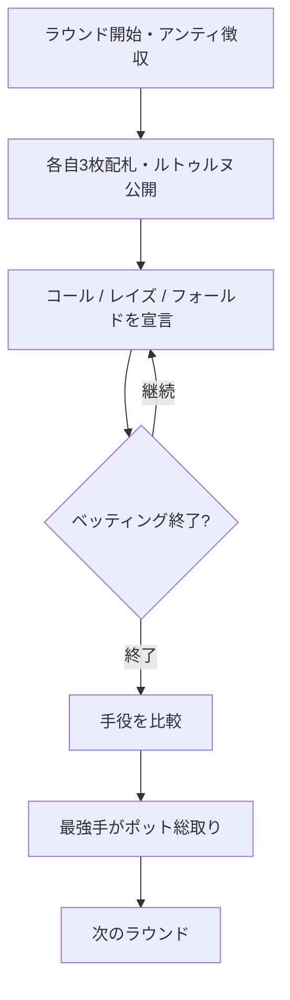

# ブイヨット（Web版）遊び方

## ゲーム概要

ブイヨット（Bouillotte）は18世紀フランスで大流行した3枚ポーカーのポット・ヴァイイング（vying）ゲームです。各プレイヤーはアンティを支払って3枚の手札を受け取り、テーブル中央に共有カード「ルトゥルヌ（retourne）」が1枚表向きに置かれます。プレイヤーは順番にコール・レイズ（ヴィ）・フォールドを選んで賭け合い、ベッティングが終わると降りていないプレイヤーが手役を比べ、最強手がポットを総取りします。ルトゥルヌを含めて同じランクが3枚そろう「ブルラン（brelan）」が最強手です。

## 起動方法

```sh
go run ./cmd/trumpcards web  # CLI経由でWebサーバーを起動
go run ./cmd/server          # 直接Webサーバーを起動
```

ブラウザで `http://localhost:8080` にアクセスし、ナビゲーションバーから「ブイヨット」を選択します。
ナビバーの JA/EN ボタンで日本語・英語を切り替えられます。

## ルール

### 基本ルール

1. 全員がアンティを支払い、標準52枚デッキから各自3枚の手札が配られます。中央には共有の「ルトゥルヌ」カードが1枚表向きに置かれます。
2. あなたの3枚とルトゥルヌを見て、コール（現在のベットに合わせる）・レイズ（ヴィ、賭け金を上げる）・フォールド（降りる）を宣言します。CPU は手札の強さで自動判断します。
3. レイズは規定回数まで可能で、上限に達すると以降はコールかフォールドのみになります。
4. ベッティングが終わると、降りていないプレイヤー同士が手役を比較します。
   - **ブルラン**（ルトゥルヌを含めて同ランク3枚）はハイカードに勝ちます。
   - ブルラン同士はランクの高い方が勝ち。
   - ブルランがなければハイカード → キッカーの順で比較（A が最強）。
5. 最強手のプレイヤーがポットを総取りします。全員が降りた場合は最後に残ったプレイヤーがポットを獲得します。

### 停止条件

規定ラウンド数を消化するか、アンティを払えるプレイヤーが2人未満になるとゲーム終了。最終的にチップが最も多いプレイヤーが勝者です。

## ゲームの流れ



## 画面の操作方法

- **コール / レイズ / フォールド**: あなたの番になったら、「コール」「レイズ（ヴィ）」「フォールド（降りる）」のいずれかのボタンをクリックします。レイズできない場合はレイズボタンは表示されません。
- **次のラウンド**: 結果表示後に「次のラウンド」をクリックして続行します（チップは引き継がれます）。
- **ヒント**: あなたの番で手札の強さに応じたコール/レイズ/フォールドの助言を表示（オプション）。
- **アクションログ**: これまでの配札・宣言・精算の履歴を確認できます。

## 画面構成

- **フェーズ表示**: 現在のフェーズ、ラウンド番号、ポット額、アンティ、現在のベット、チップ残高
- **ルトゥルヌ**: テーブル中央に表向きの共有カードを表示
- **プレイヤー一覧**: 各プレイヤーのチップ・状態（参加中／降りた／脱落／勝者）。結果フェーズでは降りていないプレイヤーの手札と役名を公開
- **結果表示**: ラウンドの勝敗とポットの行方

## 遊び方のコツ

- ルトゥルヌと自分の手でブルランが完成する見込みがあれば、積極的にレイズ（ヴィ）で攻めましょう。
- ハイカードしかないときは、参加人数やベットの大きさを見てコールかフォールドを慎重に選びます。
- ポットが大きく膨らんでいるときのコールはリスクが高くなります。手役の強さと相談して宣言しましょう。
- ヒントを有効にすると、手札の強さに基づく推奨アクションが表示されます。
