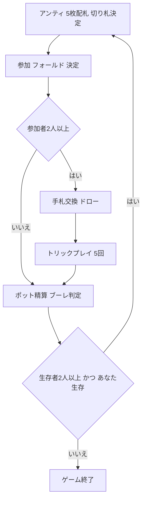

# ブーレ（Web版）遊び方

## ゲーム概要

ブーレ (Bourré / Booray) は、アメリカ南部 (ルイジアナ州など) で古くから親しまれている、トリックテイキングとポーカーのベッティング (チップの賭け) を融合させたゲームです。各ラウンドでアンティ (参加料) を支払い、配られた5枚を見て「勝負する (参加)」か「降りる (フォールド)」を選びます。参加したのに1トリックも取れないと「ブーレ」となり、ポットと同額のペナルティを支払う強烈なリスクがあります。

## 起動方法

Web GUIのゲーム一覧から「ブーレ」を選択するか、`/bourre` を開きます。ページを開くと自動的に新しいゲームが開始されます。

## ルール

- 5人 (あなた + CPU 4人)、各自100チップを持って開始。標準52枚を使用します。
- 各ハンドの流れ:
  1. 全員がアンティ (5チップ) をポットに入れ、5枚ずつ配ります。ディーラーの最後の1枚を表向きにして切り札 (トランプ) スートを決定します。
  2. 各プレイヤーは手札と切り札を見て、参加するかフォールドするかを決めます。フォールドしたアンティはポットに残ります。
  3. 参加者は不要なカードを捨て、山札から同数をドローできます (ドローポーカーと同様)。
  4. マストフォロー (リードスートに従う)・マストトランプ (リードスートが無ければ切り札を出す)・マストウィン (勝てるなら勝ちにいく) のトリックテイキングを5回行います。
  5. 最も多くトリックを取ったプレイヤーがポットを総取り。参加したのに0トリックのプレイヤーは「ブーレ」となり、ポットと同額を次ポットへ支払います。最多が同数の場合はポットが次ハンドへ繰り越されます。
- チップが尽きたプレイヤーは脱落します。生存者が1人になるか、あなたが破産するとゲーム終了。最も多くチップを持つプレイヤーが勝者です。

## ゲームの流れ

## 画面の操作方法

- **決定フェーズ**: あなたの番に「参加（アンティ）」「フォールド」のボタンが表示されます。
- **ドローフェーズ**: 交換したいカードをタップして選び、「交換する」ボタンを押します。交換しない場合は「交換しない」を選びます。
- **プレイフェーズ**: 出せるカード (合法手) だけが選択可能になります。カードをタップするとそのまま出します。
- **ハンド終了**: 「次のハンド」ボタンで次のハンドへ進みます。
- **新しいゲーム**: フッターのリセットボタンから開始できます。

## 画面構成

- 上部: フェーズ名と手番表示、ポット額 (+繰越)、切り札スート、CLIトグル。
- 中央上: CPU各プレイヤーのチップ・状態 (参加中 / フォールド / 脱落 / 獲得トリック)。
- 中央: 現在のトリック (各プレイヤーが出したカード)。
- 下部: あなたの手札と操作ボタン。
- 終了時: 各プレイヤーの獲得トリックと勝敗。

## 遊び方のコツ

- 切り札の高い札やエースが乏しい弱い手はフォールドが無難。参加して0トリックは「ブーレ」となり大きな損失です。
- ポットが大きいハンドほどブーレのリスクも大きくなります。確実に1トリック取れる見込みがあるかを基準にしましょう。
- 切り札のエース・キングは確実なトリック源。リードでは高い札を使ってトリックを取りにいきましょう。
- マストウィンのルールにより、勝てる札を持っていれば出さなければなりません。残り札と相手の動きを読んで立ち回りましょう。
