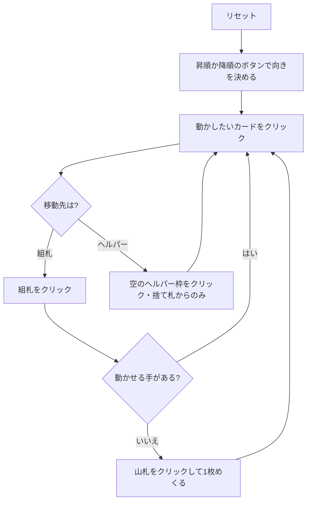

# ブレイド (Braid) — Web マニュアル

## ゲーム概要

52 枚 2 組（104 枚）で遊ぶソリティア。**20 枚の三つ編み（ブレイド）**を中央に置き、その周りに **4 つのブレイド札**と **8 つのヘルパー枠**を並べる。開始札 1 枚が基礎札に置かれ、残り 71 枚が山札になる。

特徴は 3 つ。**行き先が基礎札しかないこと**、**ブレイド札とヘルパーで補充元が違うこと**、そして**積む向きを最初に一度だけ選ぶこと**です。

## 起動方法

1. `go run ./cmd/trumpcards web` でサーバーを起動する
2. ブラウザで `http://localhost:8080` を開く
3. ゲーム一覧または左サイドバーから「ブレイド」を選ぶ

## ルール

- **向き**: 「昇順」「降順」ボタンで**最初に一度だけ**決める。決めるまで組札には置けない
- **組札**: 8 つ。**同スート**で、選んだ向きに 13 枚。K の次は A。8×13 = 104 枚でクリア
- **ブレイド**: **末尾の 1 枚だけ**が使え、行き先は組札のみ
- **ブレイド札（4 枠）**: 組札へ出すと**ブレイドの末尾から自動で**埋まる。ブレイドを削れる唯一の経路
- **ヘルパー（8 枠）**: 組札へ出せる。空き枠は**捨て札からのみ**埋められる
- 山札は 1 枚ずつ捨て札へ。**めくり直しは 2 回**まで

## ゲームの流れ

## 画面の操作方法

| 操作 | 説明 |
|------|------|
| 昇順 / 降順ボタン | 組札を積む向きを決める（最初の 1 度だけ・以後は消える） |
| ブレイドをクリック | 末尾の札を移動元として選択する（**行き先は組札だけ**） |
| ブレイド札をクリック | その枠の札を移動元として選択する |
| ヘルパーをクリック | その枠の札を移動元として選択する |
| 捨て札をクリック | 一番上の札を移動元として選択する |
| 組札をクリック | 選択中のカードをその組札に置く |
| 空のヘルパー枠をクリック | 選択中の**捨て札**をその枠へ退避する |
| 山札 / めくるボタン | 山札を 1 枚めくって捨て札へ送る（空ならめくり直す） |
| ドラッグ＆ドロップ | クリック 2 回と同じ移動をドラッグでも行える |
| ヒントボタン | ブレイド札 → ブレイド → ヘルパー → 捨て札 → めくる の順に手を 1 つ提示する |
| 自動完成ボタン | 組札へ送れる札がなくなるまで自動で送る |
| 元に戻す / 手詰まり脱出ボタン | 1 手戻す / 脱出に必要な手数だけまとめて戻す |
| ギブアップ / リセットボタン | 確認ダイアログのうえで投了 / やり直す |
| CLI トグル | 同じゲームをコマンド入力で操作するモードに切り替える |

キーボードショートカット: `d` めくる / `h` ヒント / `a` 自動完成 / `z` 元に戻す / `g` ギブアップ（確認あり）。

## 画面構成

- **上部**: フェーズ表示、開始ランクと向き、手数
- **中央上段**: 8 つの組札、山札（めくり直し残り回数つき）と捨て札
- **中央**: ブレイド（残り枚数つき）と 4 つのブレイド札
- **中央下段**: 8 つのヘルパー枠。番号 `#0`〜`#7` はヒント表示の番号と一致する
- **下部**: ヒント表示、アクションログ、設定、キーボードショートカット一覧

## 遊び方のコツ

- **ブレイドを削れるのはブレイド札の 4 枠だけ。** ここが出せない札で埋まるとブレイドが止まる
- **ヘルパーは捨て札からしか埋まらない。** 一度埋めると組札に出すまで空かないので、8 枠の使い所を選ぶ
- **向きの選択がゲーム全体を決める。** 決める前にめくって、開始ランクの前後どちらが取りやすいか見ておく
- 山札は 3 巡できるので、序盤は無理をせずめくって様子を見る手も有効
- 詰まったら元に戻すで分岐をやり直す
