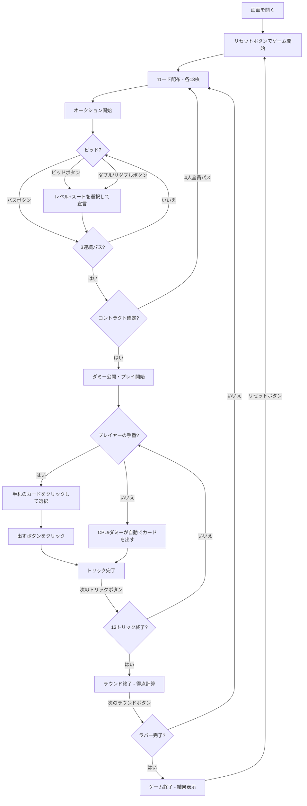

# コントラクトブリッジ（Web版）遊び方

## ゲーム概要

4人（プレイヤー1人 + CPU 3人）で遊ぶ2チーム制（0+2 vs 1+3）のトリックテイキング型カードゲームです。標準52枚のカード（各プレイヤー13枚）を使用し、オークション（ビッド）でコントラクトを決定した後、13トリックをプレイします。ラバーブリッジ方式のスコアリングで、先に2ゲームを獲得したチームがラバーに勝利します。

## 起動方法

```sh
go run ./cmd/trumpcards web     # CLI経由でWebサーバーを起動
go run ./cmd/server             # 直接Webサーバーを起動
```

ブラウザで `http://localhost:8080` にアクセスし、ナビゲーションバーから「コントラクトブリッジ」を選択します。
ナビバーのJA/ENボタンで日本語・英語を切り替えられます。

## ルール

### 基本ルール

- 52枚のカードを4人に均等配布（1人13枚）
- 4人を2チームに分ける（プレイヤー0+2 vs プレイヤー1+3）
- オークション（ビッド）でコントラクト（レベル+スート/ノートランプ）を決定
- コントラクトを勝ち取ったプレイヤーがディクレアラー（宣言者）
- ディクレアラーのパートナーがダミー（手札を公開し、ディクレアラーが操作）
- リードスートに従う（フォロースート）
- 切り札（トランプ）がある場合、切り札が勝つ

### オークション（ビッド）

- ディーラーの左隣から時計回りにビッド
- ビッドはレベル（1〜7）とスート（クラブ < ダイヤ < ハート < スペード < ノートランプ）の組み合わせ
- **パス**: ビッドを見送る
- **ダブル**: 相手チームの最後のビッドに対して宣言
- **リダブル**: 自チームへのダブルに対して宣言
- 3人連続パスでオークション終了

### プレイ

- ディクレアラーの左隣がオープニングリード
- リード後、ダミーの手札が公開される
- ディクレアラーはダミーのカードも操作する

### 得点（ラバーブリッジ）

- コントラクトポイント（ライン以下）が100点以上でゲーム獲得
- 2ゲーム先取でラバー勝利（ボーナス 500/700点）
- バルネラブル（1ゲーム獲得済み）でペナルティ/ボーナス増加

### CPU難易度

- **Easy**: ランダムにビッド・プレイ
- **Normal**: HCPに基づくビッド、基本的なトリック戦略（デフォルト）
- **Hard**: HCP+分布点によるビッド、パートナー連携、切り札管理、ボイド戦略

## ゲームの流れ



## 画面の操作方法

### オークションフェーズ

1. **レベルセレクター** からビッドレベル（1〜7）を選択します
2. **スートセレクター** からスート（クラブ/ダイヤ/ハート/スペード/ノートランプ）を選択します
3. **「ビッド」** ボタンで選択したレベル+スートをビッドします
4. **「パス」** ボタンでビッドを見送ります
5. **「ダブル」** ボタンで相手のビッドをダブルします（有効な場合のみ表示）
6. **「リダブル」** ボタンでダブルに対してリダブルします（有効な場合のみ表示）

### カードのプレイ（プレイフェーズ）

1. 手札のカードをクリックして選択します
2. フォロー必須のルールに従い、出せないカードは選択できません
3. **「カードを出す」** ボタンをクリックしてカードを場に出します
4. ディクレアラーの手番では、ダミーの手札も操作できます

### ヒント

- **「ヒント」** ボタンをクリックすると、CPUの戦略に基づく推奨ビッドまたは推奨カードが表示されます

### トリック・ラウンドの進行

1. トリックが完了すると結果が表示されます
2. **「次のトリック」** ボタンで次のトリックに進みます
3. ラウンドが完了するとスコアが表示されます
4. **「次のラウンド」** ボタンで次のラウンドに進みます

### キーボードショートカット

| キー | アクション | 有効条件 |
|------|-----------|---------|
| `1`〜`9`, `0` | カード選択/解除（1=1枚目, ..., 0=10枚目） | プレイヤーの手番 |
| `Enter` | カードを出す | プレイヤーの手番 |
| `Escape` | 選択クリア | プレイヤーの手番 |

※ テキスト入力欄にフォーカスがある場合、ショートカットは無効になります。

## 画面構成

```
┌────────────────────────────────────────────┐
│  ▶ 設定 (クリックで展開)                   │
│    CPU難易度:    [Normal▼]                 │
├────────────────────────────────────────────┤
│           CPU プレイヤーエリア              │
│ ┌──────────┐ ┌──────────┐ ┌──────────┐    │
│ │ CPU 1    │ │ CPU 2    │ │ CPU 3    │    │
│ │ 13枚     │ │ 13枚(D)  │ │ 13枚     │    │
│ └──────────┘ └──────────┘ └──────────┘    │
├────────────────────────────────────────────┤
│              ゲーム情報                     │
│  ラウンド 2 / トリック 5                    │
│  コントラクト: 3NT by CPU 1 (Dbl)          │
│  チーム1: G1 B60 A50                       │
│  チーム2: G0 B40 A0 [V]                    │
├────────────────────────────────────────────┤
│           現在のトリック                    │
│  CPU 1: ♠K                                │
├────────────────────────────────────────────┤
│     ビッドエリア (オークション時)           │
│  レベル: [1▼]  スート: [NT▼]              │
│  [パス] [ビッド] [ダブル] [リダブル]       │
├────────────────────────────────────────────┤
│     フッター: あなた                        │
│  [♥A][♥K][♠Q][♦10][♣7]...               │
│  [リセット] [ヒント] [カードを出す] [次のトリック] │
└────────────────────────────────────────────┘
```

- **設定パネル（▶ 設定）**:
  - 「CPU難易度」セレクト: Easy / Normal / Hard から選択
  - 次のリセット時に設定が適用される
- **CPU プレイヤーエリア**: 各 CPU の手札枚数を表示
  - 手番の CPU は金色枠
  - ディーラーは (D) マーク
  - ダミーの手札は公開表示
- **ゲーム情報**: コントラクト、ラウンド/トリック番号、チームスコア
  - G=ゲーム数、B=ライン以下、A=ライン以上
  - [V]=バルネラブル
- **現在のトリック**: トリックに出されたカード
- **ビッドエリア**: オークション中に表示、レベル/スート選択とビッドボタン
- **フッター（あなたの手札）**:
  - クリックで選択（緑枠 + 上に浮き上がる）
  - フォロー必須のカードのみ選択可能

## 遊び方のコツ

- HCP（A=4, K=3, Q=2, J=1）が13点以上あればオープニングビッドを検討しましょう
- パートナーとのビッドのやり取りで互いの手札の強さを伝え合います
- ディクレアラーの場合、ダミーの手札と合わせて作戦を立てましょう
- フォロースートできない場合、切り札で取るか、不要なカードを捨てるか判断しましょう
- バルネラブル時はアンダートリックのペナルティが大きいため、無理なビッドは避けましょう
- 迷った時はヒントボタンでCPUの戦略に基づく推奨を確認できます
