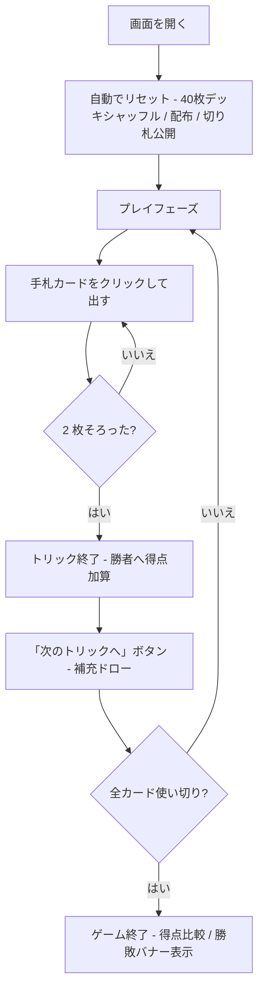

# ブリスコラ（Web版）遊び方

## ゲーム概要

イタリア生まれの古典的な2人対戦トリックテイキングゲームです。40枚デッキ (8/9/10 を除く) を使い、最大の特徴は **「リードスートに従う義務 (must-follow) がない」** こと。いつでも好きなカードを出して、切り札 (briscola) で勝負できます。120点を取り合い、61点以上を獲得した側が勝利します。

## 起動方法

```sh
go run ./cmd/trumpcards web   # CLI経由でWebサーバーを起動
go run ./cmd/server           # 直接Webサーバーを起動
```

ブラウザで `http://localhost:8080` にアクセスし、ナビゲーションバーから「ブリスコラ」を選択します。
ナビバーのJA/ENボタンで日本語・英語を切り替えられます。

## ルール

### 基本ルール

- 40枚のデッキ (A, 2-7, J, Q, K × 4スート, 8/9/10は除外) を使用
- 各プレイヤーに 3 枚ずつ配り、次の 1 枚を表向きで山札の底に置きます (この札の**スートが切り札**)
- リードスートに従う義務はなし — どのカードでも出せます
- 1 トリックが終わるごとに、勝者が先に 1 枚、敗者が 1 枚を山札から補充
- 山札が尽きると表向きの切り札を最後に引き、その後は補充なしで残り 3 トリック

### カードの強さ (スート内)

A > 3 > K > Q > J > 7 > 6 > 5 > 4 > 2

### カードの得点

| カード | 点数 |
|-------|------|
| A (エース) | 11 |
| 3 (トレ) | 10 |
| K (レ) | 4 |
| Q (カバッロ) | 3 |
| J (ファンテ) | 2 |
| その他 (2,4,5,6,7) | 0 |

合計 120点。

### トリックの勝者

1. **両者が切り札**: 上記スート内強さの大きい方が勝つ
2. **片方だけ切り札**: 切り札の方が勝つ
3. **両者非切り札**: リードスートで返したカード同士で強さ比べ。リードスートを切らないとそもそも勝てない

### ゲーム終了

40 枚すべてプレイし終えたらゲーム終了。

- 61点以上を獲得した側が勝利
- 60-60 は引き分け

### CPU難易度

| レベル | 説明 |
|--------|------|
| Normal | 標準戦略 (v1で唯一サポート)。リード時は低得点札を温存、追随時はトリックに高得点があれば切り札で取りに行く |

## ゲームの流れ



## 画面の操作方法

| 操作 | 動作 |
|------|------|
| 手札カードをクリック | そのカードをプレイ (must-follow がないのでどれでも可) |
| 「次のトリックへ」ボタン | トリック終了後に表示。次のトリックに進む (両者ドロー) |
| 「リセット」ボタン | 確認ダイアログを経てゲームをリセット |

## 画面構成

- **ヘッダー**: 現在のトリック番号、山札残り枚数、両者の得点
- **トランプカード表示**: 場に表向きで置かれている切り札 (山札が尽きると非表示)
- **CPU 情報パネル**: CPU の手札枚数と獲得トリック数 (カード裏面のみ)
- **トリックエリア**: 現在進行中のトリックに出されたカード
- **メッセージ欄**: ゲーム状態や結果バナー (ja/en で切替可能)
- **自分の手札**: 0-2 のインデックスで並び、クリック対象。CPU の手番中はグレーアウト

## 遊び方のコツ

- **must-follow がない** ので、相手が高得点 (A=11, 3=10) を出してきたら積極的に切り札で取りに行きましょう
- 自分から切り札を出すのは控えめに — 山札にある間は補充されるとはいえ、切り札は希少です
- リードする時は **0点のスモールカード** (2, 4, 5, 6, 7) を選び、得点札 (A, 3) は切り札で勝てる場面まで温存
- 山札が空になったら **残り全カードをカウント** して、相手の手札を読み切る局面に入ります
