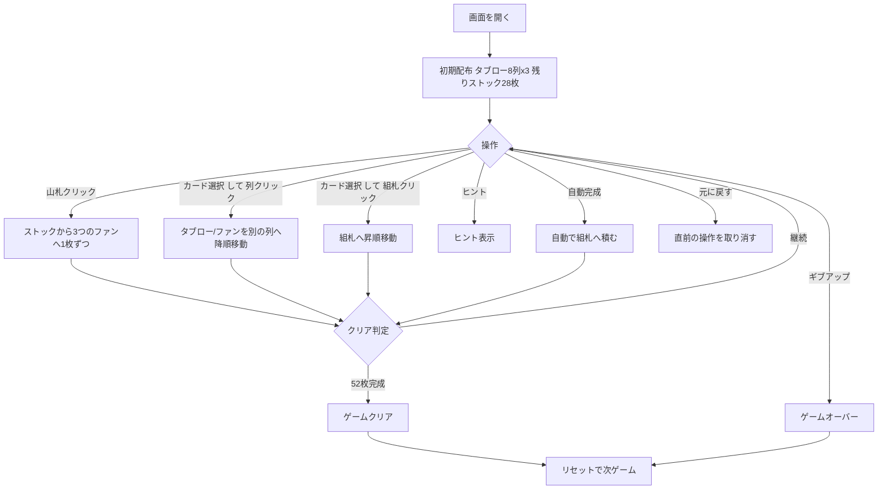

# ブリストル（Web版）遊び方

## ゲーム概要

ブリストル（Bristol）は1人用ソリティア。8列のタブロー（場札）、3つのファン（予備列）、ストック、4つのファウンデーション（組札）を使う。タブローはスートに縛られず降順に積めるため自由度が高い。52枚すべてをファウンデーションに積み上げれば勝利。

## 起動方法

```sh
go run ./cmd/trumpcards web        # CLI経由でWebサーバーを起動
go run ./cmd/server                # 直接Webサーバーを起動
```

ブラウザで `http://localhost:8080` にアクセスし、ナビゲーションバーから「ブリストル」を選択します。
ナビバーのJA/ENボタンで日本語・英語を切り替えられます。

## ルール

### レイアウト

- **タブロー**: 8列。開始時に各列3枚ずつ表向きに配られる（計24枚）
- **ファン**: 3つの予備列。ストックから配られ、各ファンのトップ1枚のみ移動できる
- **ストック**: 残り28枚。1回の配り操作で3つのファンに1枚ずつ配られる
- **ファウンデーション**: 4つ。AからKへ昇順に積む（スート不問）

### 移動ルール

- タブローの最上段、またはファンのトップカードを、他のタブロー列へ移動できる（スート不問・降順）
- 一度空になったタブロー列には、カードを置けない
- タブローやファンのトップカードはファウンデーションへも積める（AからK、スート不問）

### ゲーム終了

- 4つのファウンデーションすべてが13枚（合計52枚）積まれれば **ゲームクリア**
- ギブアップでゲームオーバー

## ゲームの流れ



## 画面の操作方法

### プレイフェーズ

1. **山札クリック**: ストックから3つのファンに1枚ずつ配る
2. **タブロー最上段 / ファンのトップカードをクリック**: 移動元として選択（枠が強調表示）。選択中は、**その札を実際に置ける移動先だけ**が緑の枠になります（置けない先は光りません）
3. **別のタブロー列をクリック**: 選択中のカードをその列へ降順移動
4. **ファウンデーションをクリック**: 選択中のカードを組札へ昇順移動
5. **ヒント**: 次の一手を提示
6. **自動完成**: 移動可能なカードを自動的にファウンデーションへ積む
7. **元に戻す**: 直前の操作を取り消す
8. **ギブアップ**: 現在のゲームを終了
9. **リセット**: 新しいゲームを開始

## 画面構成

```
┌────────────────────────────────────────────┐
│  組札  0   1   2   3                         │
│                                            │
│  タブロー 0  1  2  3  4  5  6  7             │
│                                            │
│  ファン 0  1  2     ストック                 │
│                                            │
│  [配る] [ヒント] [自動完成] [元に戻す]         │
│  [ギブアップ] [リセット]                      │
└────────────────────────────────────────────┘
```

- **組札（ファウンデーション）**: 上部。4つ。カード選択後にクリックで積む
- **タブロー**: 中央。8列。最上段が選択可能、他の列へ降順で移動
- **ファン / ストック**: 下部。山札をクリックして3ファンに配る
- **操作ボタン**: 下部フッター

## 遊び方のコツ

- 空き列を作るとそこには二度と置けないため、列を空にするタイミングは慎重に
- ファンのトップは塞がれやすいので、早めに組札やタブローへ逃がす
- 同じランクが複数スートで揃うと、組札が連鎖的に伸びる
- 行き詰まったら「元に戻す」で読み直す
