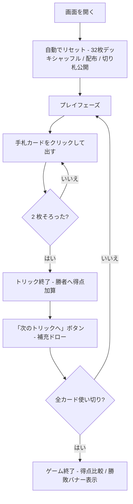

# ブリュスカンビーユ（Web版）遊び方

## ゲーム概要

17世紀フランス生まれのトリックテイキングゲームで、ブリスコラとベジークの**双方の祖先**とされます。**2〜5人**で遊び、32枚デッキ (7-8-9-10-J-Q-K-A) を使います。

最大の特徴は**二相構造**です。**山札が残っている間は自由出し**（どのカードでも出せる）ですが、**山札と表向きの切り札を使い切ると、以降はリードスートへの追従が必須**になります。前半は補充があるので好きに捨てられ、後半は補充が無いので手元に残した札で受けるしかありません —— 前半に何を捨てたかが後半に効いてきます。

120点を取り合い、最多得点者が勝利します。

## 起動方法

```sh
go run ./cmd/trumpcards web   # CLI経由でWebサーバーを起動
go run ./cmd/server           # 直接Webサーバーを起動
```

ブラウザで `http://localhost:8080` にアクセスし、ナビゲーションバーから「ブリュスカンビーユ」を選択します。
ナビバーのJA/ENボタンで日本語・英語を切り替えられます。

## ルール

### 基本ルール

- 32枚のデッキ (7, 8, 9, 10, J, Q, K, A × 4スート) を使用
- **3人卓・5人卓では低い札 (7) を2枚抜きます。** 32 は 3 でも 5 でも割り切れず、
  そのままだと最後に手札が残って打ち切れないためです
- 各プレイヤーに 3 枚ずつ配り、次の 1 枚を表向きで山札の底に置きます (この札の**スートが切り札**)
- **前半 (山札あり)**: リードスートに従う義務はなし — どのカードでも出せます
- **後半 (山札切れ)**: リードスートを持っていれば**必ず従います**。持っていなければ自由
- 1 トリックが終わるごとに、**勝者から順に**卓を一周して 1 枚ずつ山札から補充
- 山札が尽きると表向きの切り札を最後に引き、**その時点から追従必須**に切り替わります

### カードの強さ (スート内)

**A > 10 > K > Q > J > 9 > 8 > 7**

普段のトランプと違い、**10 が K より強い**（A に次ぐ2番目）のがこのゲームの癖です。

### カードの得点

| カード | 点数 |
|-------|------|
| A (アス) | 11 |
| 10 (ディス) | 10 |
| K (ロワ) | 4 |
| Q (ダム) | 3 |
| J (ヴァレ) | 2 |
| その他 (7,8,9) | 0 |

合計 120点。

### トリックの勝者

1. **両者が切り札**: 上記スート内強さの大きい方が勝つ
2. **片方だけ切り札**: 切り札の方が勝つ
3. **両者非切り札**: リードスートで返したカード同士で強さ比べ。リードスートを切らないとそもそも勝てない

### ゲーム終了

40 枚すべてプレイし終えたらゲーム終了。

- 最多得点者が勝利
- 60-60 は引き分け

### CPU難易度

| レベル | 説明 |
|--------|------|
| Normal | 標準戦略 (v1で唯一サポート)。リード時は低得点札を温存、追随時はトリックに高得点があれば切り札で取りに行く |

## ゲームの流れ



## 画面の操作方法

| 操作 | 動作 |
|------|------|
| 手札カードをクリック | そのカードをプレイ (must-follow がないのでどれでも可) |
| 「次のトリックへ」ボタン | トリック終了後に表示。次のトリックに進む (両者ドロー) |
| 「リセット」ボタン | 確認ダイアログを経てゲームをリセット |

## 画面構成

- **ヘッダー**: 現在のトリック番号、山札残り枚数、両者の得点
- **トランプカード表示**: 場に表向きで置かれている切り札 (山札が尽きると非表示)
- **CPU 情報パネル**: CPU の手札枚数と獲得トリック数 (カード裏面のみ)
- **トリックエリア**: 現在進行中のトリックに出されたカード
- **メッセージ欄**: ゲーム状態や結果バナー (ja/en で切替可能)
- **自分の手札**: 0-2 のインデックスで並び、クリック対象。CPU の手番中はグレーアウト

## 遊び方のコツ

- **must-follow がない** ので、相手が高得点 (A=11, 3=10) を出してきたら積極的に切り札で取りに行きましょう
- 自分から切り札を出すのは控えめに — 山札にある間は補充されるとはいえ、切り札は希少です
- リードする時は **0点のスモールカード** (2, 4, 5, 6, 7) を選び、得点札 (A, 3) は切り札で勝てる場面まで温存
- 山札が空になったら **残り全カードをカウント** して、相手の手札を読み切る局面に入ります
