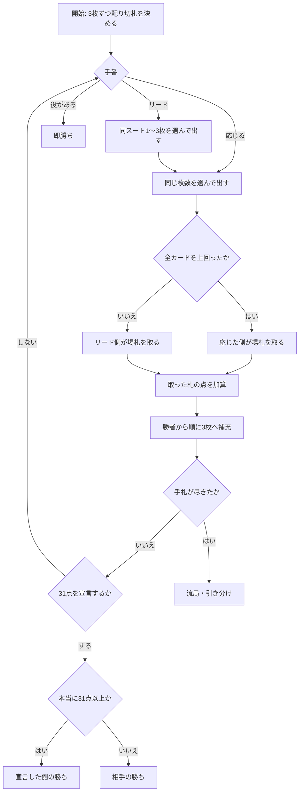

# ブラ（Web版）遊び方

## ゲーム概要

ロシアの ace-ten 系トリックテイキングゲーム。36 枚のショートデッキ（6〜A）を使い、手札は常に 3 枚に補充されます。取った札のカード点を合計 **31 点**集め、それを**自分から宣言**すると勝ちです。

同じスートのカードは最大 3 枚まとめて出せます（**molodka**）。一度に大きく点が動く反面、受けきられれば全部相手のものになります。

## 起動方法

```sh
go run ./cmd/trumpcards web  # CLI経由でWebサーバーを起動
go run ./cmd/server          # 直接Webサーバーを起動
```

ブラウザで `http://localhost:8080` にアクセスし、ナビゲーションバーから「ブラ」を選択します。
ナビバーのJA/ENボタンで日本語・英語を切り替えられます。

## ルール

- **デッキ**: 36 枚（A, 6, 7, 8, 9, 10, J, Q, K × 4 スート）
- **カード点**: A=11 / 10=10 / K=4 / Q=3 / J=2 / その他=0（デッキ全体で 120 点）
- **強さ**: A > 10 > K > Q > J > 9 > 8 > 7 > 6（**10 が K/Q/J より強い**のが特徴）
- **切札**: 山札の底のカードで決まり、表向きに置かれます
- **リード**: 同一スートを 1〜3 枚まとめて出せます
- **応じ方**: リードと**同じ枚数**を出します。**フォロー義務はありません**
- **勝敗判定**: リードの各カードをそれぞれ別のカードで上回れば受けきり、場の札を全部取ります
- **31 点は自己申告制**: 到達しただけでは勝ちません。宣言して初めて勝ち、**足りていなければ負け**です
- **即勝ち役**: bura（切札3枚）/ Moscow（A3枚）/ Little Moscow（切札の6を含む6が3枚）/ molodka（切札以外の同スート3枚）
- **流局**: 山札も手札も尽きて誰も宣言しなければ引き分けです

## ゲームの流れ



## 画面の操作方法

| 操作 | 説明 |
|------|------|
| 手札のカードをクリック | 選択／選択解除。同じスートなら複数枚選べます |
| **出す** ボタン | 選択したカードを出します |
| **31点を宣言** ボタン | 31 点到達を宣言します。足りなければその場で負けます |
| **役を宣言** ボタン | 手札の即勝ち役を宣言します |
| **ヒント** トグル | 推奨手をハイライトします |
| **設定** パネル | CPU 難易度を変更してリセットします |
| **CLI** トグル | ターミナル風の操作に切り替えます |

## 画面構成

- **フェーズ表示**: 現在のトリック番号と山札の残り枚数
- **切札**: 表向きの指示カード。引かれた後はスートのみ表示されます
- **得点**: 双方の獲得点と目標の 31 点
- **場**: リードされたカードと、それに応じたカード
- **手札**: 自分の手札。CPU の手札は裏向きで枚数のみ表示されます
- **アクションログ**: 局の進行を後から追えます

## 遊び方のコツ

- **まとめ出しは諸刃**です。2 枚出せば取れる点は倍ですが、受けきられれば倍取られます
- **10 は K より強い**ことを忘れないでください。K で 10 を受けようとして失敗するのが最も多い事故です
- **切札は温存**しましょう。どの非切札スートも上回れる万能札です
- **宣言のタイミング**が全てです。31 点に届いたら早めに宣言してください。相手が先に宣言すると、こちらが何点持っていても負けます
- 逆に**届いていないのに宣言すると即負け**です。ヒントで到達を確認できます
