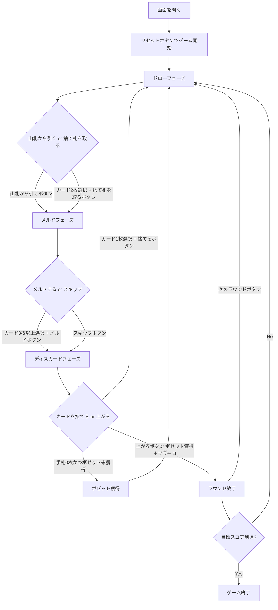

# ブラーコ（Web版）遊び方

## ゲーム概要

ブラーコ（Burraco）はイタリア・南米で人気のカナスタ派生ラミー系カードゲームです。2デッキ＋4枚のジョーカー（計108枚）を使用し、同ランクのカードを集めてメルド（3枚以上の組）を作り、7枚以上のメルド「ブラーコ」の完成を目指します。最大の特徴は「ポゼット（Pozzetto）」と呼ばれる11枚の予備手札で、最初に手札を出し切ったプレイヤーだけがこれを獲得できます。先に目標スコア（デフォルト2005点）に到達したプレイヤーが勝利します。

## 起動方法

```sh
go run ./cmd/trumpcards web
# または
go run ./cmd/server
```

ブラウザで `http://localhost:8080` を開き、ナビゲーションから「ブラーコ」を選択してください。

## ルール

### 基本ルール

- **デッキ**: 標準52枚×2デッキ＋ジョーカー4枚＝108枚
- **配布**: 各プレイヤーに11枚。さらに11枚の「ポゼット」を2山、脇に取り分ける
- **ワイルドカード**: 2（ピネッラ）とジョーカーはワイルド
- **赤3**: ハート3・ダイヤ3は自動的に場に出される
- **黒3**: 捨てるだけ（メルド不可、相手のピックアップをブロック）

### ポゼット（Pozzetto）

- 最初に手札（11枚）をすべて出し切ったプレイヤーは、ポゼット（11枚）を新しい手札として獲得します
- ポゼットを獲得しないと上がれません
- 上がるには「ポゼット獲得」かつ「ブラーコ完成」かつ「手札0枚」が必要です

### メルド

- 同ランク3枚以上で構成
- ナチュラルカード最低2枚必要
- ワイルドカードは最大3枚まで
- ブラーコ = 7枚以上のメルド

### 初回メルド最低点

| 累積スコア | 最低点 |
|-----------|--------|
| マイナス | 15点 |
| 0〜1499 | 50点 |
| 1500〜2999 | 90点 |
| 3000以上 | 120点 |

### 得点

| ボーナス | 点数 |
|----------|------|
| プーロ（清い）ブラーコ | 200点 |
| スポルコ（汚い）ブラーコ | 100点 |
| 上がりボーナス | 100点 |
| コンシールド上がり | 200点 |
| 赤3（1枚あたり） | 100点 |
| 赤3（4枚全部） | 800点 |

### CPU難易度

- Easy: ランダムプレイ
- Normal: 基本戦略
- Hard: 戦略的プレイ

## ゲームの流れ



## 画面の操作方法

### ドローフェーズ

1. 「山札から引く」ボタンをクリック
2. または、手札からナチュラルカード2枚を選択し「捨て札を取る」ボタンをクリック

### メルドフェーズ

1. 手札からメルドするカード3枚以上を選択し「メルド」ボタンをクリック
2. メルドしない場合は「スキップ」ボタンをクリック

### ディスカードフェーズ

1. 手札からカード1枚を選択し「捨てる」ボタンをクリック
2. 手札を出し切ると、ポゼット未獲得なら自動的にポゼットを獲得します
3. ポゼット獲得済みでブラーコがある場合は「上がる」ボタンで上がれます

### キーボードショートカット

| キー | アクション | 有効条件 |
|------|-----------|----------|
| ← → | カード選択移動 | 人間の手番 |
| Space | カード選択/解除 | 人間の手番 |
| Enter | 確定 | カード選択中 |
| Escape | 選択解除 | カード選択中 |

## 画面構成

```
┌──────────────────────────────────┐
│ ゲームタイトル / フェーズ表示     │
│ ラウンド / 山札・捨て札 / ポゼット │
├──────────────────────────────────┤
│ 設定パネル (CPU難易度/目標スコア) │
├────────────────┬─────────────────┤
│ 捨て札エリア   │ スコアテーブル   │
│ メルド表示     │ CPU情報         │
│ 赤3表示       │ ポゼット獲得状況 │
├────────────────┴─────────────────┤
│ 手札エリア (カード選択)          │
│ アクションボタン                 │
└──────────────────────────────────┘
```

- **ヒントを有効にすると、勧めている札に枠が付きます。** 文言だけでは、手札のどれを指しているのかを自分で探すことになるためです（相手の手番などサーバが答えを返さない場面では付きません）。

## 遊び方のコツ

- まず手札を出し切ってポゼット（予備手札）を獲得することが上がりの前提です
- ブラーコの完成を最優先にしましょう
- プーロ（ワイルドなし）ブラーコは200点のボーナス
- 捨て札の山が大きい時は積極的に取りましょう
- ワイルドカードを捨てると山がフリーズします
- 黒3で相手の山取りをブロックできます

